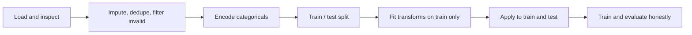

# Data Preparation: Handling Messy Data

Picture training on flashcards where half the answers are blank, a few lines are duplicated so you drill them ten times by accident, and one card swears the capital of France is “−10.” You would not blame yourself for failing the quiz—you would blame the deck. Machine learning behaves the same way **unless someone fixes the deck first**. Models do not “know” what a price, a grade, or an order *means*; they only see **numbers and correlations**. This session is about **data preparation**: the disciplined pass that turns messy tables into **inputs you can trust**, using the same moves whether the rows are cars, students, or e-commerce orders.

If you have ever seen a model that “works” in a notebook yet feels wrong in production—or a leaderboard score that was too good to be true—often the story starts here: **gaps**, **repeats**, **impossible values**, **text labels**, **mismatched scales**, or **test data bleeding into training**. Join us to replace that fuzzy worry with a **shared workflow**: inspect before you touch, impute with intent, remove duplicates and nonsense, encode categories without faking order, scale features so magnitude does not dominate meaning, and **split data the right way** so evaluation stays honest. You will leave with a mental checklist you can apply the next time a CSV lands on your desk.

---

## Models, tables, and why “clean” is not optional

In this course frame, a dataset is not decoration—it is the **only** surface from which many models learn. Whatever is missing, wrong, duplicated, or inconsistently typed becomes part of the pattern the system tries to exploit. The emphasis on **preparation** is deliberate: skipping it does not produce “neutral” learning; it produces **learning from artifacts**—bias toward repeated rows, overweighting of huge numeric columns, or phantom order implied by label encoding when none exists.

**Data preparation** is the set of steps that make the table **complete**, **consistent**, and **numeric enough** for training—without pretending that cleaning is a single button. It is the bridge between “we have data” and “we have **usable** data”—and the habit of **integrity across rows**: each record should represent reality **once**, with fields that make sense together, before any model treats them as signal.

---

## Why messy data survives until you look

Most real tables look “fine” at a glance. Problems hide in **single cells**: one missing mileage, one quantity not filled, one negative price, one grade that no grading scheme allows. Humans pattern-check in context; models pattern-check **across everything you gave them**. That is why the session starts with **load and inspect**—not to rush to `fillna`, but to **name** what is broken so every later step is purposeful.

We will reuse **three small datasets** (car, student, e-commerce) on purpose. Different domains, **same disease**: incompleteness, repetition, invalid values, text columns, and features on wildly different scales. Recognizing those families of issues early is what prevents “random cleaning”—the kind where you fix one column and accidentally bake in a new distortion elsewhere.

---

## Missing values, duplicates, and values that defy reality

**Missing values** are not “empty space” to a model; they are often a hard stop or a silent distortion if handled carelessly. We will use **imputation**—for example, filling with a **median** when you want a robust middle that extreme values do not yank around—and talk about the trade-off: dropping rows saves purity but **costs data**; wrong guesses **invent facts**.

**Duplicates** deserve their own spotlight. The same row twice is not harmless duplication in training; it is a **vote** cast twice. We will **drop duplicates** so the model does not overweight whatever happened to be logged repeatedly.

**Outliers** in this session include the obviously invalid: negative prices, impossible grades, quantities that cannot be negative in the business rule set. Filtering them is not “being mean to edge cases”—it is refusing to teach the model that nonsense is normal. In session we connect each of these operations to the **pandas** habits you will see in the notebook: see it, then fix it.

---

## Encoding: turning labels into numbers without lying

**Categorical** columns—fuel type, brand, grade, product—are meaningful to humans but opaque to many classic ML pipelines until they become numeric. **Encoding** is that translation, and the design choice matters.

**Label encoding** assigns integers to categories. It is compact and quick—but it can smuggle in a **fake ordering** (is “Diesel” “greater than” “Petrol” because 1 > 0?). When order is not real, that illusion steers learning wrong.

**One-hot encoding** spreads categories across separate binary columns. You trade **width** for **clarity**: no bogus rank, each category its own switch. We will use patterns like mapping for labels and **`get_dummies`**-style expansion where independence matters.

Recognizing which tool fits **which column** is part of the craft—noticing when “A / B / C” might be ordinal versus when “Phone / Laptop” is just nominal.

---

## Feature scaling: when big numbers bully small ones

Even after cleaning and encoding, columns can sit on **incomparable scales**: price in lakhs, year near 2018, quantity tiny. A learner that leans on distance, magnitude, or gradient balance can then **over-focus** on whichever column shouts loudest—not whichever feature actually drives the outcome.

**Feature scaling** rebases features so they **contribute fairly**. We will see **normalization** (squeeze a column into a bounded range like 0–1 using min and max) and **standardization** (center and scale using mean and standard deviation) and discuss what changes in the model’s **perception** without changing the underlying meaning of the business fields.

---

## Data leakage: the score that flatters you by cheating

**Data leakage** is what happens when information that should belong only to **evaluation**—or to **future** reality—sneaks into how you built the training side of the problem. The model can look dazzling while secretly **peeking**.

A common footgun: compute medians, fill missing values, or fit scaling **on the entire dataset**, *then* split into train and test. Statistically, the test slice has already influenced those summaries. The fix is structural: **split first**, then compute every statistic and fitted transform using **training data only**, then **apply** the same rules to the held-out set. We will show **`train_test_split`** in that story and ask the discipline question you should carry everywhere:

> Would this information be available at prediction time?

If not, it should not be how you trained.

---

## Clean data and agentic systems: wrong inputs, wrong actions

Later in the notes we connect this groundwork to **agentic systems**—loops that **observe**, **decide**, and **act**. Agents inherit the same fragility: if the table behind recommendations, pricing, or feedback is wrong, the **actions** compound the error. Data preparation is not a prelude you skip because “the agent is smart.” It is part of making **decisions traceable** and **trust** possible.

---

By the time we are in the room together, the vocabulary should feel **earned**, not memorized: **inspection** before transformation; **imputation** versus dropping rows; **duplicates** as accidental weighting; **invalid values** as patterns you refuse to teach; **label versus one-hot encoding** as a representation choice, not a syntactic trick; **normalization versus standardization** as ways to tame magnitude; **leakage** as optimism manufactured by letting test information touch training. Bring one example from your own world—a spreadsheet row that “looked fine” until you stared at a single cell, or a metric that broke when the split was fixed. Those examples are what turn checklist into conversation, and they are welcome from the first minute.
