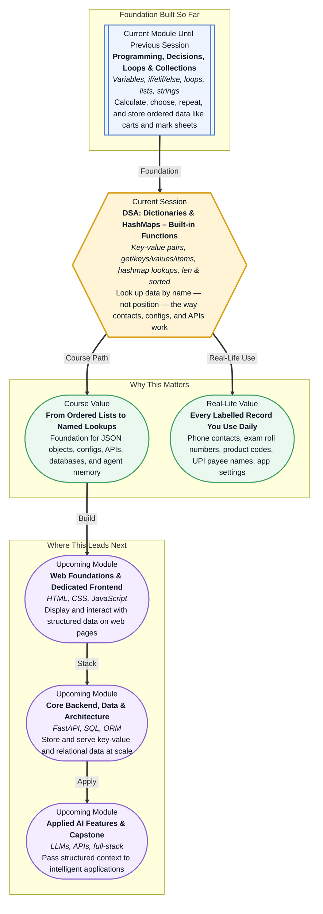

```mermaid
%%{init: {"flowchart": {"nodeSpacing": 45, "rankSpacing": 65, "diagramPadding": 20}} }%%
flowchart TB
    subgraph Foundation["Foundation Built So Far"]
        C1[["Current Module Until Previous Session<br/><b>Programming, Decisions, Loops &amp; Collections</b><br/><i>Variables, if/elif/else, loops, lists, strings</i><br/>Calculate, choose, repeat, and store ordered data like carts and mark sheets"]]
    end

    CS{{"Current Session<br/><b>DSA: Dictionaries &amp; HashMaps – Built-in Functions</b><br/><i>Key-value pairs, get/keys/values/items, hashmap lookups, len &amp; sorted</i><br/>Look up data by name — not position — the way contacts, configs, and APIs work"}}

    subgraph Value["Why This Matters"]
        CV(["Course Value<br/><b>From Ordered Lists to Named Lookups</b><br/>Foundation for JSON objects, configs, APIs, databases, and agent memory"])
        RV(["Real-Life Value<br/><b>Every Labelled Record You Use Daily</b><br/>Phone contacts, exam roll numbers, product codes, UPI payee names, app settings"])
    end

    subgraph Future["Where This Leads Next"]
        F1(["Upcoming Module<br/><b>Web Foundations &amp; Dedicated Frontend</b><br/><i>HTML, CSS, JavaScript</i><br/>Display and interact with structured data on web pages"])
        F2(["Upcoming Module<br/><b>Core Backend, Data &amp; Architecture</b><br/><i>FastAPI, SQL, ORM</i><br/>Store and serve key-value and relational data at scale"])
        F3(["Upcoming Module<br/><b>Applied AI Features &amp; Capstone</b><br/><i>LLMs, APIs, full-stack</i><br/>Pass structured context to intelligent applications"])
    end

    C1 ==>|&nbsp;Foundation&nbsp;| CS
    CS ==>|&nbsp;Course Path&nbsp;| CV
    CS ==>|&nbsp;Real-Life Use&nbsp;| RV
    CV ==>|&nbsp;Build&nbsp;| F1
    F1 ==>|&nbsp;Stack&nbsp;| F2
    F2 ==>|&nbsp;Apply&nbsp;| F3

    classDef previous fill:#eef4ff,stroke:#4f7ccf,color:#111827,stroke-width:2px;
    classDef current fill:#fff4d6,stroke:#d9a321,color:#111827,stroke-width:3px;
    classDef value fill:#eaf8ef,stroke:#3f9f63,color:#111827,stroke-width:2px;
    classDef future fill:#f4ecff,stroke:#8a61d1,color:#111827,stroke-width:2px;

    class C1 previous;
    class CS current;
    class CV,RV value;
    class F1,F2,F3 future;
    linkStyle default stroke-width:3px;
```
