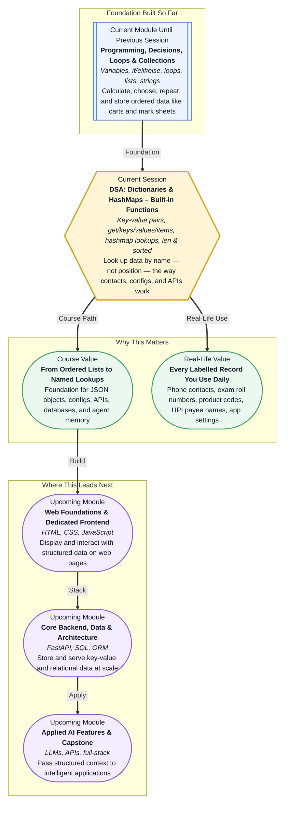

# Pre-read: DSA: Dictionaries & HashMaps – Built-in Functions

## Context of This Session in the Course

---

Open your phone's **Contacts** app. You do not scroll to "person number 17" to call your friend Priya. You type **Priya** — a name you remember — and the app instantly shows her number, photo, and last call time. Now open your **exam result portal**. You enter your **roll number**, not your position in the class queue, and the system returns your marks, grade, and subject-wise breakdown. Same idea at a **Big Bazaar billing counter**: the cashier scans a **product barcode**, and the screen shows the item name and price without searching through every product on the shelf one by one.

These everyday systems all share one quiet superpower: they store information as **labelled pairs** — a **name** linked to a **value** — and fetch the right value the moment you provide the label. That is a completely different way of thinking about data compared to a **list**, where you reach items by **position** (first, second, third). In real applications, people rarely think in positions. They think in **names, codes, and IDs**. This session teaches you how Python handles that style of data through **dictionaries** — and why the same idea is one of the most important structures in all of software, often called a **hashmap**.

---

## When position numbers are not enough

Imagine you are the **class teacher** again. You already know how to store forty students' marks in a **list** — mark at index 0, mark at index 1, and so on. That works beautifully when you want the **third mark** or the **highest mark in the list**. But the principal walks in with a different request: *"What is the mark for roll number **B-1042**?"* or *"Update **Ananya's** phone number for the PTA WhatsApp group."*

With only a list, you would need a **separate list of roll numbers in the exact same order** as the marks — and hope nobody ever joins or leaves mid-semester. If the orders ever get out of sync, you assign the wrong mark to the wrong student. One small shuffle, and the entire record becomes unreliable. Manually matching two parallel lists for hundreds of students is slow, error-prone, and exactly the kind of work computers should eliminate.

What you really need is a **register** where each **roll number points directly to its mark**, each **student name points to its phone number**, and each **product code points to its price**. Look up the label, get the value — no counting, no guessing, no scanning from the top every time. That register is what a **dictionary** gives you in Python: a collection of **key-value pairs**, where every piece of data is stored under a **meaningful key** you choose.

In the previous session, you learned to work with **lists** and **strings** — ordered collections where position matters. You used **indexing**, **slicing**, and built-in tools like **len** and **sorted** to analyse and present data. Dictionaries do not replace lists; they solve a different class of problem. A Swiggy cart is still a **list** (order of items matters at checkout). But the menu that maps **"Paneer Butter Masala" → ₹280** is dictionary-style thinking. Most real programs use **both** — lists for sequences, dictionaries for lookups.

---

## The school locker with name tags

Think of a **dictionary** like a **school locker room where every locker has a name tag instead of a serial number**. Locker tagged **"Rahul"** holds Rahul's bag. Locker tagged **"Section-B-Timetable"** holds the printed schedule. Locker tagged **"Lab-Fee-Amount"** holds the fee figure. You walk in, read the tag you need, open that locker directly, and take what is inside. You do not open locker 1, then locker 2, then locker 3, hoping to find Rahul's bag by accident.

That direct reach is the core idea behind a **hashmap** — the technical name for this kind of structure. When a system is built well, looking up one entry among thousands takes roughly the same effort as looking up one entry among ten. That is why your phone finds a contact among five thousand names almost instantly, and why apps can resolve a **UPI ID** to the correct bank account without freezing the screen. The computer does not "search from the beginning" the way you might flip through a paper register page by page; it uses the key to jump straight to the right slot.

Every key-value pair has two parts. The **key** is the label — a roll number, a product name, a setting name like `"dark_mode"`. The **value** is whatever is stored under that label — a mark, a price, `True` or `False`. Keys must be **unique** (you cannot have two lockers with the same tag) and **hashable** — a fancy way of saying the key must be a stable, fixed label the system can hash into a storage slot. Strings, numbers, and tuples work well as keys. A list cannot be a key, because lists can change shape — imagine a locker tag that rewrites itself every hour; the system would lose track of where your data lives.

---

## Safe lookups and ready-made tools

Real programs constantly need to **read**, **update**, and **explore** dictionary data — and they need to do it without crashing when a key is missing. Suppose a student record has a phone number field, but one student never submitted it. A careless lookup might break the whole program. Python gives you a gentler tool called **get()** — it tries to fetch a value for a key, and if the key is not there, it returns a **default** you specify instead of throwing an error. That is the difference between a system that **gracefully says "not available"** and one that **crashes in front of five hundred users**.

Sometimes you need to see **everything inside** a dictionary at once — all the student names, all the marks, or every pair together for printing a report. Methods like **keys()**, **values()**, and **items()** let you pull out exactly the view you need. **keys()** gives you all the labels. **values()** gives you all the stored data. **items()** gives you both together — like reading the full register with names and marks side by side. These are the building blocks for loops, reports, and summaries you will write throughout the course.

You already met **len()** and **sorted()** when working with lists. They work on dictionaries too — but with a twist worth understanding early. **len()** tells you **how many key-value pairs** exist — how many lockers are occupied. **sorted()** can arrange the **keys** or **values** for display, like printing product names alphabetically on a shop shelf label without changing the original storage order inside the dictionary. Knowing which part you are sorting — keys or values — keeps your output clean and predictable.

**In this pre-read, you'll discover:**

- How **dictionaries** store data as **key-value pairs** — so you can look up marks by roll number, prices by product name, and settings by label instead of by position.
- How to **create**, **access**, and **update** entries in a dictionary — adding a new student, changing a phone number, or correcting a mark without rebuilding the whole collection.
- How methods like **get()**, **keys()**, **values()**, and **items()** help you fetch data safely and explore everything inside a dictionary for reports and summaries.
- Why a dictionary behaves like a **hashmap** — and why that means **fast, direct lookups** even when your data grows from ten entries to ten thousand.
- How **len()** and **sorted()** work with dictionary data to count entries and present keys or values in a neat, readable order.

---

A **key-value pair** is simply a **label connected to a piece of data** — like `"Priya" → "9876543210"` in your contacts. A **hashmap** is the same idea under the hood: the computer turns each key into a storage address so it can jump there directly instead of walking through every entry. **Hashable** means the key is stable enough to use as a permanent label — numbers and text work; changeable collections like lists do not. A **KeyError** is what happens when you ask for a key that does not exist and you did not use a safe method like **get()** — like opening a locker tag that nobody assigned yet. None of this requires advanced maths. It requires the same clarity you use when finding a file folder labelled **"2026 Admission Forms"** in an office cabinet: read the label, go straight to the right place.

---

## After this session, you'll be able to

- Create and update **dictionaries** with meaningful keys — roll numbers, product codes, student names, app settings — and retrieve values without relying on list positions.
- Use **get()** for safe lookups that handle missing keys gracefully, instead of breaking your program when data is incomplete.
- Extract **keys**, **values**, or full **key-value pairs** using **keys()**, **values()**, and **items()** to build reports, summaries, and loop-friendly views of your data.
- Explain the **hashmap intuition** — why labelled lookups scale well and why keys must be unique and hashable.
- Apply **len()** and **sorted()** to dictionary data to count entries and display keys or values in a sorted, readable format.
- Combine dictionaries with the **loops**, **conditions**, and **lists** you already know to model real records like student databases, product catalogues, and configuration settings.

---

## Questions we will solve together in the live class

1. **Your coaching centre keeps a dictionary of five students — each roll number mapped to their mid-term mark.** The admin needs the total marks, the highest and lowest score, and a sorted list of roll numbers for the notice board. How do you pull out just the marks, just the roll numbers, or both together — without maintaining two separate lists that can fall out of sync?

2. **A grocery billing system stores product names and prices in a dictionary.** A customer asks for **"Organic Tur Dal"**, but that exact name was never added to the system. What is the difference between a direct lookup that crashes the program and a **get()** lookup that prints *"Item not found — please check spelling"* and continues smoothly?

3. **An app settings dictionary holds `"dark_mode": True`, `"language": "Hindi"`, and `"notifications": False`.** The product team adds a new setting `"font_size": "large"` and changes `"language"` to `"English"`. How do you add and update entries without rebuilding the entire settings object from scratch — and why can `"dark_mode"` be a key but not a list like `[True, False]`?

Every app that remembers your preferences, resolves a roll number to a result, or maps a product code to a price is built on dictionary logic. The live session turns these everyday lookup problems into programs you can write, test, and trust — the same foundation backend APIs, databases, and AI systems use when they pass **structured, labelled data** from one part of an application to another.
