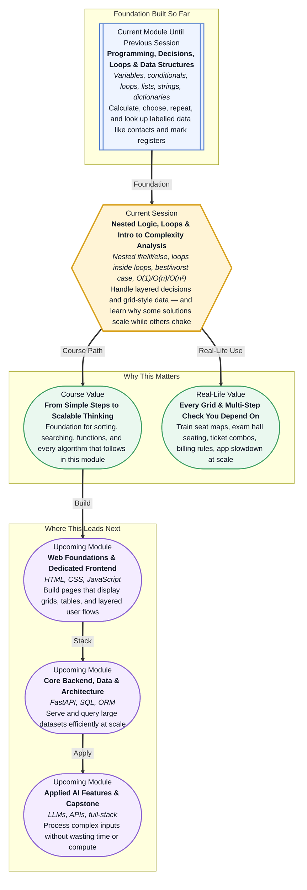

```mermaid
%%{init: {"flowchart": {"nodeSpacing": 45, "rankSpacing": 65, "diagramPadding": 20}} }%%
flowchart TB
    subgraph Foundation["Foundation Built So Far"]
        C1[["Current Module Until Previous Session<br/><b>Programming, Decisions, Loops &amp; Data Structures</b><br/><i>Variables, conditionals, loops, lists, strings, dictionaries</i><br/>Calculate, choose, repeat, and look up labelled data like contacts and mark registers"]]
    end

    CS{{"Current Session<br/><b>Nested Logic, Loops &amp; Intro to Complexity Analysis</b><br/><i>Nested if/elif/else, loops inside loops, best/worst case, O(1)/O(n)/O(n²)</i><br/>Handle layered decisions and grid-style data — and learn why some solutions scale while others choke"}}

    subgraph Value["Why This Matters"]
        CV(["Course Value<br/><b>From Simple Steps to Scalable Thinking</b><br/>Foundation for sorting, searching, functions, and every algorithm that follows in this module"])
        RV(["Real-Life Value<br/><b>Every Grid &amp; Multi-Step Check You Depend On</b><br/>Train seat maps, exam hall seating, ticket combos, billing rules, app slowdown at scale"])
    end

    subgraph Future["Where This Leads Next"]
        F1(["Upcoming Module<br/><b>Web Foundations &amp; Dedicated Frontend</b><br/><i>HTML, CSS, JavaScript</i><br/>Build pages that display grids, tables, and layered user flows"])
        F2(["Upcoming Module<br/><b>Core Backend, Data &amp; Architecture</b><br/><i>FastAPI, SQL, ORM</i><br/>Serve and query large datasets efficiently at scale"])
        F3(["Upcoming Module<br/><b>Applied AI Features &amp; Capstone</b><br/><i>LLMs, APIs, full-stack</i><br/>Process complex inputs without wasting time or compute"])
    end

    C1 ==>|&nbsp;Foundation&nbsp;| CS
    CS ==>|&nbsp;Course Path&nbsp;| CV
    CS ==>|&nbsp;Real-Life Use&nbsp;| RV
    CV ==>|&nbsp;Build&nbsp;| F1
    F1 ==>|&nbsp;Stack&nbsp;| F2
    F2 ==>|&nbsp;Apply&nbsp;| F3

    classDef previous fill:#eef4ff,stroke:#4f7ccf,color:#111827,stroke-width:2px;
    classDef current fill:#fff4d6,stroke:#d9a321,color:#111827,stroke-width:3px;
    classDef value fill:#eaf8ef,stroke:#3f9f63,color:#111827,stroke-width:2px;
    classDef future fill:#f4ecff,stroke:#8a61d1,color:#111827,stroke-width:2px;

    class C1 previous;
    class CS current;
    class CV,RV value;
    class F1,F2,F3 future;
    linkStyle default stroke-width:3px;
```
