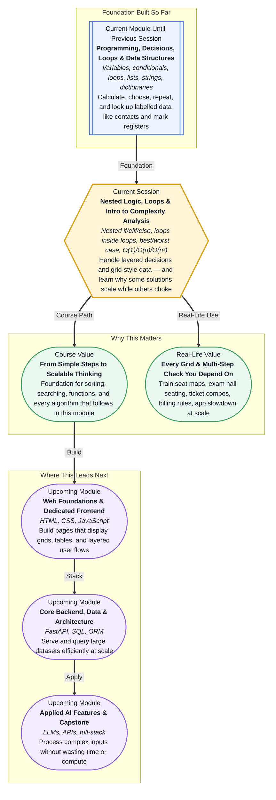

# Pre-read: Nested Logic, Loops & Intro to Complexity Analysis

## Context of This Session in the Course

---

Open the **IRCTC** app and try to book a train ticket. First you pick a **route**. Then you choose a **class** — Sleeper, AC 3-Tier, or AC 2-Tier. Then you pick a **date**. Then you scan a **seat map** — row after row, berth after berth — until you find an empty lower berth near the window. Every step depends on the answer from the step before. Now think about your **college exam hall**. Forty rows, twenty benches per row, each bench seating two students. The invigilator must confirm that **every seat has exactly one admit card**, that **no two students share the same roll number**, and that **reserved-category seats** follow the correct rules. One flat checklist will not cover it. The system needs **decisions inside decisions** and **checks inside checks** — the same pattern repeated across hundreds of seats.

That is the leap in this session. Until now, your programs could **decide once** — pass or fail, discount or full price, loop through a list of marks. They could **repeat a task** — print every name, total every bill, walk through every item in a cart. Real applications rarely stop at one layer. They combine **multi-step decision trees** with **grids and combinations** — seat maps, timetable clashes, pairing every student with every project topic, comparing every product with every coupon rule. And here is the part most beginners only discover when something breaks at scale: **how you structure those layers changes how fast your program runs** when the data grows from ten items to ten thousand.

---

## When one decision and one loop are not enough

Imagine you are organising a **college fest ticket desk**. A student walks up. You need to know: Are they from **this college** or an **outside guest**? If they are from this college, are they in **Year 1**, **Year 2**, or **Year 3**? Each year gets a **different price**. If they are an outside guest, do they want a **single-day pass** or a **three-day pass**? And regardless of category — has the **early-bird deadline** passed or not? A single yes-or-no question cannot capture this. You need a **decision inside another decision** — like opening a folder, then a sub-folder, then the exact file.

Now scale the problem. After tickets are sold, the security team must **verify every attendee against every gate list** for **every event stage** across **three days**. That is not one loop over a list. That is a **loop inside a loop** — for each day, for each stage, for each name on the list, run the check. Do it by hand for fifty people and you survive. Do it for five thousand people across twelve stages and the manual approach collapses. Two different programs might both give the **correct answer**, but one finishes in seconds and the other keeps the user staring at a loading spinner. Professional developers care about **both** — correct logic **and** sensible efficiency.

In the previous session, you learned to store and fetch **labelled data** with **dictionaries** — roll numbers pointing to marks, product names pointing to prices. You already know **conditionals** for branching and **loops** for repetition. This session stacks those skills: **nested conditionals** for layered rules, **nested loops** for grid-style and combination-style problems, and a first look at **complexity analysis** — a plain-language way to describe **how much work** a solution does as the input grows.

---

## The cinema hall and the wedding guest list

Think of **nested conditionals** like the **security desk at a wedding reception**. The first guard asks: *"Are you on the bride's list or the groom's list?"* If you say bride's list, the second guard asks: *"Family or friend?"* If you say family, a third check confirms: *"Which side — maternal or paternal?"* Each answer **opens the next question**. You do not ask everyone every question — you only go deeper when the earlier answer demands it. That keeps the flow clean and avoids mistakes like giving a VIP pass to someone who only needed a general entry band.

Now think of **nested loops** like **checking every seat in a multiplex**. The **outer loop** walks through **rows** — Row A, Row B, Row C. The **inner loop** walks through **seats in that row** — Seat 1, Seat 2, Seat 3. To inspect the entire hall, you repeat the inner walk for **each** row. Total checks = rows × seats per row. That is exactly how programs handle **2D data** — a timetable with days and periods, a marks sheet with students and subjects, a seat map with rows and columns. One loop handles a **line**; two nested loops handle a **grid**.

**Complexity analysis** — often written as **Big-O** — is simply a **fair way to compare plans** before the crowd arrives. **O(1)** means the job stays the **same size** no matter how many guests you add — like reading a signboard that always shows one fixed message. **O(n)** means the work grows **in step** with the guest count — like shaking every hand once at the door. **O(n²)** means the work explodes faster — like making **every guest introduce themselves to every other guest**. Ten guests means roughly a hundred introductions. A thousand guests means roughly a million. Same logic, wildly different waiting time. Developers use these labels not to show off maths, but to **spot slow patterns early** — especially the **nested loop** pattern that often signals **O(n²)** work.

**In this pre-read, you'll discover:**

- How **nested conditionals** handle **multi-step decisions** — college discounts, ticket categories, eligibility checks — without turning your logic into a tangled mess.
- How **nested loops** process **grids and combinations** — seat maps, timetables, student–subject tables — by repeating an inner task for every step of an outer task.
- How to explain **best case**, **average case**, and **worst case** in everyday terms — the fastest scenario, the typical scenario, and the slowest scenario a program might face.
- How to recognise **O(1)**, **O(n)**, and **O(n²)** patterns — constant work, work that scales with input size, and work that scales much faster — so you can tell a smart solution from a fragile one before data grows.

---

A **nested conditional** is a **decision placed inside another decision** — like asking "Are you a student?" and only then asking "Which year?" A **nested loop** is a **repeating task placed inside another repeating task** — like "for each row, check every seat." **2D data** is information arranged in **rows and columns** — a spreadsheet, a seating chart, a weekly timetable. **Time complexity** describes **how the running time grows** when input size increases — not the exact seconds on your laptop, but the **shape** of the growth. **Big-O notation** is the standard shorthand for that shape: **O(1)** for fixed work, **O(n)** for work proportional to input size, **O(n²)** for work that often comes from **nested loops over the same data**. **Best case** is when everything goes your way (the first seat you check is free). **Worst case** is when everything goes against you (the only free seat is the very last one in the hall). None of this requires advanced calculus. It requires the same instinct you use when choosing a checkout queue at **DMart** — pick the line that will finish soonest when the store gets crowded.

---

## After this session, you'll be able to

- Write **nested conditional logic** for real multi-step rules — eligibility checks, tiered pricing, category-based seating — where each answer leads to a deeper, more specific branch.
- Implement **nested loops** to walk through **2D structures** — rows and columns, days and sessions, students and subjects — and to generate or inspect **combinations** systematically.
- Explain **best, average, and worst case** behaviour in plain language — what happens in the lucky scenario, the typical scenario, and the painful scenario.
- Identify **O(1)**, **O(n)**, and **O(n²)** patterns in straightforward programs — a direct lookup, a single pass through a list, or a loop nested inside another loop over the same collection.
- Connect **logic structure** to **performance intuition** — so you can spot when a correct solution might still struggle as lists, seats, or users multiply.

---

## Questions we will solve together in the live class

1. **A coaching centre offers discounts based on three layers:** Is the student enrolled in the **full-year batch** or the **crash course**? If full-year, are they in **Group A** or **Group B**? If Group A, did they score above **80%** in the last mock test? How do you structure this as **nested decisions** so each student is evaluated fairly — without repeating the same checks in the wrong order?

2. **An exam hall has 8 rows and 10 seats per row.** The admin holds a list of **occupied seat numbers** and must print a **visual grid** showing which seats are free and which are taken. How many total seat checks happen if you use **nested loops** — and what happens to that count if the hall doubles to 16 rows with 20 seats each?

3. **Two programs both find whether a list of 100 roll numbers contains any duplicate.** Program A checks each roll number against every other roll number using **nested loops**. Program B walks through the list once and remembers what it has already seen. Both give the correct answer — but one is **O(n²)** and one is closer to **O(n)**. Why does that difference matter when the list grows from 100 students to 10,000 — and how would you describe the **worst case** for each approach?

Every system that books seats, applies layered discounts, detects timetable clashes, or stays responsive when users multiply relies on the ideas in this session. The live class turns these everyday grid-and-rules problems into programs you can write confidently — and equips you with the **efficiency lens** that separates hobby scripts from software built to **scale**.
