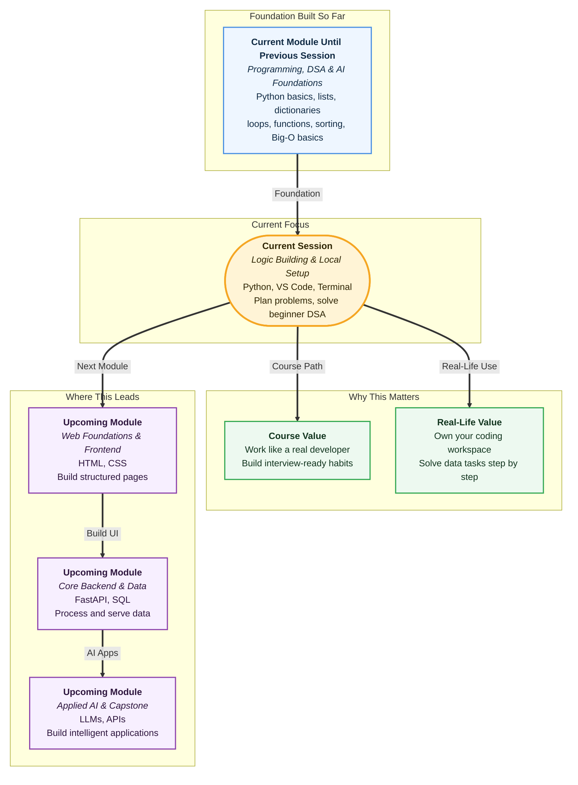

# Pre-read: Hands-on Logic Building, Development Setup & DSA Problem Solving – I

## Context of This Session in the Course

Picture this: you are shortlisted for a technical round at a company you really want to join. The interviewer sends you a link and says, *"Open your laptop, set up your workspace, and solve this problem while sharing your screen."*

You already know the basics. You have used **lists**, **strings**, **dictionaries**, **loops**, and **conditionals** before. In the previous session, you also saw how **sorting** helps arrange data in order. But now the challenge is different. It is not only about knowing the idea. It is about working on your own machine like a professional developer — saving files, running programs, and thinking clearly under pressure.

Until now, many of your practice sessions may have happened inside a browser-based tool. That is useful for learning. But real internships, team projects, and interview setups expect something more: a **local development environment** on your laptop. In simple words, that means your computer becomes your personal coding workspace — like having your own study table at home instead of depending on a shared cyber cafe computer every time.

That shift matters because coding is not only about getting one answer once. It is about building a habit. You create folders, save many practice files, rerun them, fix mistakes, and try again. That is how developers actually work.

---

## The Challenge: Smart Thinking Meets a Real Workspace

Now imagine a second situation.

Your college fest team has a list of **500 student registrations**. Each registration has a name, a city, and a contact number stored as text. Someone asks you three questions:

- How many names start with the letter **A**?
- Which city appears most often in the list?
- Is there any pair of registration numbers that adds up to a fixed target value?

You could try doing this manually with pen and paper. For five names, maybe it is manageable. For five hundred, it becomes slow, tiring, and easy to mess up. One missed row, one wrong count, and the whole answer changes.

This is exactly the kind of challenge beginners face when they move from small classroom examples to real **DSA** problems. **DSA** stands for **Data Structures and Algorithms** — in simple words, it means choosing the right way to store data and the right step-by-step method to solve a problem.

You already have the tools in your toolkit:

- A **list** is like a row of values — marks, prices, or registration IDs in order.
- A **string** is text — a name, a sentence, or a PAN card spelling.
- A **dictionary** is like a labelled notebook — each key has a matching value, such as player name and runs scored.

What you still need is a reliable way to **think before you code**, and a proper place on your laptop to **write, save, and run** your solutions.

---

## Your Personal Coding Desk: Python, VS Code, and Terminal

The answer to the workspace problem is setting up three things on your machine:

| Tool | What it does | Simple analogy |
|---|---|---|
| **Python** | Reads your saved program files and runs them | The engine that powers your code |
| **VS Code** | A professional editor to write and manage files | Your clean digital notebook with helpful hints |
| **Terminal** | A text window where you type commands to run programs | Telling the shopkeeper exactly what you want, instead of pointing at many shelves |

When these three work together, you can save a program as a file, open it anytime, and run it again with one command. That is how developers prepare for platforms like **LeetCode** and **HackerRank**, and how teams share work in companies.

One important professional habit: use **`python3`** consistently when running Python 3 programs. In simple words, this avoids confusion because the word `python` alone can mean different things on different laptops.

The **Terminal** also helps you move between folders, check where you are, and confirm that Python is installed correctly. Developers use it every day — not because it looks fancy, but because it is fast and precise.

---

## Logic Building: The Recipe Before the Cooking

Knowing tools is not enough. The bigger skill is **logic building** — planning the solution before writing any code.

Think of cooking **biryani** at home. You do not randomly throw ingredients into the pot. First, you check what you have. Then you decide how many people you are serving. Then you follow steps in order — soak, marinate, layer, cook. Coding works the same way.

Every beginner problem can be broken into four simple parts:

| Part | Question to ask | Example |
|---|---|---|
| **Input** | What data am I receiving? | A list of marks |
| **Output** | What answer must I give? | The highest mark |
| **Conditions** | What special cases exist? | Empty list, negative values |
| **Steps** | What happens in order? | Loop, compare, update answer |

This framework sounds simple, but it changes everything. When students skip planning and jump straight to typing, they often get stuck, print the wrong value, or forget an edge case. When they plan first, the code almost writes itself.

For example, to find the largest number in a list of marks, your plan might be:

1. Assume the first mark is the largest so far.
2. Visit every remaining mark one by one.
3. Whenever you see a bigger mark, update your answer.
4. At the end, show the final largest mark.

That is **logic building** — turning a plain-English problem into clear steps. The live session will show you how to do this for lists, strings, and dictionaries using **loops** and **conditionals** you already know.

---

## Three Types of Problems You Will Practice

In this session, you will apply your planning method to three familiar data types. Each type matches real-life tasks you have seen before.

### List problems

A list problem gives you a row of values and asks you to calculate something from them — like finding the highest score in a class test, counting how many numbers are even, or building a new list of squared values.

### String problems

A string problem gives you text and asks you to inspect or transform it — like counting vowels in a word, checking whether a word reads the same forwards and backwards, or counting words in a sentence.

### Dictionary problems

A dictionary problem asks you to store and look up information quickly — like counting how many times each letter appears in a word, finding the most frequent mark among students, or checking whether two numbers in a list add up to a target value.

These patterns appear again and again on coding practice platforms. Once you recognise the pattern, new questions feel less scary.

---

In this pre-read, you'll discover:

- How to set up **Python**, **VS Code**, and the **Terminal** so your laptop becomes a proper coding workspace.
- How to **write, save, and run** programs locally — the same workflow developers use in companies.
- How **logic building** breaks any problem into **input**, **output**, **conditions**, and **steps** before you start coding.
- How to solve beginner **DSA** problems using **lists**, **strings**, and **dictionaries** with **loops** and **conditionals**.

---

## Why This Session Changes Your Confidence

There is a big difference between *understanding* a concept and *being able to use it independently*.

Understanding means you followed an example in class. Independence means you can open your laptop, create a file, plan the logic, run the program, see the output, and fix it if something goes wrong.

That independence is what builds interview confidence. It is also what helps you in everyday situations where data needs quick checking — attendance lists, expense splits, word counts, frequency counts, and simple lookups.

The shift from browser practice to local practice is like moving from reading driving theory to actually sitting in the driver's seat. The road rules matter, but hands-on control is what makes you ready.

---

## What's Next

After the session, you will be able to:

- Install and verify **Python** on your laptop and run programs using **`python3`** from the **Terminal**.
- Use **VS Code** to create, save, and organise `.py` practice files in folders.
- Break any beginner problem into **input**, **output**, **conditions**, and **steps** before writing code.
- Solve basic **list**, **string**, and **dictionary** problems using **loops** and **conditionals**.
- Follow the full local workflow — create a file, save it, run it, read the output, and debug common mistakes like wrong folder or unsaved changes.

---

## Think About These Before the Session

Keep these questions in mind. They sound simple, but the live session will show you structured ways to solve them on your own machine:

- A class teacher has marks `[78, 85, 78, 92, 85, 78]` and wants to know which mark appears most often. How would you count repeats without losing track after the tenth value?
- Someone gives you the word **"education"** and asks how many vowels it contains. How would you check each letter systematically so you do not miss or double-count any character?
- You have the numbers `[2, 7, 11, 15]` and need to know whether any two of them add up to **9**. How would you search for that pair without checking every combination by hand?

If these questions feel challenging right now, that is a good sign. It means you are ready to learn the planning method and local setup that turn confusion into clear step-by-step solutions. Bring your curiosity to the session — we will build the workspace and the thinking habit together.
