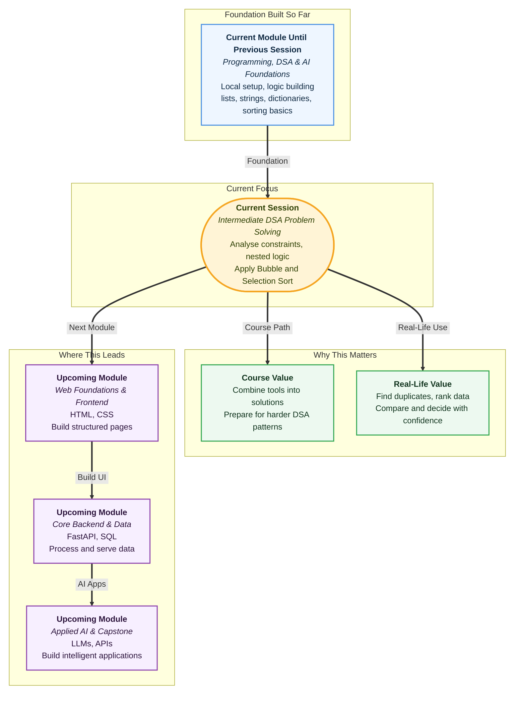

```mermaid
%%{init: {"flowchart": {"nodeSpacing": 45, "rankSpacing": 60, "diagramPadding": 18}} }%%
flowchart TB
    subgraph Foundation["Foundation Built So Far"]
        A["<b>Current Module Until Previous Session</b><br/><i>Programming, DSA & AI Foundations</i><br/>Local setup, logic building<br/>lists, strings, dictionaries, sorting basics"]
    end

    subgraph Current["Current Focus"]
        B(["<b>Current Session</b><br/><i>Intermediate DSA Problem Solving</i><br/>Analyse constraints, nested logic<br/>Apply Bubble and Selection Sort"])
    end

    subgraph Value["Why This Matters"]
        C["<b>Course Value</b><br/>Combine tools into solutions<br/>Prepare for harder DSA patterns"]
        D["<b>Real-Life Value</b><br/>Find duplicates, rank data<br/>Compare and decide with confidence"]
    end

    subgraph Future["Where This Leads"]
        E["<b>Upcoming Module</b><br/><i>Web Foundations & Frontend</i><br/>HTML, CSS<br/>Build structured pages"]
        F["<b>Upcoming Module</b><br/><i>Core Backend & Data</i><br/>FastAPI, SQL<br/>Process and serve data"]
        G["<b>Upcoming Module</b><br/><i>Applied AI & Capstone</i><br/>LLMs, APIs<br/>Build intelligent applications"]
    end

    A ==>|&nbsp;Foundation&nbsp;| B
    B ==>|&nbsp;Course Path&nbsp;| C
    B ==>|&nbsp;Real-Life Use&nbsp;| D
    B ==>|&nbsp;Next Module&nbsp;| E
    E ==>|&nbsp;Build UI&nbsp;| F
    F ==>|&nbsp;AI Apps&nbsp;| G

    classDef previous fill:#eef6ff,stroke:#4a90e2,color:#102a43,stroke-width:2px
    classDef current fill:#fff4d6,stroke:#f5a623,color:#2f4004,stroke-width:3px
    classDef value fill:#edf9f0,stroke:#34a853,color:#12351f,stroke-width:2px
    classDef future fill:#f7efff,stroke:#8e44ad,color:#2d153d,stroke-width:2px

    class A previous
    class B current
    class C,D value
    class E,F,G future
    linkStyle default stroke-width:3px
```
