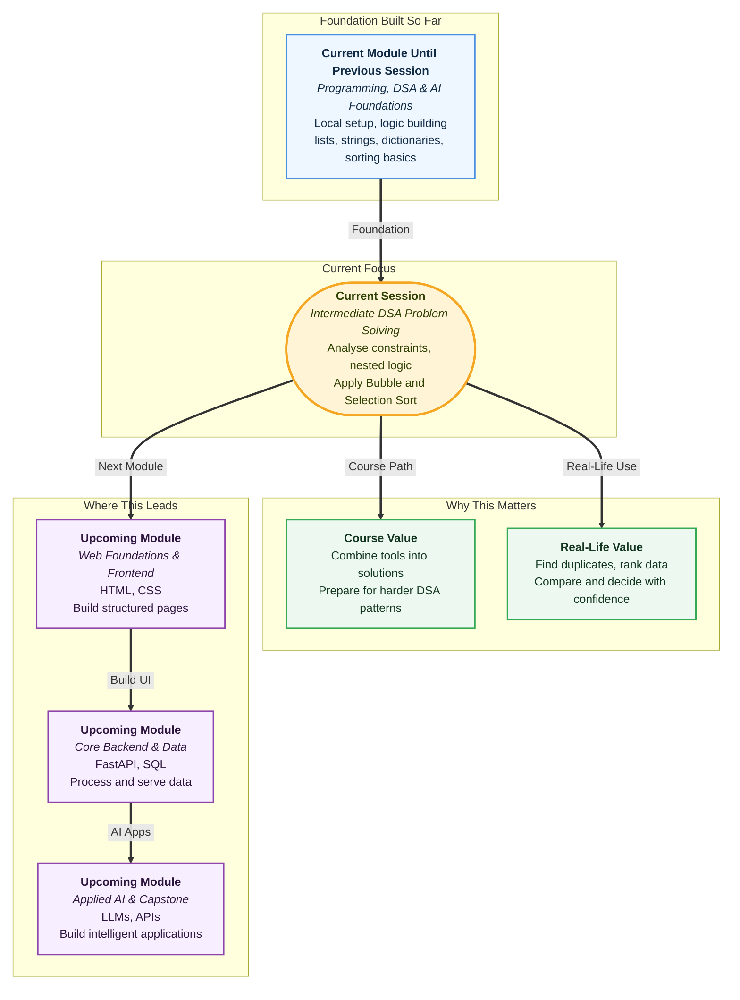

# Pre-read: Hands-on Logic Building & DSA Problem Solving – II

## Context of This Session in the Course

You have already taken an important step. In the previous session, you set up your laptop for **local development**, learned to plan problems using **input**, **output**, **conditions**, and **steps**, and solved beginner-level questions with **lists**, **strings**, and **dictionaries**.

That felt good — until you opened a practice platform and saw a problem tagged **"Medium."**

The question looks familiar. It still uses lists or text. It still mentions loops. But something feels heavier. Maybe you need to compare every value with every other value. Maybe you must find the **second highest** score, not just the highest. Maybe you must check whether any **duplicate** roll numbers exist before confirming exam seating.

These are not random harder questions. They are the natural next level. Real data is messy. Real tasks ask for comparisons, ordering, and careful checking — not just one simple pass through a list.

This session is about learning to handle that next level with calm, structured thinking.

---

## When Simple Loops Are Not Enough

Imagine you are helping with a college scholarship shortlist. You receive test scores for 80 students in no particular order:

`[91, 88, 91, 76, 95, 88, 82, 95, 90, ...]`

Three requests arrive at once:

- Find the **second highest** unique score.
- Check whether **any score appears more than once**.
- Arrange scores from **low to high** so the top ten can be picked quickly.

For five numbers, you might manage with rough mental maths. For eighty, you need a method.

A single loop can find the maximum. But finding the **second largest** often needs extra thinking — what happens if the largest appears twice? What if two students tie for second place?

Checking **duplicates** means asking, for each value, "Have I already seen this before?" That is comparison work, not just counting.

Arranging values in order is exactly what **sorting** solves. You have already met **Bubble Sort** and **Selection Sort** — two step-by-step methods that rearrange a list by comparing values again and again until everything sits in the right place.

In this session, you will not only remember those sorting ideas. You will **use** them as tools inside bigger problems.

---

## Problem Analysis: Read the Rules Before You Run

Before writing any solution, strong problem solvers pause and analyse the **constraints**.

**Constraints** are the rules and limits of the problem — in simple words, they tell you what kind of input you will get and what kind of answer is expected.

Ask yourself:

| Question | Why it matters |
|---|---|
| How big can the input be? | Tells you whether a simple method is enough |
| Can values repeat? | Changes duplicate and ranking problems |
| Should output be sorted or just a single answer? | Decides whether sorting is needed |
| Are negative numbers or empty inputs possible? | Prevents wrong assumptions |

This step turns a scary paragraph into a clear plan. An **algorithm** is simply a fixed sequence of steps to solve a problem — like a checked recipe where each step has a reason.

**Problem analysis** means converting the question plus its constraints into that step-by-step plan **before** you touch your editor.

You already used a lighter version of this in the previous session. Now the problems are moderately complex — so the planning step becomes even more important.

---

## Nested Logic: Checking Every Pair Carefully

Many intermediate problems need **nested logic** — one loop inside another, or one condition inside another, or both.

Think of invigilators checking exam seating in a large hall. One invigilator walks row by row. For each student, another check compares that student with others nearby to spot duplicate roll numbers. The outer walk and the inner check work together.

In programming terms, **nested loops** mean: for each item, do something with every other item (or with every remaining item). This pattern appears when you:

- Compare all pairs in a list.
- Check whether any duplicate exists.
- Scan a two-level structure row by row.

**Nested logic** sounds advanced, but the idea is daily life: an outer task repeated, and inside each repetition a smaller detailed task.

The skill is not memorising syntax. The skill is recognising *when* the problem is asking you to compare or revisit data more than once — and then writing that structure cleanly.

You will practice this with **lists**, **strings**, and **dictionaries** — the same data tools you already know, now combined in richer ways.

---

## Sorting as a Superpower, Not Just a Topic

**Bubble Sort** and **Selection Sort** are often taught as standalone lessons. Here, they become practical tools.

**Bubble Sort** compares neighbours and swaps them when they are out of order — like students in a line exchanging places until taller ones drift toward one end.

**Selection Sort** repeatedly finds the smallest remaining value and places it in the next correct position — like arranging coins from smallest to largest by picking the next coin each time.

Both methods use repeated comparisons. That is why they connect naturally to problems about **ordering**, **ranking**, and **spotting duplicates after arrangement**.

Examples you will explore in the live session:

| Problem type | How sorting helps |
|---|---|
| **Duplicate handling** | Once sorted, equal values sit next to each other — easier to spot repeats |
| **Second largest element** | After ordering, the answer is often one step away — but watch duplicate max values |
| **Ordered comparisons** | Comparing ranks, prices, or marks in sequence becomes straightforward |

Sorting is not always the only way to solve a problem. But knowing when to sort — and tracing Bubble or Selection Sort step by step — builds the kind of thinking interviewers and practice platforms expect at the intermediate level.

---

## Bringing It All Together on Your Machine

You are no longer only learning concepts in theory. You will implement solutions on your local setup — the same **Python**, **VS Code**, and **Terminal** workflow from the previous session.

That matters because intermediate problems need testing. You try sample inputs, notice edge cases, adjust your plan, and run again. This back-and-forth is how confidence grows.

The progression looks like this:

1. **Read** the problem twice and list constraints.
2. **Plan** input, output, conditions, and steps — including whether sorting or nested checks are needed.
3. **Implement** Bubble Sort or Selection Sort where the problem demands order.
4. **Test** with small examples, empty lists, and repeated values.
5. **Refine** if the output does not match the rules.

This is exactly how structured **DSA** practice works on platforms like **LeetCode** and **HackerRank** — plan first, then code, then verify.

---

In this pre-read, you'll discover:

- How to **analyse constraints** and turn a word problem into a clear step-by-step **algorithm**.
- How **nested logic** and **nested loops** help with moderately complex **list**, **string**, and **dictionary** tasks.
- How to **implement Bubble Sort and Selection Sort** step by step — not just recall the idea, but trace and apply it.
- How sorting supports real problem patterns such as **duplicate handling**, finding the **second largest** value, and making **ordered comparisons**.

---

## What's Next

After the session, you will be able to:

- Break an intermediate problem into constraints, inputs, outputs, and logical steps before coding.
- Recognise when a task needs nested loops or nested conditions instead of a single pass.
- Implement and trace **Bubble Sort** and **Selection Sort** on sample data.
- Apply sorting to solve problems involving duplicates, ranking, and ordered data.
- Combine **lists**, **strings**, **dictionaries**, **loops**, and **conditionals** into complete solutions on your local machine.

---

## Think About These Before the Session

These questions sound simple, but each one hides a constraint worth discussing live:

- A list of exam scores has the highest mark **95** appearing **twice**. How would you find the **second highest** score without guessing?
- A registration desk receives roll numbers `[101, 204, 101, 309, 204]`. What is the fastest **logical** way to confirm whether any duplicate exists?
- You need student marks sorted from **low to high** before selecting the top five. Would you use **Bubble Sort** or **Selection Sort** thinking — and how would you trace the first two passes on paper?

If you can already solve easy list and string problems locally, you are ready for this step up. The live session will show you how to analyse harder questions, use nested logic with confidence, and treat sorting as a problem-solving tool — not just a classroom definition.
