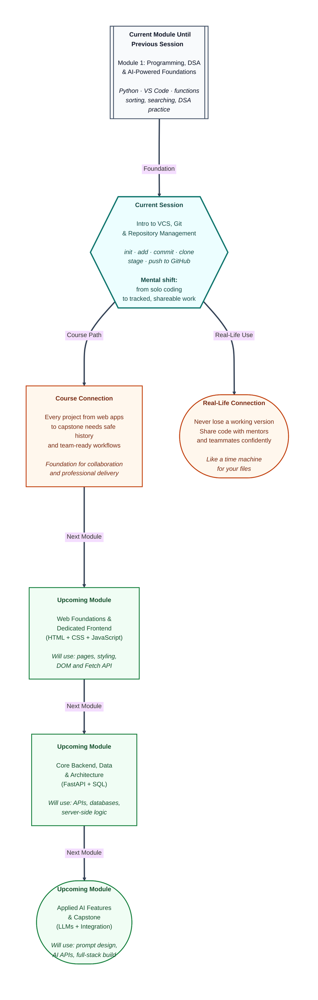

# Pre-read: Intro to VCS, Git & Repository Management

You have been writing **Python** programs on your own laptop. You solved **list** problems, traced **sorting** steps, and built small scripts inside **VS Code**. That progress feels real — until one evening you open your project folder and realise something painful.

Yesterday's working version is gone. You changed a function, saved the file, ran the program, and now nothing passes the test cases. You cannot remember what you changed. Worse, your friend asks for a copy of your code for a group assignment, and you send the wrong file from your **Downloads** folder.

Every developer — beginner or experienced — faces this moment. The difference is not talent. It is whether they have a **system** to remember every change, recover old versions, and share the right code at the right time.

That system is what this session introduces.

---

## Context of This Session in the Course

---

## When "Final_v2_really_final.py" is not a plan

Imagine three classmates — Priya, Arjun, and Meera — are building a **scholarship calculator** in Python for their college fest. Each person edits the same folder on a shared pen drive.

Priya fixes the **average marks** logic on Monday. Arjun rewrites the **input section** on Tuesday. Meera copies the folder to her laptop on Wednesday and accidentally saves an older version back onto the drive. By Thursday, nobody knows which file is correct. They have files named `calculator.py`, `calculator_backup.py`, `calculator_new.py`, and `calculator_working_maybe.py`.

**What if** you had a tool that recorded every change like a diary — who changed what, when, and why — and let you jump back to any earlier version in seconds?

That is the job of **version control**. **Version control** is a way to track changes in files over time so you never lose history and never overwrite good work by mistake.

---

## Your safety net: Git and GitHub

In this session, you will meet **Git** — the most widely used **version control system** in the software industry. Think of Git as a careful assistant sitting inside your project folder. Every time you reach a good stopping point, you tell Git to **save a snapshot** of your work with a short message like *"Added duplicate check for roll numbers."*

Those snapshots live in a **repository** — simply a project folder that Git is watching. At first, the repository stays on your laptop. That is your **local repository** — your personal copy with full history.

Then comes **GitHub** — a popular online platform where developers store and share repositories. **GitHub** is like a secure cloud cupboard for your project. You keep working locally, and when you are ready, you **push** your latest snapshots so your mentor, teammate, or future self can access them from anywhere.

The basic workflow looks like this:

| Step | What it means in simple words |
|---|---|
| **Initialize** | Tell Git to start tracking a project folder |
| **Stage** | Choose which changed files to include in the next snapshot |
| **Commit** | Save the snapshot with a clear message |
| **Clone** | Copy someone else's repository from GitHub to your machine |
| **Push** | Upload your commits from local machine to GitHub |

You do not need to memorise every command before the session. You need to understand **why** each step exists — because professional developers use this same rhythm every single day.

---

## Think of it like a school homework register

Here is a daily-life analogy that maps cleanly to Git.

Your school teacher maintains a **homework register**. Before checking notebooks, she asks students to **submit** their work at the desk. Only after submission does she **stamp and record** the entry with the date and a note — *"Unit test answers complete"* or *"Diagram pending."*

Git works similarly:

- Your edited files are like notebooks on the desk — changed, but not yet officially recorded.
- **Staging** is placing the correct notebook on the teacher's table — choosing what goes into this submission.
- **Committing** is the teacher's stamp and dated entry — a permanent record in the register.
- **GitHub** is the staff room cupboard where a copy of the register is kept so the principal or another teacher can review it anytime.

Once you see Git this way, terms like **staging area** and **commit history** stop feeling mysterious. They are just organised steps to avoid chaos.

---

## Why this matters beyond college projects

Companies building **UPI apps**, **food delivery platforms**, and **AI tools** have hundreds of developers changing the same codebase. Without version control, one wrong save could break payments for millions of users.

Even as a beginner, you benefit immediately:

- **Recovery** — Break something at midnight? Return to yesterday's working commit.
- **Clarity** — Read your commit messages and remember why you made each change.
- **Sharing** — Send a GitHub link instead of confused ZIP files on WhatsApp.
- **Professional habit** — Recruiters expect Git on resumes; this session starts that journey.

In the previous sessions, you learned to **write** and **run** code locally. This session teaches you to **protect** and **share** that code like a developer.

---

In this pre-read, you'll discover:

- Why **version control** is essential the moment your projects grow beyond one file and one person.
- How to **initialize a repository** and use basic Git operations — **init**, **add**, and **commit** — to build local history.
- How **GitHub** fits in: **cloning** a remote repository and understanding the difference between local and online copies.
- The full **remote workflow** — **staging**, **committing**, and **pushing** your work so it lives safely on GitHub.

---

## What's Next

After the session, you will be able to:

- Explain why teams rely on version control instead of manual file naming tricks.
- Create a local Git repository and save meaningful commits with clear messages.
- Clone an existing GitHub repository and explore its history.
- Stage changes, commit them, and push updates to a remote repository.
- Describe the difference between working on your laptop and syncing work to GitHub.

---

## Think About These Before the Session

These scenarios will come alive in the live class — bring your curiosity:

- Priya's **sorting program** worked perfectly on Friday, but Saturday's changes broke it. Without copying files manually, how could she return to Friday's version in one step?
- Arjun wants to start a new Python mini-project. What is the **first thing** he should do so Git begins tracking every future change from day one?
- Meera finds a useful starter project on GitHub. How does she bring that entire project — files and history — onto her laptop to study and extend it?
- Three students edit the same project folder. Why is **pushing** the latest commits to GitHub better than emailing the folder as a ZIP file?

If you have been writing Python locally and feel ready to stop losing good work, you are in exactly the right place. The live session will walk you through each step — from your first commit on your machine to seeing your code appear on GitHub, ready to share with the world.
