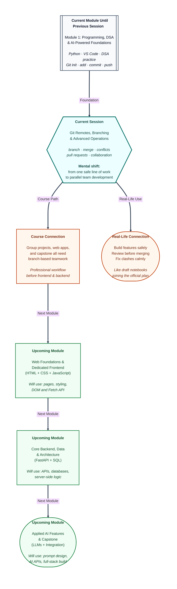

# Pre-read: Git Remotes, Branching & Advanced Operations

You and two classmates — Ananya, Rohit, and you — are building a **Scholarship Tracker** in Python for a college fest. Last week, in the previous session, you learned to save your work safely with **Git** and upload it to **GitHub**. Each of you can now commit changes and push them online. That already feels like progress.

Then Monday morning arrives. Ananya adds a welcome message on her laptop. Rohit fixes a bug in the marks calculator on his. You redesign the menu on yours. All three of you push to the same project at the same time. By Tuesday, the app shows Ananya's greeting *and* Rohit's half-finished bug fix *and* your broken menu layout — all mixed together in one messy file. The version that worked on Friday is buried somewhere in the history, and nobody is sure which copy is the "official" one.

This is not a failure of teamwork. It is what happens when everyone edits the **same main line** of a project without a system for **parallel work**. Real software teams — from small startups to companies behind **UPI** and food-delivery apps — solved this problem long ago. The solution is not "stop collaborating." It is learning how to work on **separate paths** and join them only when each piece is ready.

That is exactly what this session teaches.

---

## Context of This Session in the Course

---

## When one shared folder is not enough

**What if** three people need to improve the same project at the same time — one adding a login screen, one fixing a calculation error, one updating the welcome text — but nobody wants to break the version that already works?

Doing everything on the default **main** branch is like three fest committee members scribbling directly on the same official notice board. Every half-finished idea becomes public instantly. One risky experiment can spoil what everyone else trusts.

**Branching** solves this. A **branch** is a separate line of work inside the same project — a named path where you can build one idea safely while **main** stays stable. Think of **main** as the published highway everyone relies on. A **feature branch** is a side road where you draft your changes. When the work is finished and reviewed, you **merge** that side road back onto the highway.

You already know how to save snapshots with **commits** and share them by **pushing** to **GitHub** — your online **remote** copy of the project. This session adds the missing layer: how to organise *parallel* history so teammates (or your future self) can work without stepping on each other's toes.

---

## The fest committee analogy

Picture your college annual fest planning committee.

The **main notice board** in the corridor holds the official, approved plan — dates, budget, confirmed events. That is your **main** branch: the version everyone trusts.

The **decoration team** keeps rough sketches and colour ideas in a separate notebook labelled *Fest Decor Draft*. They try bold ideas without changing the official board. That notebook is a **feature branch**.

When the principal approves the final decoration plan, the secretary copies those approved points onto the main notice board. That joining step is a **merge**.

Sometimes two teams edit the **same sentence** differently — one writes *"Practice daily with Git branches"* and another writes *"Practice daily and push often."* Git cannot guess which wording you want, so it pauses and shows both versions. That pause is a **merge conflict**. It sounds alarming, but it simply means: *"Two people changed the same line — please pick the final wording."* You choose, clean up, and continue. Professionals face this regularly; calm reading beats panic every time.

Once you see branching this way, the whole workflow feels familiar — not like mysterious "advanced Git magic."

---

## From solo saving to team-ready workflows

In the previous session, you moved from writing code alone to **tracking and sharing** one line of history. That was the right first step. Now you level up to how real teams operate daily.

The rhythm you will practise looks like this:

| Step | What it means in simple words |
|---|---|
| **Update main** | Pull the latest trusted version from GitHub before starting |
| **Create a branch** | Open a labelled side path for one clear task |
| **Commit on the branch** | Save snapshots only on that path — main stays untouched |
| **Push the branch** | Upload your side path so mentors or teammates can see it |
| **Open a pull request** | Ask for review before your work joins main |
| **Merge** | Bring approved work back into the trusted main line |
| **Sync again** | Pull main so your laptop matches the shared project |

A **pull request** — often shortened to **PR** on GitHub — is a polite review door. You are not forcing changes onto main. You are saying: *"Here is my finished branch — please look at it and merge if it is good."* Even in practice repos, opening a PR teaches the habit used in internships, hackathons, and industry codebases.

**Pulling** before you start keeps you aligned with teammates. **Pushing** a branch (not always main) lets others review your work without mixing half-done experiments into the stable copy.

---

In this pre-read, you'll discover:

- Why **branches** exist and how they let multiple people (or ideas) grow in parallel without breaking **main**.
- How to **create**, **switch**, and **name** branches with purpose — one task per branch, clear labels like a well-organised folder.
- The full **merge workflow**: finish work on a branch, update **main**, combine histories, and share the result on GitHub.
- How to **recognise and resolve merge conflicts** when two edits clash — read the markers, choose the final text, and complete the merge calmly.
- How **collaboration on shared repositories** works through feature branches, frequent syncing, and **pull requests** before code joins the trusted main line.

---

## Why this matters for your career path

Whether you build **Python** tools today, **web pages** in the next module, or a full **AI-powered capstone** later, your projects will live on GitHub with other contributors. Interviewers and mentors expect you to explain not just *"I can commit code"* but *"I can work on a branch, resolve a conflict, and open a PR."*

These habits also protect **you** from **you**. Want to try a risky redesign at midnight? Do it on a branch. If it fails, **main** still runs. That freedom makes experimentation safe instead of scary.

In the upcoming session, you will explore **AI coding tools** for DSA practice. Clean Git habits will still matter — keep experimental AI-assisted changes on feature branches so your stable project copy stays trustworthy.

---

## What's Next

After the session, you will be able to:

- Create and switch between branches for focused, parallel development.
- Make commits on a feature branch and explain why those changes stay isolated from **main** until merged.
- Push a branch to GitHub and open a pull request for review.
- Merge a finished branch into **main** using a standard team workflow.
- Spot merge conflict markers in a file and produce a clean, final version.
- Pull the latest shared changes before starting new work on a team repository.
- Describe the reusable daily loop: update **main** → new branch → commit → push → PR → merge → pull again.

---

## Think About These Before the Session

These scenarios will come alive in the live class — bring your curiosity:

- Ananya improves the welcome message on a **feature branch** while Rohit stays on **main**. When Ananya switches back to **main**, why does her new greeting line **disappear** from the file — even though her commits still exist somewhere in the project?
- Two teammates edit the **same line** in a team motto file on different branches. Git stops the merge and highlights both versions. What steps turn that messy highlighted file back into one clean sentence?
- Rohit finishes his bug-fix branch and pushes it to GitHub. Why is opening a **pull request** better than merging directly into **main** without anyone looking at the changes?
- You start Monday morning on a shared repo but have not synced since Friday. Your teammate pushed three commits over the weekend. What should you do **before** creating your new branch — and what might go wrong if you skip that step?
- After a successful merge on GitHub, your local **main** still shows the old files. What is the one habit that brings your laptop back in sync with the online project?

If you already save and push code from the previous session, you have the foundation. This session turns that solo safety net into a **team-ready workflow** — the same pattern used every day in professional software development. The live class will walk you through each step until branching feels like a normal daily habit, not an advanced topic reserved for experts.
