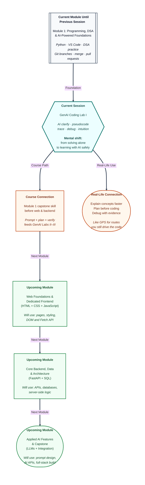

```mermaid
%%{init: {"diagramPadding": 24, "flowchart": {"htmlLabels": true, "nodeSpacing": 90, "rankSpacing": 110, "curve": "basis", "padding": 20}, "theme": "base", "themeVariables": {"fontFamily": "Arial", "fontSize": "15px", "lineColor": "#334155"}}}%%
flowchart TB
    subgraph FOUNDATION[" "]
        direction LR
        CM[["&nbsp;&nbsp;<b>Current Module Until Previous Session</b>&nbsp;&nbsp;<br/><br/>Module 1: Programming, DSA<br/>&amp; AI-Powered Foundations<br/><br/><i>Python · VS Code · DSA practice<br/>Git branches · merge · pull requests</i>"]]
    end

    CURRENT{{"&nbsp;&nbsp;<b>Current Session</b>&nbsp;&nbsp;<br/><br/>GenAI Coding Lab I<br/><br/><i>AI clarify · pseudocode<br/>trace · debug · intuition</i><br/><br/><b>Mental shift:</b><br/>from solving alone<br/>to learning with AI safely"}}

    subgraph VALUE[" "]
        direction LR
        COURSE["&nbsp;&nbsp;<b>Course Connection</b>&nbsp;&nbsp;<br/><br/>Module 1 capstone skill<br/>before web &amp; backend<br/><br/><i>Prompt + plan + verify<br/>feeds GenAI Labs II–III</i>"]
        REAL(["&nbsp;&nbsp;<b>Real-Life Connection</b>&nbsp;&nbsp;<br/><br/>Explain concepts faster<br/>Plan before coding<br/>Debug with evidence<br/><br/><i>Like GPS for routes<br/>you still drive the code</i>"])
    end

    subgraph FUTURE[" "]
        direction LR
        M2["&nbsp;&nbsp;<b>Upcoming Module</b>&nbsp;&nbsp;<br/><br/>Web Foundations &amp;<br/>Dedicated Frontend<br/>(HTML + CSS + JavaScript)<br/><br/><i>Will use: pages, styling,<br/>DOM and Fetch API</i>"]
        M3["&nbsp;&nbsp;<b>Upcoming Module</b>&nbsp;&nbsp;<br/><br/>Core Backend, Data<br/>&amp; Architecture<br/>(FastAPI + SQL)<br/><br/><i>Will use: APIs, databases,<br/>server-side logic</i>"]
        M4(["&nbsp;&nbsp;<b>Upcoming Module</b>&nbsp;&nbsp;<br/><br/>Applied AI Features<br/>&amp; Capstone<br/>(LLMs + Integration)<br/><br/><i>Will use: prompt design,<br/>AI APIs, full-stack build</i>"])
    end

    CM ==>|&nbsp;Foundation&nbsp;| CURRENT
    CURRENT ==>|&nbsp;Course Path&nbsp;| COURSE
    CURRENT ==>|&nbsp;Real-Life Use&nbsp;| REAL
    COURSE ==>|&nbsp;Next Module&nbsp;| M2
    M2 ==>|&nbsp;Next Module&nbsp;| M3
    M3 ==>|&nbsp;Next Module&nbsp;| M4

    classDef previous fill:#f8fafc,stroke:#475569,stroke-width:2px,color:#0f172a
    classDef current fill:#ecfeff,stroke:#0f766e,stroke-width:3px,color:#134e4a
    classDef value fill:#fff7ed,stroke:#c2410c,stroke-width:2px,color:#7c2d12
    classDef future fill:#f0fdf4,stroke:#15803d,stroke-width:2px,color:#14532d

    class CM previous
    class CURRENT current
    class COURSE,REAL value
    class M2,M3,M4 future

    style FOUNDATION fill:transparent,stroke:transparent
    style VALUE fill:transparent,stroke:transparent
    style FUTURE fill:transparent,stroke:transparent
    linkStyle default stroke:#334155,stroke-width:3px
```
