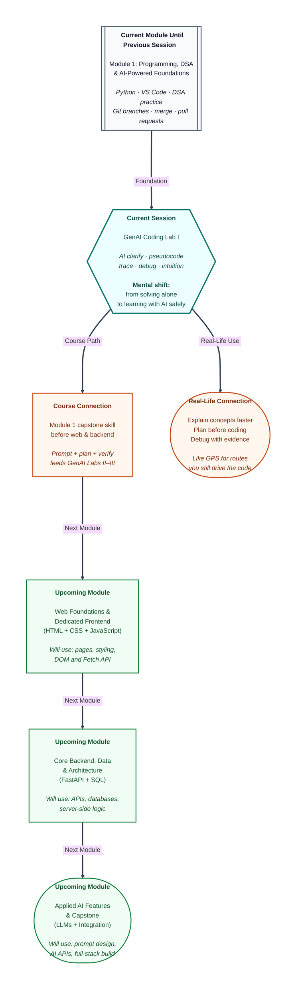

# Pre-read: GenAI Coding Lab I

Rahul opens a practice sheet the night before his internal viva. The question looks simple on paper: *"Given a list of exam roll numbers, check whether any roll number appears more than once."*

He knows what a **list** is. He remembers **loops** from earlier classes. But when he stares at the blank editor, his mind goes quiet. Should he compare every number with every other number? What happens if the list is empty? What if two duplicates sit far apart — does he still catch them?

He opens a chat tool, types *"Write the full answer for me,"* copies whatever appears, and runs it. The program prints `True` for the sample test. Relief — until the viva.

The instructor asks: *"Walk me through your logic line by line."* Rahul freezes. The code is on his screen, but the thinking is not in his head. A small change in the question — *return the duplicate value, not just True* — and he would be completely lost.

This moment is more common than people admit. **Data Structures and Algorithms** — the structured way of storing data and solving step-by-step problems on a computer — is not hard because Python is hard. It is hard because **planning** and **checking your own logic** take practice. And today, every student has a new tool sitting in the browser: **AI assistants** like **ChatGPT** and **Claude** that can explain ideas, draft plans, and help debug mistakes in seconds.

The question is not *"Should I use AI?"* The real question is *"How do I use AI so I actually learn — instead of renting an answer I cannot defend?"*

That is what this lab session is built for.

---

## Context of This Session in the Course

---

## When understanding the words is not enough

**What if** you face twenty practice problems this week — find the second highest score, count pairs that add to a target, detect duplicates, merge sorted lists — and each one needs more than one careful loop or a clear plan before you touch your keyboard?

Doing everything from scratch without help can feel slow and lonely. Jumping straight to *"AI, write the complete solution"* feels fast — until the question changes one small rule and your confidence collapses.

There is a middle path. **AI-assisted problem solving** means using smart chat tools to **clarify** confusing ideas, **draft** step-by-step plans in plain language called **pseudocode**, **trace** how those steps behave on sample input, and **debug** when your answer is wrong — while **you** stay responsible for checking every result on your own machine.

In the previous session, you learned **Git branching** and **team collaboration** on **GitHub**. That habit matters here too: keep AI-assisted experiments on a **feature branch** so your stable project copy stays clean while you try new ideas.

Before that, you already practised breaking problems into **input**, **output**, **conditions**, and **steps**, and solved questions with **lists**, **strings**, **dictionaries**, and **sorting** on your laptop. This lab does not replace that foundation. It adds a disciplined partner workflow on top of it.

---

## The Google Maps analogy for learning with AI

Think of **Google Maps** on a scooter ride through an unfamiliar city.

The app suggests a route — turn left after the petrol pump, stay on the main road for two kilometres. But **you** still ride. **You** watch for wrong turns, traffic, and closed lanes. If the map says one thing and the road shows another, **you** decide what to trust only after checking.

**AI coding tools** work the same way for DSA practice. They can suggest an explanation, a numbered plan, or a trace table — but **you** still implement, test, and verify. If AI's plan misses an empty list or double-counts a pair, **you** catch it by tracing small examples before submitting anything.

The core logic of this session is a repeatable loop:

| Step | What happens |
|---|---|
| **Understand** | Read the problem; note input, output, and rules |
| **Clarify** | Ask AI to explain any term or pattern you do not own yet |
| **Plan** | Write or generate **pseudocode** — steps in plain language before real syntax |
| **Trace** | Walk through the steps on paper or with an AI table, ball by ball |
| **Implement** | Type the solution yourself in **VS Code** |
| **Verify** | Test normal cases and edge cases |
| **Reflect** | Note the pattern so the next similar question feels familiar |

Steps two through four are where AI helps most. Steps five through seven are where **you** become the programmer — the person who can explain the answer in a viva, not just display it on a screen.

---

In this pre-read, you'll discover:

- How to use **AI tools** to **explain and clarify DSA concepts** in simple language — without copying answers you cannot defend.
- How to **generate and review pseudocode** before writing Python, so logic mistakes show up early instead of hiding inside syntax errors.
- How to **visualize step-by-step execution** with trace tables — like a ball-by-ball scoreboard — and catch wrong loop behaviour before you run anything.
- How to **debug solutions with AI** using evidence (wrong output, error messages, what you already tried) while building **problem-solving intuition** you can reuse when numbers and words change.

---

## Why this matters beyond one lab

Companies building **UPI**, food-delivery apps, and college placement platforms still ask candidates to **think in steps**, not just paste generated text. Internships expect you to read a problem, plan, test edge cases, and explain trade-offs calmly.

Learning to use AI as a **learning accelerator** — not an answer key — prepares you for later modules too. When you move into **web pages**, **backend APIs**, and eventually a full **AI-powered capstone**, the same discipline returns: draft with help, verify with your own eyes, keep experiments on separate branches, and own what you submit.

The upcoming **web foundations** module will introduce pages, styling, and browser logic. A later **GenAI coding lab** will apply the same habits to frontend work. The mindset you build now — plan first, trace second, code third — carries forward even when the tools and languages change.

---

## What's Next

After the session, you will be able to:

- Write strong **prompts** that ask AI to explain a concept with definition, analogy, example, and common mistake — at your beginner level.
- Turn a problem statement into reviewed **pseudocode** with explicit edge cases before opening your editor.
- Request and verify **trace tables** that show how variables change step by step on sample input.
- Use AI to debug with **context and evidence**, asking for causes and minimal fixes instead of blind copy-paste.
- Run the full lab loop — understand, clarify, plan, trace, implement, verify, reflect — on a DSA problem end to end.
- Save AI-assisted work safely using **Git feature branches** while keeping your stable copy trustworthy.
- Start a personal **Bug Diary** that turns one confusing mistake into long-term pattern recognition.

---

## Think About These Before the Session

These puzzles will come alive in the live lab — bring a notebook and curiosity:

- Rahul's AI-generated plan for duplicate detection compares every pair of roll numbers, but the inner loop starts at index zero instead of after the outer index. The program runs and prints an answer — why might the **count be wrong** for "how many pairs sum to target" even when duplicate True/False still looks fine?
- A trace table for input `[4, 7, 4, 9]` shows a match at step two and returns **True** immediately. If Rahul keeps tracing to step ten out of habit, what does that tell you about **reading stop conditions** carefully in algorithms?
- Priya asks AI, *"Explain nested loops,"* and gets a long essay she cannot reuse. What three things should she add to her prompt so the reply is **short, structured, and at her level** — like asking a patient senior after class?
- After AI drafts pseudocode for "second largest unique score," the plan forgets what happens when **all scores are equal**. Which manual checks — empty list, one item, all same — must you run **before** trusting any generated plan?
- Rahul finishes an AI-assisted solution and commits directly to **main**. His teammate pulls the next morning and the shared project breaks. How does the **branching habit** from the previous session protect both Rahul and the team when experimenting with AI output?

If you already solve basic DSA problems on your laptop and save work with Git, you have the foundation. This session adds the layer every modern developer needs: **using AI without outsourcing your thinking**. The live class will walk you through each stage until the workflow feels natural — like checking Google Maps, then riding the route yourself with your eyes open.
