# Pre-read: HTML Structure and Semantic Markup

Priya’s college fest team needs a simple website by Friday. Nothing fancy — just a clean home page, a short “About the Event” section, a photo from last year, links to the registration Google Form, and a contact box where visitors can type their name and email.

She opens her laptop, creates a blank document, and starts typing: big title at the top, a paragraph underneath, maybe a bullet list of events. It *looks* like a webpage in her mind. She saves the file, double-clicks it, and… the browser shows plain text. No headings. No clickable links. The “Submit” box she drew with underscores does nothing.

Her teammate says, *“Just use a website builder.”* That works for a one-off poster. But Priya is learning to build **agentic systems** — software that helps people get things done. Every chat dashboard, login screen, and feedback form she will touch later starts with the same question: **how do you describe a page so a browser understands it?**

That question is older than Python loops or Git branches. It is the front door of the web. And it has a name: **HTML** — the standard way to mark up content so browsers know what is a heading, what is a paragraph, what is a link, and what is a form field waiting for user input.

Until now, your practice lived mostly on the **logic side** — Python programs, DSA patterns, Git history, AI-assisted planning. All of that still matters. But the moment an application faces a real person, someone has to build what they **see and click**. That is **frontend work**, and HTML is its foundation.

---

## Context of This Session in the Course

```mermaid
%%{init: {"diagramPadding": 24, "flowchart": {"htmlLabels": true, "nodeSpacing": 90, "rankSpacing": 110, "curve": "basis", "padding": 20}, "theme": "base", "themeVariables": {"fontFamily": "Arial", "fontSize": "15px", "lineColor": "#334155"}}}%%
flowchart TB
    subgraph FOUNDATION[" "]
        direction LR
        PM[["&nbsp;&nbsp;<b>Previous Module</b>&nbsp;&nbsp;<br/><br/>Module 1: Programming,<br/>DSA &amp; AI Foundations<br/><br/><i>Python · VS Code · DSA<br/>Git · AI-assisted coding</i>"]]
        CM[["&nbsp;&nbsp;<b>Current Module Until Previous Session</b>&nbsp;&nbsp;<br/><br/>Module 1 completed<br/><br/><i>Logic building · Git collaboration<br/>GenAI lab workflow</i>"]]
    end

    CURRENT{{"&nbsp;&nbsp;<b>Current Session</b>&nbsp;&nbsp;<br/><br/>HTML Structure &amp;<br/>Semantic Markup<br/><br/><i>Document skeleton · tags<br/>forms · accessibility</i><br/><br/><b>Mental shift:</b><br/>from backend logic<br/>to what users see"}}

    subgraph VALUE[" "]
        direction LR
        COURSE["&nbsp;&nbsp;<b>Course Connection</b>&nbsp;&nbsp;<br/><br/>First step in web stack<br/>before CSS &amp; JavaScript<br/><br/><i>Structure feeds styling,<br/>DOM, and capstone UI</i>"]
        REAL(["&nbsp;&nbsp;<b>Real-Life Connection</b>&nbsp;&nbsp;<br/><br/>Build pages users click<br/>Forms, links, readable layout<br/><br/><i>Like restaurant menu<br/>before decoration</i>"])
    end

    subgraph FUTURE[" "]
        direction LR
        M2["&nbsp;&nbsp;<b>Upcoming Module</b>&nbsp;&nbsp;<br/><br/>Module 2 continues:<br/>CSS · JS · DOM · Fetch<br/><br/><i>Will style &amp; animate<br/>HTML you build today</i>"]
        M3["&nbsp;&nbsp;<b>Upcoming Module</b>&nbsp;&nbsp;<br/><br/>Core Backend, Data<br/>&amp; Architecture<br/><br/><i>FastAPI · SQL · APIs<br/>connect to frontend forms</i>"]
        M4(["&nbsp;&nbsp;<b>Upcoming Module</b>&nbsp;&nbsp;<br/><br/>Applied AI Features<br/>&amp; Capstone<br/><br/><i>LLMs · AI APIs<br/>full-stack agentic apps</i>"])
    end

    PM ==>|&nbsp;Foundation&nbsp;| CM
    CM ==>|&nbsp;Blueprint&nbsp;| CURRENT
    CURRENT ==>|&nbsp;Course Path&nbsp;| COURSE
    CURRENT ==>|&nbsp;Real-Life Use&nbsp;| REAL
    COURSE ==>|&nbsp;Next Module&nbsp;| M2
    M2 ==>|&nbsp;Next Module&nbsp;| M3
    M3 ==>|&nbsp;Next Module&nbsp;| M4

    classDef previous fill:#f8fafc,stroke:#475569,stroke-width:2px,color:#0f172a
    classDef current fill:#ecfeff,stroke:#0f766e,stroke-width:3px,color:#134e4a
    classDef value fill:#fff7ed,stroke:#c2410c,stroke-width:2px,color:#7c2d12
    classDef future fill:#f0fdf4,stroke:#15803d,stroke-width:2px,color:#14532d

    class PM,CM previous
    class CURRENT current
    class COURSE,REAL value
    class M2,M3,M4 future

    style FOUNDATION fill:transparent,stroke:transparent
    style VALUE fill:transparent,stroke:transparent
    style FUTURE fill:transparent,stroke:transparent
    linkStyle default stroke:#334155,stroke-width:3px
```

---

## When a page looks fine to you but breaks for someone else

**What if** you had to publish ten different pages this month — a workshop signup, a project portfolio, a simple blog post, a contact form — and every page had to work on a phone, make sense to a screen reader, and stay easy for a teammate to update?

You could paste random text into a file and hope the browser guesses your intentions. Sometimes it will. Often it will not. Headings will look like body text. Links will not go anywhere. Form fields will have no labels, so users on mobile cannot tell which box is for email. Search tools will not know which part is the main article and which part is a sidebar.

Doing this by hand without structure feels like writing a wedding invitation where the venue address is hidden in fine print on the envelope flap while the greeting card repeats the same sentence five times. Guests arrive confused. Some never arrive at all.

There is a better way. **Structured HTML** gives every page a predictable skeleton — a **head** section for backstage details like the title on the browser tab, and a **body** section for everything visitors actually read. Inside the body, you choose tags that describe **meaning**, not just appearance: navigation here, main article there, footer at the bottom.

In the previous session, you practised **AI-assisted problem solving** and **Git collaboration** — planning before coding, tracing logic, keeping experiments on safe branches. Those habits transfer directly. You will still plan before you type, still save versions of your work, still check results with your own eyes. The language changes from Python to **HTML**, but the discipline stays.

---

## The restaurant analogy for the web

Think of a busy restaurant on a Saturday night.

The **frontend** is what guests experience: the menu design, the table layout, the waiter who takes the order, the “Pay Here” button on the billing tablet. You see it, read it, tap it.

The **backend** is the kitchen, the inventory room, the payment gateway confirming whether your UPI went through. Important — but mostly hidden.

**HTML** is the blueprint that tells the browser what belongs in the dining area. It does not paint the walls (**CSS** handles colours and layout later). It does not cook the food (**JavaScript** and server logic handle actions later). It answers a simpler question first: *What is this piece of content — a title, a paragraph, a link, a form field?*

**Semantic HTML** goes one step further. Instead of throwing everything into anonymous boxes, you label sections the way a **tiffin carrier** has separate compartments — dal here, roti there, rice below. A person opening the carrier instantly knows where to look. A browser, a search engine, and assistive tools get the same clarity when you use meaningful tags like **header**, **nav**, **main**, and **footer** instead of a confusing pile of identical containers.

That is the core logic of this session: **structure before decoration, meaning before magic.**

| Layer | Simple job | Restaurant picture |
|---|---|---|
| **HTML** | Describe what each block is | Menu sections labelled “Starters,” “Mains,” “Desserts” |
| **CSS** | Control how it looks | Font, colours, spacing on the menu card |
| **JavaScript** | React when users act | Waiter sends order to kitchen when you tap “Confirm” |

You do not need to be an artist to start. You need to be organised — the same skill that helped you break DSA problems into input, output, and steps.

---

In this pre-read, you'll discover:

- What **frontend developers** actually do — and how **HTML** fits beside the Python and Git skills you already built.
- How a proper **HTML document** is organised — the invisible **head** versus the visible **body**, and why that split matters before you add a single heading.
- How to build readable pages with **headings**, **paragraphs**, **links**, and **images** — the four building blocks of almost every site you use daily.
- Why **semantic tags** and **accessible forms** (labels, input types, buttons) are not “extra credit” — they are how professional pages stay usable for everyone, including future you when you return to your own code after a month.

---

## Why this matters for your path ahead

Every product you admire — college portals, internship dashboards, AI chat tools — renders **HTML** underneath. When you later add **CSS** to style pages and **JavaScript** to make buttons respond, you will be decorating and wiring a house whose rooms you defined today.

Backend modules will teach you how form data reaches a server. Capstone modules will ask you to connect frontend screens to **AI features**. If the HTML skeleton is sloppy, everything stacked on top wobbles — like building floors on a crooked foundation.

Learning HTML now also makes you a sharper reviewer when **AI tools** generate page markup for you. You will know whether the output uses proper labels, one clear main heading, and meaningful structure — or whether it is a messy shortcut you should reject.

---

## What's Next

After the session, you will be able to:

- Explain the **frontend developer's role** and describe how a browser turns an HTML file into a page you can click.
- Create a valid **HTML5 document** with **head** and **body**, then open it in Chrome or Firefox from your own laptop.
- Build a mini page with **headings**, **paragraphs**, **links**, and an **image** that includes helpful **alt text**.
- Lay out content using **semantic elements** — **header**, **nav**, **main**, **article**, **section**, **footer** — so the page outline makes sense even without styling.
- Design a **registration or feedback form** with **labels**, common **input types**, radio buttons, checkboxes, and submit/reset buttons.
- Apply basic **accessibility habits** — logical heading order, meaningful link text, keyboard-friendly controls — and explain why they help real users.
- Connect this work to your existing **Git** habit by saving each practice page in a project folder you can version and share.

---

## Think About These Before the Session

Bring curiosity — these scenarios will come alive in the live class:

- Priya saves her fest page as `notes.txt` and sees raw angle brackets in the browser. What must change about the **file type and document skeleton** before Chrome treats it as a real webpage?
- A page has five identical “Click here” links in a row. Why would a classmate using a **screen reader** struggle — and what would you write instead for each link?
- Two teammates both used generic boxes for navigation, main content, and footer. One used **semantic tags**, one did not. The pages look identical on screen. Why might the semantic version still be the better professional choice?
- A registration form shows placeholder text inside each field (“Enter your email”) but no visible labels. Mobile users tap the wrong box and submit incomplete data. What simple HTML pairing fixes this — and why does it help even when the page looks fine to you?
- Rahul builds a workshop signup with **Online** and **Offline** options, but both can stay selected at once. What logical rule about **radio buttons** is he missing — and how is that different from **checkboxes** for “topics I want”?

If you have been writing Python on your laptop, using Git branches, and planning before you code, you already have the mindset this session needs. The live class will show you how to turn that discipline toward **pages people actually use** — starting with structure you can be proud of before a single colour is applied.
