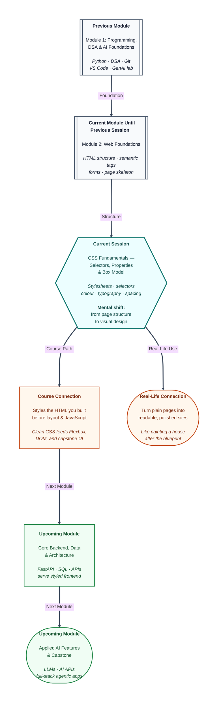

# Pre-read: CSS Fundamentals – Selectors, Properties & Box Model

Priya finally has her college fest pages working. The **HTML** is solid — headings, a photo from last year, links to registration, and a contact form. She opens the files in Chrome, feels proud for three seconds… then her friend laughs politely.

“It looks like a Word document from 2005.”

Black text. Blue underlined links. Everything stacked tightly with no breathing room. The content is correct. The *look* is not. Mentors, sponsors, and first-year students will judge the fest by what they see in the first two seconds — not by how carefully she tagged her sections.

Her teammate suggests Canva screenshots or a drag-and-drop builder. That can save a poster. It will not teach Priya how **agentic systems** and real products get their visual identity. Every dashboard, portfolio, and chat interface she builds later will need the same skill: **tell the browser how the page should look** — colours, fonts, spacing, and borders — without rewriting the structure she already created.

That skill has a name: **CSS** — Cascading Style Sheets. If HTML is the skeleton of a house, CSS is the paint, tiles, curtains, and furniture arrangement. Same rooms. Completely different first impression.

---

## Context of This Session in the Course

---

## When the page is correct but nobody wants to read it

**What if** you had to polish five pages this week — a profile, a registration form, a small portfolio, a workshop notice, a contact page — and every page must look consistent: same heading colour, same readable font, same comfortable spacing, same button style?

You could paste colours onto each tag one by one. Change the brand blue later, and you hunt through every file like finding a missing sock after laundry day. Or you copy the same style block into ten HTML files — until one file drifts out of sync and your “brand” becomes three slightly different blues.

Doing visual design without a system feels like decorating a wedding hall by sticking a sticky note on each chair: “paint this one navy.” It works for one chair. It collapses for a hundred.

There is a better way. **CSS** lets you write design rules once and apply them to the right parts of the page. You already built the **structure** in the previous session. Now you add the **look** — without throwing away that structure.

---

## The school notice board — and three ways to decorate it

Think of a school notice board.

The **text on the paper** is your HTML — the announcement itself. **CSS** is the coloured paper, the border, the bold marker size, and the space you leave so the message does not feel cramped.

You can decorate in three practical ways:

| Approach | Everyday picture | Best when |
|---|---|---|
| **Inline** | A sticky note on one chair | Quick one-off experiments |
| **Internal** | Decorations planned only for today’s hall | A single demo page |
| **External** | A decorator’s master theme used at every venue | Real sites and portfolios |

Professionals prefer a **shared stylesheet** — one design booklet many pages can follow. Change the theme once; every linked page updates when you refresh. That is how you keep a fest site, a portfolio, and a registration page looking like one product instead of three accidents.

---

## Selectors: who gets painted?

A CSS rule has two jobs: **who** to style, and **what** to change.

Imagine a coaching centre classroom:

- An **element** rule paints *every* bench — useful for “all paragraphs should be readable grey.”
- A **class** rule paints benches tagged “VIP” or “front row” — reusable highlights, cards, and buttons.
- An **id** rule paints the *one* chair with the Director’s nameplate — a unique main wrapper or hero block.

Properties are the paintbrush settings: **colour** (ink), **background** (paper), **typography** (how large, bold, or spaced the writing looks), and **borders** (the photo frame around a block). Hex colours like a deep festival blue are common in professional work — and contrast still matters so light grey on white does not fail readers.

---

## The tiffin box model

Here is the core logic of spacing on the web.

Every piece of content sits in a rectangular box. Think of a **tiffin** on a desk:

| Layer | Simple meaning | Tiffin picture |
|---|---|---|
| **Content** | The text or image itself | The food inside |
| **Padding** | Space between content and the edge | Gap from food to the steel wall |
| **Border** | The visible outline | The steel rim of the box |
| **Margin** | Empty space outside the box | Gap before the next tiffin on the shelf |

Once you see pages as stacked tiffins — not floating words — spacing stops feeling mysterious. You stop stuffing empty lines everywhere and start deciding *inner space* versus *outer space* on purpose. Browser tools even draw these layers in colour so you can *see* what your rules did.

---

In this pre-read, you'll discover:

- Why **CSS** exists — and how it turns structured HTML into pages people actually want to open.
- How to **link styles** to HTML using sticky-note, single-page, and shared-file approaches — and which one scales.
- How **element, class, and id selectors** decide *who* gets styled, while **properties** decide *what* changes — colour, type, backgrounds, borders.
- How the **box model** (content, padding, border, margin) explains spacing the way a tiffin explains packed lunch.

---

## Why this matters for your path ahead

Upcoming sessions will teach **layout systems** that arrange sections side by side, then **JavaScript** that makes buttons and forms react. None of that looks professional if the base colours, fonts, and spacing are random.

Backend modules will send data to screens you design. Capstone work will ask for polished UI around **AI features**. Clean CSS habits — shared files, reusable classes, predictable boxes — keep those screens maintainable when AI tools generate markup and you must review whether the styling is organised or a mess of one-off sticky notes.

You already practise planning and versioning with **Git**. Treat your stylesheet the same way: one clear design source, small intentional changes, refresh, verify.

---

## What's Next

After the session, you will be able to:

- Explain what **CSS** does beside HTML — presentation versus structure — in plain language.
- Apply styles using **inline**, **internal**, and **external** stylesheets, and choose the right approach for practice versus real projects.
- Write **element**, **class**, and **id** selectors and combine them with core properties for **colour**, **typography**, **backgrounds**, and **borders**.
- Describe and apply the **box model** — content, padding, border, margin — and use browser inspection to check spacing visually.
- Attach a shared stylesheet to the HTML pages you already built and turn a plain document into a readable, branded-looking page.

---

## Think About These Before the Session

Bring curiosity — these challenges come alive in the live class:

- Priya changes her heading colour on **ten** HTML pages. In which approach — sticky note on each tag, style block inside each file, or one shared design file — does she finish fastest, and why do professionals almost always pick the third?
- A coaching page has three “note” paragraphs and one sidebar. How would you style *all* paragraphs grey, only the notes with a soft highlight, and the *single* sidebar with its own background — without repeating the same decoration on every tag by hand?
- Two tiffin boxes sit on a desk. One feels cramped inside; the other almost touches its neighbour. Which layer is **padding**, which is **margin**, and what goes wrong if you only use empty line breaks to “create space”?
- Rahul sets a box to a fixed width, then adds thick padding and a border. Suddenly the box looks wider than he expected and breaks his layout. What mental model about “width” is he missing — and how does a common sizing habit keep measurements predictable?
- Your fest profile and registration pages must share the same navy headings and soft page background. What would you put in a shared stylesheet first — and what would you leave unique to each page?

If your HTML pages already open in the browser, you have the blueprint. The live session adds the paint, the frames, and the breathing room — so the same content finally looks like a site people trust.
