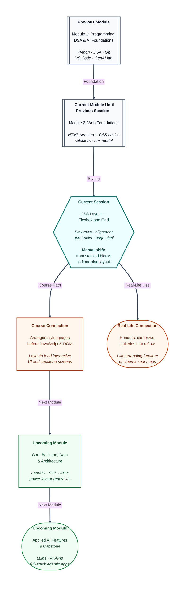

# Pre-read: CSS Layout – Flexbox and Grid

Priya’s fest pages finally have colour. Navy headings. Soft backgrounds. Comfortable padding. Mentors nod at the design… then someone opens the site on a phone and frowns.

Everything is still a **single tall column**. The logo sits above the menu. Three project cards stack like a grocery list. The footer floats somewhere after a long scroll. On a wide laptop screen, huge empty side margins make the page look lonely — like furniture pushed against one wall of an empty hall.

Her friend asks the question every visitor thinks: *“Where is the header bar? Why aren’t the cards side by side?”*

Priya knows the **structure** (HTML) and the **paint** (colours, fonts, spacing). What she does not have yet is a **floor plan** — a way to place sections across the screen the way a railway chart places seats in rows and columns, not as one endless vertical list.

That skill is **CSS layout**. And the two tools professionals reach for first are **Flexbox** and **Grid**.

---

## Context of This Session in the Course

---

## When paint is ready but the furniture is still in a pile

**What if** you had to ship a portfolio this week with a top bar (brand on the left, links on the right), a main area with three project cards in a row, and a footer pinned to the bottom of the screen — and the same page must still make sense when someone squeezes the browser to phone width?

You could fight the browser with random margins, empty spacer boxes, and “move this left a little.” That is like rearranging a living room by kicking sofas until they *almost* look right. On a different screen size, everything collapses again.

Browsers, by default, stack block sections top to bottom and stretch them full width. Colours and fonts do not change that stacking habit. You need layout tools that answer a new question: **where does each block sit, and how does it share the screen with its neighbours?**

---

## Flexbox — one line of control

**Flexbox** is a **one-dimensional** layout model. Think of a **bus seat row** or a **school lunch queue**: items line up along one main direction — left to right, or top to bottom.

You mark a **parent** as the flex container. Its direct children become flex items automatically. Then you decide:

| Idea | Everyday meaning |
|---|---|
| **Direction** | Does the queue go sideways or up-down? |
| **Wrap** | When the shelf fills, do extras start a new shelf? |
| **Justify** | How do you spread items along the line — packed left, centred, or space between? |
| **Align** | How do items sit on the “shelf height” — top, centre, or stretched? |

A navigation bar is classic Flexbox: logo on one end, links on the other, vertically centred in a blue strip. A row of cards that grow, shrink, and wrap on a narrow phone is Flexbox again — siblings sharing leftover sweets fairly when the tray is wide, and giving space back when the tray shrinks.

**Rule of thumb:** if the problem is mostly *one row or one column of things that need to align and share space*, start with Flexbox.

---

## Grid — the cinema seating chart

**CSS Grid** is **two-dimensional**. Think of a **cinema hall seating plan** or a **spreadsheet**: rows *and* columns form cells, and each piece of content sits in a cell (or spans several).

| Need | Prefer |
|---|---|
| One row of nav links | **Flexbox** |
| Cards wrapping in a flexible row | **Flexbox** |
| Whole page zones — header, main, sidebar, footer | **Grid** |
| Photo gallery with neat columns | **Grid** |

With Grid you draw tracks — how many columns, how tall the rows are, how wide the aisles (**gaps**) should be. Fractions of free space let regions grow and shrink as the window changes. You can even map named areas the way a newspaper front page assigns the lead story two columns and side stories one column each.

**Rule of thumb:** if you are designing the **floor plan of the whole page**, start with Grid.

---

## Combining both — rooms and furniture

Professionals rarely pick only one tool forever. A common pattern:

1. **Grid** draws the house — header across the top, flexible main in the middle, footer at the bottom.
2. **Flexbox** arranges furniture *inside* a room — brand and nav inside the header; equal cards inside the main section.

Resize the browser and watch: the page shell keeps its zones, while card columns drop from three to two to one as space runs out. That “it still looks intentional on my phone” feeling is layout working — not luck.

In the previous session you controlled **how each box looks**. This session controls **how boxes sit relative to each other and to the viewport**.

---

In this pre-read, you'll discover:

- Why styled pages can still feel unfinished until you learn **layout** — arranging sections like furniture, not stacking them like a shopping list.
- How **Flexbox** handles one-dimensional alignment — queues, toolbars, and wrapping card rows.
- How **CSS Grid** handles two-dimensional page structure — cinema-style rows and columns for header, main, and footer.
- How to **combine** Flexbox and Grid so a full page reflows when the browser window changes width.

---

## Why this matters for your path ahead

Upcoming sessions introduce **JavaScript** and the **DOM** — making buttons respond and content update. Interactive UI still needs a readable frame: a stable header, a main content column, cards that do not explode on mobile.

Backend modules will fill those cards with real data. Capstone and **AI** screens will need dashboards and galleries that look planned, not improvised. When AI tools generate layout CSS for you, you will know whether they chose Flexbox for a nav row and Grid for the page shell — or mixed them in a confusing way you should fix.

Keep the same habits you already use: small intentional changes, save versions, refresh the browser, and *watch what happens when you drag the window edge*. Layout is a skill you verify with your eyes.

---

## What's Next

After the session, you will be able to:

- Explain when to reach for **Flexbox** (one dimension) versus **Grid** (two dimensions) in plain language.
- Build a flex **navbar** with direction, gap, **justify-content**, and **align-items**.
- Create **grid** galleries and page shells with template rows/columns, gaps, and sensible track sizing.
- Place regions with spanning cells or named areas for **header**, **main**, and **footer**.
- **Combine** Grid and Flexbox on one responsive practice page and watch columns reflow as you resize the browser.

---

## Think About These Before the Session

Bring curiosity — these challenges come alive in the live class:

- Priya’s logo and three menu links sit in a header. She wants the brand on the left, links on the right, and everything vertically centred. Is that a **Flexbox** problem or a **Grid** problem — and which parent do you turn into the container?
- Three project cards look perfect on a laptop but overflow off-screen on a phone. What Flexbox ideas — **wrap**, **grow/shrink**, starting width — help them share space and drop to a new line instead of breaking the page?
- A portfolio needs a full-height feeling: header on top, main content filling the middle, footer near the bottom even when content is short. How does a simple **three-row Grid** page shell solve that better than stacking alone?
- Six gallery boxes should show as many neat columns as fit, then drop to fewer columns as the window narrows — without writing separate “phone rules” by hand. What Grid thinking (equal tracks, minimum width, auto-fit) makes that possible?
- A teammate styles the *child* links with layout properties and wonders why nothing moves. What common mistake about **container versus items** is almost certainly the cause?

If your pages already look painted, you are ready for the floor plan. The live session turns stacked boxes into headers, card rows, and full-page shells that still behave when someone opens them on a smaller screen.
