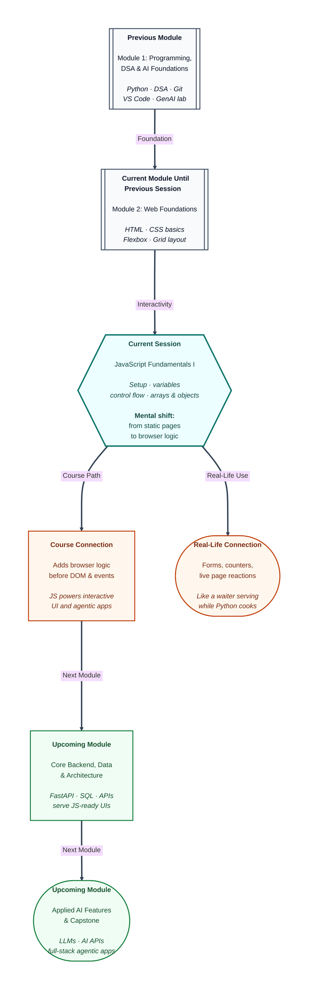

# Pre-read: JavaScript Fundamentals I

## Context of This Session in the Course

---

Aman finishes his college fest landing page late at night. The **HTML** is clean. The **CSS** looks sharp — Flexbox header, Grid cards, colours mentors like. On a laptop it looks ready to ship.

Then a friend asks: “Nice. Now make Register show seats left. If seats hit zero, change the message. Warn them if the name is blank *before* they leave.”

Aman freezes. The page can *look* finished… but it still cannot *decide*, *count*, or *react*. It is a beautiful poster stuck to the wall of the internet.

**What if** every click and tiny yes/no check meant redrawing the whole site — or calling a distant server for every napkin-sized request?

That gap is filled by **JavaScript** — the language that runs **inside the browser** so your page can think while the visitor is still looking at it.

---

## You already know how to think like a programmer

In Module 1 you learned **Python**. You already understand ideas like storing values, writing conditions, and repeating work with loops. That foundation does not disappear here.

So why learn another language?

Think of a busy Indian restaurant:

- **Python** is often the **kitchen manager** — cooking logic on a server, crunching data, talking to databases.
- **JavaScript** is the **waiter on the floor** — standing with the guests (the browser), taking orders, updating the table, reacting the moment someone clicks.

Guests do not walk into the kitchen for every small request. The waiter handles the live moment. That is why websites need JavaScript even when the team already knows Python.

In the previous session you arranged furniture with **Flexbox** and **Grid**. Now you hire the person who can *move* furniture when a visitor asks.

---

## The challenge: a page that only “looks” smart

Imagine you must deliver this by Friday for a campus workshop page:

| Visitor action | What should happen |
|---|---|
| Opens the page | See “Seats left: 40” update without reloading the whole internet |
| Clicks Register when seats remain | Count goes down; message stays friendly |
| Seats reach zero | Show “Waitlist only” and disable the happy path |
| Types a blank name | Get a clear warning before anything is “submitted” |

Doing this by redrawing the whole site for every click is slow and painful. Waiting for a distant server for every tiny check feels like calling the kitchen for every napkin.

You need rules that live **next to the page** — in the browser — so decisions happen instantly.

---

## JavaScript — the waiter who follows rules

**JavaScript** is the standard language browsers understand for interactivity. In simple words: it is how you teach a web page to *respond*.

In this session you will not jump straight to fancy buttons. You will first learn the waiter’s basic habits:

1. **Setup** — attach JavaScript to HTML and talk to the **Developer Console** (the browser’s “billing screen” that shows messages and errors).
2. **Variables & data types** — store names, numbers, true/false values, and know when a value is empty on purpose.
3. **Control flow** — decide with conditions (`if` thinking) and repeat with loops (do this for every seat, every mark, every card).
4. **Data structures** — keep ordered lists (**arrays**, like numbered spice jars on a shelf) and labelled records (**objects**, like drawers marked Name, Age, Plan).

These are the same mental muscles you used in Python — with browser-friendly rules and a new way to declare names.

---

## Labels, paths, shelves, and drawers

In Python you often write a name and give it a value. In JavaScript you still store values in named boxes, but you also choose *how locked* the box is.

- **`let`** is a **refillable jar** — useful for counters like “seats left.”
- **`const`** is a **sealed jar** — the binding should not be reassigned by accident.
- Older **`var`** still exists; modern projects prefer clearer, safer choices.

**Control flow** means: *what should happen next?* Picture a campus fork — **if** true, take the green gate; **else**, take the other road. A circular track is a **loop** — repeat until a stop rule is met. Careful comparisons matter so text `"5"` is not confused with number `5` when values come from forms.

Once you can decide and repeat, store related information well:

- A **string** holds text — messages and names.
- An **array** is an **ordered shelf** (slot 0, 1, 2) — marks, colours, seats.
- An **object** is a **labelled drawer cabinet** — `name`, `age`, `plan` for one student or user.

You already used list-and-dictionary thinking in Python. Here you map that skill to browser tools so upcoming work on the **DOM** (the live page blueprint) and events can update real screens.

---

In this pre-read, you'll discover:

- Why a polished **HTML + CSS** page can still feel “dead” until it can decide and react in the **browser**.
- Why **JavaScript** is needed even after **Python** — kitchen vs waiter, server vs guest-facing floor.
- How **variables**, **conditions**, **loops**, **arrays**, and **objects** become the waiter’s basic toolkit.
- How **console** feedback helps you debug like a detective before bigger UI work begins.

---

## Why this matters for your path ahead

Upcoming sessions deepen **functions**, **scope**, then **DOM** and **events**. With today’s fundamentals, those topics feel like tools — not magic.

Backend modules will cook real data in the kitchen. Capstone and **AI** screens will need pages that react while users click and correct mistakes. When tools generate JavaScript for you, you will spot wrong jars, endless loops, or text-vs-number confusion.

Keep the habit: change one idea at a time, refresh, and watch the **console**.

---

## What's Next

After the session, you will be able to:

- Attach **JavaScript** to an HTML page and verify it with **console** messages.
- Choose between **`let`** and **`const`** with clear intent (and know why older **`var`** is usually avoided).
- Write **conditions** and **loops** for everyday browser decisions.
- Use **strings**, **arrays**, and **objects** in small practical programs that prepare you for interactive pages.

---

## Think About These Before the Session

Bring curiosity — these challenges come alive in the live class:

- “Seats left: 40” should drop after each Register click. Is that a **refillable** value or a **sealed** one — and what breaks if you pick wrong?
- A form gives text `"18"` while your rule expects number `18`. Why can a careless equality check surprise you?
- Four workshop marks need a total and average without four separate add lines. How do an **array** and a **loop** help?
- Why is one labelled **object** clearer than three loose variables for name, age, and active status?
- The page looks fine but nothing runs. Do you check the **script** link first, or the **console** — and what does each reveal?

If your layouts already look intentional, you are ready for the next leap: teaching the browser to think. The live session turns static posters into pages that can count, decide, and store information — the foundation every interactive web feature stands on.
