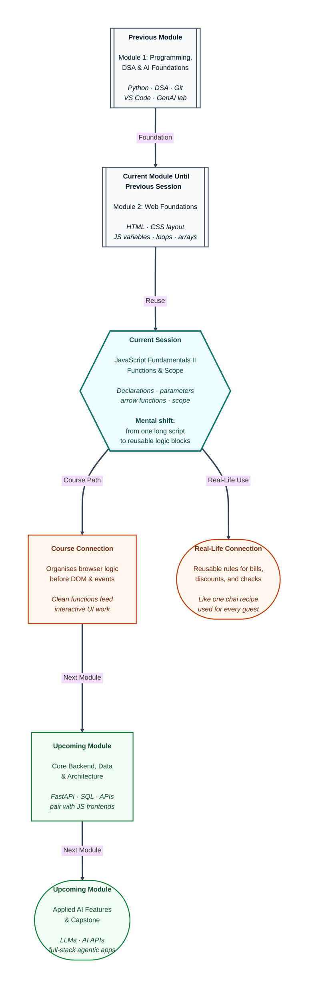

# Pre-read: JavaScript Fundamentals II – Functions & Scope

## Context of This Session in the Course

---

Riya’s college fest page finally *reacts*. Seats drop when someone registers. A blank name gets a warning. The browser console shows neat messages when she tests her logic.

Then her team lead sends a new requirement: add a **10% student discount**, a **delivery fee rule**, and a **pass/fail badge** for workshop scores — all on the same page.

Riya opens her script and sighs. The discount formula is copied in four places. The delivery fee logic appears twice with slightly different numbers. One copy still uses the old tax rate from last week.

She fixes the tax rate in one spot… and forgets the other three. The page works for notebooks but shows wrong totals for T-shirts. Her friend tests it at midnight and sends a screenshot: *“Why is my bill different from yours?”*

That is not a styling problem. It is an **organisation** problem.

---

## You already know pieces — now you need reusable rules

In the previous session you learned how JavaScript stores values, makes decisions, and repeats work with loops. You can already think in terms of “if this, then that” and “do this for every item in a list.”

In Module 1 you also wrote **functions** in **Python** — reusable blocks that accept inputs and give back answers. That skill transfers directly here.

So what is new?

Until now, your browser script may read like one long diary — line after line from top to bottom. That works for small demos. The moment the same calculation appears in many places, your program becomes fragile.

**Functions** are how professional developers write a rule once and call it whenever needed. **Scope** is how they decide which values belong to the whole program and which belong only inside one small task — so nothing accidentally gets overwritten.

---

## The challenge: one page, many repeated jobs

Imagine you must ship this fest checkout experience by Friday:

| Situation | What should happen |
|---|---|
| Visitor buys 3 notebooks at ₹40 each | Show correct line total without rewriting the multiply rule |
| Same visitor adds a T-shirt | Reuse the same billing logic with different price and quantity |
| Student discount applies | Calculate savings once, use the result everywhere |
| Delivery fee is added | One clear rule — not two slightly different copies |
| Workshop score is checked | Show Pass or Fail using the same threshold rule for every student |

**What if** every new product meant copying and pasting the same five lines again?  
**What if** fixing one tax rate meant hunting through fifty similar blocks?

Doing this by hand is like running a chai stall where you re-explain the full recipe to every customer instead of keeping one card on the counter. One small change — less sugar, more ginger — and you must re-teach everyone from scratch.

You need **named, reusable logic** that accepts different inputs and hands back clear answers.

---

## Functions — your reusable recipe cards

A **function** is a named block of work you can run again and again. In simple words: write the steps once, use them whenever the same job appears.

Think of a busy **chai stall** near a railway station:

- The **recipe card** on the counter is the function — same steps every time.
- Each customer’s order — “two cups, less sugar” — is the **input**.
- The cup handed back is the **result**.

You do not rewrite the entire chai method for every passenger. You follow the card, change only what the customer asked for, and serve.

In JavaScript you will meet a few ways to write these recipe cards:

- **Function declarations** — like a clearly labeled page in a notebook (“How to calculate bill”).
- **Function expressions** — like storing the recipe card inside a named folder you can pass around.
- **Arrow functions** — a shorter notation for small, focused rules (popular in modern browser code).

You will also learn how **parameters** (the empty slots in the definition) and **arguments** (the real values you pass in) work together — and how **return** sends an answer back to whoever called the function.

---

## Scope — who is allowed to see which value?

Functions do more than reuse logic. They also create **boundaries**.

**Scope** means: *where is this value visible?* In simple words, it is the rulebook for which names the whole program can see and which names stay private inside one task.

Picture a college campus:

- A notice on the **main gate** is visible to everyone — like a **global** value shared across the program.
- Notes on a **classroom whiteboard** are visible only inside that room — like a **local** value inside one function.
- Sticky notes passed during one meeting are not automatically available in the next room — like **block scope**, where a value lives only inside a pair of curly braces.

Why does this matter for Riya’s fest page?

If every variable is “global,” changing the discount for T-shirts might accidentally change the notebook calculation too. Scope keeps each job’s working notes separate so fixes stay safe.

---

In this pre-read, you'll discover:

- Why copying the same logic many times creates silent bugs — and how **functions** keep one source of truth.
- How **parameters**, **arguments**, and **return values** turn a generic recipe into answers for real situations.
- Why JavaScript offers more than one way to write a function — and when a shorter **arrow function** is a good fit.
- How **global**, **function**, and **block scope** protect your program from accidental mix-ups.

---

## Why this matters on your path ahead

The next topics in this module connect functions directly to the live page — clicking buttons, reading form values, updating what visitors see. Without reusable functions, that work becomes a tangled script nobody can debug.

Later, when backend modules handle data in the kitchen and capstone screens need polished frontends, teams expect small, testable helpers: `calculateTotal`, `applyDiscount`, `checkPass`. When AI tools generate JavaScript for you, you will spot duplicated logic, missing returns, and variables used outside the wrong boundary.

The habit to build today: one function, one clear job, one safe place for its working values.

---

## What's Next

After the session, you will be able to:

- Write **function declarations** and **function expressions** for reusable browser logic.
- Pass **parameters**, supply **arguments**, and use **return values** in practical mini-programs.
- Choose **arrow functions** appropriately when a short rule keeps code readable.
- Apply **scope** rules so global, local, and block-scoped values stay where they belong.
- Combine small helpers into cleaner programs that prepare you for DOM and event work.

---

## Think About These Before the Session

Bring these puzzles to the live class — they turn abstract ideas into satisfying “aha” moments:

- Riya’s discount formula appears in four places and one copy still uses an old tax rate. How would **one function** change the way she fixes bugs?
- A chai stall owner takes “sugar level” from each customer but keeps one recipe card. What is the difference between the **slot on the card** and the **customer’s actual choice**?
- A function calculates the correct total inside its own working space but never sends the answer back. Why might the caller see nothing useful — and what concept fixes that?
- Two different parts of a program both use a variable named `total`. One updates it for T-shirts; the other reads it for notebooks. Why can **scope boundaries** prevent this mix-up?
- Modern JavaScript often uses a shorter “arrow” style for tiny rules like “is this score a pass?” When is shortness helpful — and when is a full named function easier to read?

If your page already reacts to basic rules, you are ready for the next leap: teaching the browser to organise its thinking. The live session turns scattered copy-paste logic into clean, reusable building blocks — the same professional habit every interactive web feature depends on.
