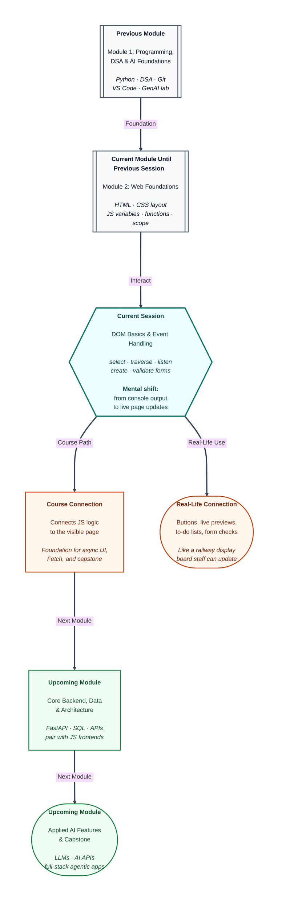

# Pre-read: DOM Basics & Event Handling

## Context of This Session in the Course

---

Riya’s college fest registration page looks polished. The header is styled. The form has neat labels. A big **Register** button sits at the bottom, waiting for clicks.

She opens the browser console, runs her discount function, and sees the correct total printed there. Her JavaScript **works**.

Then she clicks **Register** on the actual page.

Nothing happens.

She types her name in the input box. The greeting paragraph below stays frozen at *Hello,* with no name attached. She submits the form with an empty email field — the whole page refreshes and her typed text disappears.

Her teammate sends a voice note: *“The page looks ready, but it behaves like a printed poster.”*

That is the gap this session closes. You already know how to write logic in JavaScript — variables, loops, and reusable **functions** from the previous session. Now you will connect that logic to the **webpage itself**: finding elements, reading what the user typed, updating text on screen, and reacting when someone clicks or submits.

---

## A live page is not the same as a static file

When you open any website, the browser does not just show a frozen picture of an HTML file. It keeps a **live model** of the page — a tree of every heading, button, paragraph, and input, ready to change at any moment.

That live model is called the **DOM** (Document Object Model). In simple words, the DOM is the browser’s **live map** of every tag on the page right now.

Think of a **railway station display board**. The station itself does not get rebuilt when one train is delayed. Staff update a slot on the board — platform number changes, status flips to “Delayed.” The board is the live view; the printed timetable in the office is only the starting recipe.

Your HTML file is like that printed timetable. The **DOM** is the board passengers actually see — and JavaScript is the staff member who can update it without tearing down the whole station.

Every page gives you one main entry point: the **`document`** object. In simple words, `document` is the **manager of the page** — the desk you approach when you need to find “the registration button” or “the error message paragraph.”

---

## Finding the right piece of the page

Before you can change anything, you must **select** the correct element — like finding one student in a crowd by their unique ID card number.

When an element has a unique **id**, you can reach it directly. When you need the first matching item by tag or class — like picking the first person in a queue wearing a red cap — a different selection style helps. When you need **every** matching item — like listing every mobile shop in a mall — you collect the full set, not just the first one.

Once selected, you often **move through the tree**: from a list item to its neighbour, from a child back up to its parent, like walking a **family tree** — grandparents, parents, children. You can read plain text inside an element, or read what someone has typed into a form field.

This traversal matters because real pages nest elements deeply. A button might sit inside a card inside a section. You rarely rebuild the whole page; you reach the one node you need and update it.

---

## When the user does something — the page should answer

A beautiful form that ignores clicks feels broken, even if the colours are perfect.

An **event** is the browser’s way of saying: *“Something just happened.”* A click. A keystroke. A form submit. In simple words, an event is a **notification** — like a doorbell ringing when a guest arrives. You decide what to do when you hear it.

**Event listeners** are how you attach your JavaScript functions to those moments. The idea is straightforward: *“When this happens, run this logic.”* Like setting a reminder — when the train arrives, send the message.

Three events show up constantly on real sites:

| Event | When it fires | Everyday feel |
|---|---|---|
| **click** | User presses a button or link | Tapping “Add to cart” |
| **input** | User types or changes a field | Live name preview while typing |
| **submit** | User sends a form | Hitting “Sign up” on a registration page |

This is where your **functions** from the previous session finally meet the visible page. The counter function no longer lives only in the console — it updates the text the user sees after every button press.

---

## Building and checking — not just reading

Interactive pages do more than change existing text. They **add** new list items when you type a task and press Add. They **remove** an item when you change your mind. They **show errors in red** when an email field is empty and **success in green** when the format looks fine.

That is **DOM manipulation** — creating, updating, and removing elements on the live page. A new element is built in memory first; only when it is attached to the page does the visitor see it. Removing works the same way in reverse.

Forms need a special kind of care. By default, submitting a form refreshes the whole page — wiping what the user just typed. For a smooth experience, you learn to **pause that default behaviour** and run your own checks first: Is the email empty? Does it contain an `@`? Is the feedback message too short?

That pattern — **select → listen → update** — is the same loop used in registration flows, shopping carts, comment boxes, and every small interactive feature you will build later in this module and in the capstone.

---

## The core loop — one analogy to keep in mind

Picture the railway display board again:

1. **Select** the right slot on the board (find the element).
2. **Listen** for a trigger — a train arrival announcement (attach an event listener).
3. **Update** the slot text or add a new row (change content or add/remove elements).

You are not learning a separate magic system. You are learning how the browser exposes the page so your existing JavaScript logic can finally **touch what users see**.

---

In this pre-read, you'll discover:

- What the **DOM** is and why it is the bridge between your JavaScript and the visible webpage.
- How to **find and move through** page elements — by unique id, by pattern, and by walking parent, child, and sibling relationships.
- How **event listeners** turn clicks, typing, and form submissions into moments your code can respond to.
- How to **create, change, and remove** elements on the page and apply **basic form validation** so users get clear feedback before data is accepted.

---

## What's Next

After the session, you will be able to:

- Open any page’s live model through the **`document`** object and select elements with confidence.
- Read and update **text content** and form **values** without refreshing the page.
- Attach **click**, **input**, and **submit** listeners so buttons and forms feel responsive.
- Build a simple **to-do list** or **registration check** that adds items, removes them, and shows validation messages in place.
- Explain the full **select → listen → update** loop — the same pattern behind counters, live previews, and signup forms on real websites.

These skills turn a static HTML page into something that **reacts**. In upcoming work in this module, you will stretch this foundation toward richer UI behaviour, asynchronous updates, and eventually full-stack applications where the frontend you control here talks to backend APIs.

---

## Think About These Before the Session

Bring these scenarios to the live class — each one maps directly to a technique you will practice:

- Riya’s **Register** button looks perfect but does nothing when clicked. Her discount logic runs fine in the console. What is missing between her **function** and the **button on the page**?
- A registration form has three paragraphs with the same class `note`, but she only wants to highlight the **first** warning. How is “find the first match” different from “find every match”?
- A user types their name in an input box and expects the greeting **Hello, Priya** to update **while they type**, not only after they click away. Which **event** fits that live preview behaviour?
- Someone submits a signup form with a blank email. The whole page refreshes and the error never appears. What default browser behaviour might need to be **paused** so your validation message can stay visible?
- A to-do app should add a new item to a list when the user clicks **Add**, and delete one item when they click **Remove** on that row — without reloading the page. What two manipulation ideas — **creating** and **removing** — make that possible?

If your JavaScript already calculates the right answers in the console, you are one step away from making the page **show** those answers. The live session is where scattered logic becomes a page that listens, responds, and feels alive — the same professional habit every interactive web product depends on.
