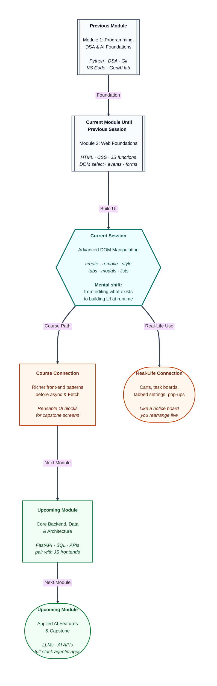

# Pre-read: Advanced DOM Manipulation

## Context of This Session in the Course

---

Riya’s fest page finally **reacts**. The register button updates a message. The name field shows a live greeting. Empty emails get a red warning before submit.

Her team lead sends a new brief: *“Build a volunteer task board. Students should add tasks, mark them done, delete wrong entries, and switch between Overview and FAQ tabs. Also add a confirmation pop-up before deleting anything important.”*

Riya opens her HTML file and counts the `<li>` tags she hard-coded for demo tasks. There are exactly three — no more, no less. She would need to copy-paste a new row every time someone registers a fresh duty. Her tabs are three separate pages linked by full reloads. Her “Are you sure?” message is just bold red text at the bottom — easy to miss.

She realises the page can **listen** now, thanks to what she learned in the previous session. But it still cannot **grow**, **restyle itself cleanly**, or **focus the user** the way real apps do.

That is the step this session covers.

---

## From updating sticky notes to running the whole board

In the previous session, you learned to treat the webpage as a **live map** — selecting elements, reading values, attaching listeners, and changing text that already exists. That is like editing sticky notes already pinned on a college notice board.

**Advanced DOM manipulation** goes further. Your JavaScript can **pin new notes**, **pull old ones off**, **swap one card for another**, and **change how cards look** — all while the user stays on the same page, with no full reload.

A **dynamic element** is any piece of the page that appears because your code created it at that moment. In simple words, it is UI born **while the app is running**, not printed in advance in the HTML file.

Think of a railway booking app. After you confirm a ticket, a fresh ticket card appears on screen. Nobody wrote that exact card into the app’s source file this morning — the app **built it on the spot** when you booked. Shopping carts, chat message lists, and volunteer rosters work the same way: the count keeps changing, so the page must **create and remove** pieces as people use it.

Reloading the entire page for every small change feels slow and wipes what the user typed. Hiding a fixed set of HTML rows works when you always have, say, three demo items. The moment the list can grow to ten or fifty entries, you need a pattern that **adds and removes at runtime**.

---

## Create, configure, attach — the three-step habit

Every new on-screen piece follows the same rhythm:

1. **Create** a blank element in memory — like cutting an empty card before writing on it.
2. **Configure** it — set the text, give it an id, attach its own buttons if needed.
3. **Attach** it to a parent on the page — pin the card onto the board so visitors can see it.

Until that third step, the element exists only in memory. This is a common beginner trap: the logic runs, nothing errors, but nothing new appears — because the card was never pinned.

Removing works in reverse: take one card off the board. **Replacing** means swapping an old card for a new one in the **same spot** — useful when a status message changes from “Pending” to “Completed” without shifting everything else around.

---

## Two ways to change how something looks

Once elements exist, users expect visual feedback — highlighted menu items, greyed-out completed tasks, an active tab in blue.

JavaScript can change appearance in two main ways:

| Approach | What it feels like | Best for |
|---|---|---|
| **Inline style** | Hand-painting one specific card right now | Quick, one-off tweaks |
| **CSS class toggle** | Switching between ready-made themes like “active” or “hidden” | Repeated UI states across many elements |

In simple words, **inline style** is writing directly on one card with a marker. **Class toggling** is flipping a label — *highlighted*, *done*, *active* — while the actual colours live in your CSS stylesheet.

Professional pages usually prefer **classes** for patterns that repeat: selected tab, completed task, open modal. Inline styles are fine for small experiments, but too many inline rules become hard to maintain.

The **`toggle`** idea is especially useful: one action switches a state on if it was off, and off if it was on — perfect for “mark done / mark not done” buttons.

---

## Walking the tree to update related pieces together

Real interfaces rarely change just one lonely element. Click a menu item and every other item should lose its highlight. Open one tab and the other panels should hide.

That means **moving through the DOM tree** — from a clicked item to its parent list, to sibling items, to the panel that should appear. In simple words, you climb the **family tree** of the page: from one seat, find the row, the neighbouring seats, and the section they belong to.

A powerful pattern here is listening on a **parent container** for clicks on its children, instead of attaching a separate listener to every row. One parent hears all child clicks — cleaner when the list keeps growing because you are creating new rows dynamically.

---

## Three UI shapes you will practice

The session ties these ideas into components you see on almost every modern site:

**Dynamic list** — Type a task, press Add, see a new row with Done and Delete controls. Each row is created at runtime; Delete removes just that row. This is the same skeleton as to-do apps, cart line items, and comment threads.

**Tabs** — Several buttons across the top; only one content panel visible at a time. Click “Overview” and the overview text shows while FAQ hides. The trick is syncing **active** styling on the button with **visible** styling on the matching panel — usually linked through a custom data attribute that says *“this button controls that panel.”*

**Modal** — A temporary dialog layered above the page: *“Save progress before leaving?”* or *“Delete this item?”* Like the confirm pop-up on a food delivery app before you cancel an order. The overlay often stays in the HTML but hidden until your code adds an **open** class; closing removes that class — no need to rebuild the whole dialog each time.

These three patterns reuse the same toolbox: create and remove nodes, toggle classes, traverse to update siblings, listen for clicks on parents and buttons.

---

## One analogy to hold through the session

Picture the college **notice board** again:

- The previous session taught you to **edit** notes already pinned.
- This session teaches you to **pin new notes**, **remove outdated ones**, **swap a pending slip for a completed one**, **highlight the row someone clicked**, and **open a temporary overlay** when a decision needs attention.

You are not learning a different language. You are learning how professional front-end pages **stay alive** as users add items, switch views, and confirm actions — without refreshing the entire campus website for every click.

---

In this pre-read, you'll discover:

- How to **create, remove, and replace** elements on the page while the user interacts — the core of dynamic lists and carts.
- Why **CSS class toggling** is often better than hand-setting styles on every click — and when inline styling still helps.
- How **DOM traversal** and parent-level listening keep menus, tabs, and highlights in sync as lists grow.
- How to assemble **dynamic lists**, **tabs**, and **modals** — reusable UI shapes you will meet again in richer front-end and capstone work.

---

## What's Next

After the session, you will be able to:

- Build a **task board** where users add items, mark them done, and delete rows without reloading the page.
- Implement **tabbed content** so one panel shows at a time with clear active styling on the selected tab.
- Open and close a **modal overlay** for confirmations and short messages.
- Choose between **inline styles** and **class toggles** for visual states — and explain why classes scale better.
- Combine create, style, traverse, and listen into the same **select → update → respond** loop you started in the previous session — now at full UI component level.

In upcoming work in this module, these DOM habits connect to **asynchronous JavaScript** and **Fetch** — pages that not only react instantly but also load data from servers. Strong create-and-style patterns now make those later features easier to wire in without tangled scripts.

---

## Think About These Before the Session

Bring these scenarios to the live class — each one previews a technique you will implement:

- Riya’s volunteer list is hard-coded with three `<li>` items in HTML. On fest day, forty students sign up for duties. Why is **creating new list items at runtime** better than copying forty rows by hand?
- A user marks a task “Done” and expects a **line-through grey style**. Should JavaScript set five separate colour properties every time, or **toggle one CSS class** named `done`? What breaks if both tabs and the task list try to use the same class name carelessly?
- Three navigation tabs should look active one at a time, but after a few clicks **two tabs stay blue**. What step is likely missing when switching **active** classes?
- Riya wants “Delete volunteer?” to appear **on top of the page** without navigating away. How is a **modal overlay** different from simply showing another paragraph at the bottom?
- A shopping app creates a ticket card only after booking — never before. What goes wrong if the code **creates** the card but forgets to **attach** it to the visible page?

If your page already listens and updates basic text, you are ready for the next layer: UIs that **grow, restyle, and focus** like the apps you use every day. The live session turns a static-looking page into a small but real interactive product — lists, tabs, and pop-ups included.
