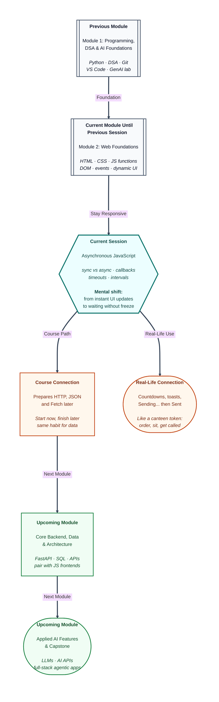

# Pre-read: Asynchronous JavaScript

## Context of This Session in the Course

---

Riya’s volunteer task board now **grows**. Students add duties, mark them done, and delete mistakes without reloading the page. Tabs switch. A confirm pop-up appears before a delete.

Then the fest coordinator adds one more request: *“When someone submits a duty, show Saving… for a couple of seconds, then Saved. Put a 10-second countdown on the banner before the event starts. After a successful save, flash a small success slip that disappears on its own.”*

Riya tries to imagine this the only way she knows so far: **do step one, finish it, then do step two**. If “wait two seconds” really meant standing still until the wait ended, the Add button would freeze. Nobody else could type. The countdown would lock the whole board. That cannot be how Swiggy, IRCTC, or UPI apps work — you still scroll while the app is “thinking.”

**What if every pause on a website froze the entire page until the pause was over?**

That is the problem this session solves.

---

## Waiting without locking the queue

In the previous session, your JavaScript updated the page **the moment** the user clicked. Create a row, toggle a class, open a modal — all immediate. Real products also need **time**: a reminder after three seconds, a clock that ticks, a status that changes from *Sending…* to *Sent*.

**Asynchronous JavaScript** is the idea that the browser can **start a wait**, keep the page usable, and **come back later** to finish the job. In simple words: you do not stand at the counter until one dosa is fully cooked. You take a **token**, sit down, and get called when it is ready — while the counter serves other people.

That canteen picture is the whole session in one image.

| Way of working | Daily-life feel | What the page feels like |
|---|---|---|
| **Synchronous** | One billing counter at a kirana store — customer 1 finishes, then customer 2 starts | Each line of work must finish before the next begins |
| **Asynchronous** | Railway token or canteen token — place the order, sit, return when your number shows | A wait is **booked**; clicks and typing can continue |

**Synchronous** means “in order, no skipping ahead.” **Asynchronous** means “start now, finish later.” JavaScript still has **one main window of work** — like one clerk at a government office. The **browser** holds the clock. When time is up, your packed instruction is given back to that clerk.

If the clerk insisted on staring at the clock for three seconds, the queue behind them would freeze. That freeze is called **blocking**. Users feel it as a dead page: buttons do not respond, text does not type, the tab looks stuck. Professional sites avoid blocking waits.

---

## A packed instruction for “do this later”

A wait is useless unless you also answer: **what should happen when the wait is over?**

That answer is a **callback** — a function you **pass** to someone else to run later. In simple words, it is a packed note: *“When you reach, call this number.”* You already used a version of this: the function you attach to a **click** is a callback for “when the user clicks.” A timer callback is the same idea for “when the clock says so.”

Two small habits matter:

- Pass the function itself — the packed note — not the result of running it immediately.
- Put the “after the wait” steps **inside** that later function. You cannot write the next line as if the wait already finished.

For a short workflow — *Order placed → Cooking → Ready to serve* — each next message lives inside the previous wait. Two or three steps are readable. Many nested waits become messy. You will meet cleaner patterns in an upcoming session. For now, nested callbacks teach the honest truth: **later work belongs inside later instructions**.

---

## One bell versus a metronome

The session gives you two everyday timing tools.

**Run once after a wait** — like setting a phone alarm, not a repeating reminder. After at least a chosen delay, your callback runs **once**. Delay is measured in **milliseconds**: one thousand of them make one second. The delay is a **minimum**, not a promise of exact time. If JavaScript is busy, the callback may arrive a little late.

Even a wait of **zero** is not “jump into the middle of the current work.” Zero means: *as soon as current work is finished*. That surprise is worth bringing to class.

You can also **cancel** a one-time wait if the user changes their mind — turning the alarm off before it rings. A Cancel button that still shows “Done” four seconds later forgot this step.

**Run again and again** — like a wall clock or a cricket scoreboard refreshing every second. This is the tool for countdowns and stopwatches. It keeps firing until you **stop** it. Forgetting to stop is a classic trap: the number keeps changing after “Go!”, or a second Start click makes the count jump twice as fast because two metronomes are running.

One-time wait and repeating wait both return an **id** — a token number for that booking — so you can cancel or stop the right one.

---

## The kitchen, the ready shelf, and the waiter

You do not need a heavy theory chapter, but one picture keeps the order of events honest.

Think of JavaScript as the **counter** that can serve only one file at a time. The **kitchen** (the browser’s timer) cooks while the counter talks to the next student. Finished plates sit on a **ready shelf**. The **waiter** (the event loop) brings a plate only when the counter’s hands are free.

That is why “sit at the table” prints **before** “dosa ready,” even though you wrote the dosa line earlier in the story. The dosa was handed to the kitchen. The sit-down line was still at the counter.

Clicks work the same way: the browser watches for the click; JavaScript runs your function when it is free. Timers are the clock version of that pattern.

---

## Time plus the page you already know

This session does not throw away the previous session. It **combines** waiting with DOM updates:

- Change on-screen text inside the later function so users see *Saving…* then *Saved*.
- Disable a button during the wait so nobody double-submits, then enable it again.
- Toggle a CSS class to show a success slip, then hide it after a second wait.
- Create and append list items on a repeating timer — the same create-and-attach habit, now on a delay.

Riya’s brief is exactly this mix: a delayed status, a countdown on the banner, and a success slip that appears and leaves — **without** freezing the task board.

---

In this pre-read, you'll discover:

- Why **synchronous** work feels like a single kirana queue, and why **asynchronous** work feels like a canteen token — start now, finish later, keep the page alive.
- How a **callback** is a packed instruction for “run this when you are done,” whether the trigger is a click or a clock.
- The difference between a **one-time wait** and a **repeating wait**, and why you must plan how the repeat **stops**.
- How timers plus **DOM updates** produce the UI you already use: countdowns, *Sending…* states, and auto-hiding notices.

---

## What's Next

After the session, you will be able to:

- Explain **sync vs async** with a clear daily-life analogy and predict the order of “now” vs “later” messages.
- Pass a **callback** so a later step runs only after a wait — including a short multi-step status flow.
- Use a **one-time timer** for reminders and delayed messages, and **cancel** it if the user changes their mind.
- Build a **countdown** or stopwatch with a repeating timer, and stop it cleanly.
- Combine timers with **text updates, class toggles, and new list items** so the page stays interactive during a wait.

In upcoming work in this module, the same “start now, finish later” habit is how the browser **talks to a server** and waits for data. Strong timer-and-callback thinking now makes those later network features easier to follow.

---

## Think About These Before the Session

Bring these scenarios to the live class — each one previews a technique you will implement:

- Riya logs three labels in order: *Order placed*, then “after two seconds print *Dosa ready*,” then *Sit at table*. Which message appears **second** on screen, and why does that not mean the dosa line was skipped?
- She writes a wait of **zero**. Does the “later” message still wait until current work finishes? What does that tell you about “zero delay”?
- A **Start reminder** button should show *Done* after four seconds. The user hits **Cancel** at two seconds. What extra piece of information must the page remember so Cancel can turn the alarm off?
- A countdown shows 5, 4, 3, 2, 1, Go! — then keeps flashing numbers. Which habit was forgotten: booking the repeat, or **stopping** it?
- After Save, a green slip should appear and then vanish. If the user clicks Save again quickly, how could an **old hide** cover a **new slip** unless the page cancels the previous hide?

If your page already creates rows and toggles classes on click, you are ready for the next layer: UIs that **wait** like real apps — without locking the queue. The live session turns “do this later” into countdowns, reminders, and status text students can see and control.
