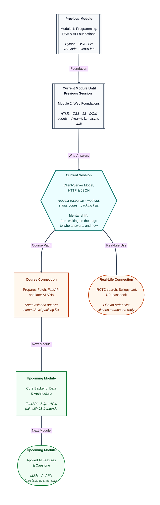

# Pre-read: Client-Server Model, HTTP & JSON

## Context of This Session in the Course

---

Riya sits on a hostel bunk and taps **Search trains** on IRCTC. A list appears: Duronto, Shatabdi, seats, times. She did not print a timetable. She did not call a clerk. Another computer, somewhere else, held the truth — and answered her.

Swiggy’s cart, a UPI passbook, and Gmail’s inbox work the same way. The numbers on the screen are not stored only on her phone. If they were, every student’s copy would go stale the moment a seat sold or a payment landed.

The fest coordinator now wants that honesty on the volunteer board: *“Do not keep the official list only on Riya’s laptop. The college office holds the records. The board should ask, then show what comes back.”*

**What if every app had to guess the latest train list, cart, or balance by itself — and you had to keep a thousand copies in sync by hand?**

That is the problem this session solves.

---

## Two roles: the one who asks and the one who answers

In the previous session you learned to **wait without freezing** the page — a token at a canteen, then a later update. This session answers the next question: **who** is the page waiting for, and **what** travels between your browser and a machine in another city?

The web is a conversation, not a single file sitting only on your laptop. One side **asks**. The other side **serves**.

The **client** is the side that says “please give me this.” In simple words: you at a railway counter, or the Swiggy app on a phone. A **browser** (Chrome, Edge, Firefox) is a client. A mobile app can be a client too.

The **server** is the side that listens, does the work, and sends an answer. In simple words: the **kitchen** that receives the order slip and sends the plate. IRCTC’s computers and a college exam cell that prints a hall ticket are servers.

A **resource** is the “counter” or record you are asking about — a page, an image, a train list. The client never paints the full timetable from memory. It **requests**. The server never draws Riya’s screen. It **responds**. Her HTML and JavaScript turn that reply into what she sees.

If every train timetable lived only on each student’s phone, IRCTC could never stay up to date. One server holds the truth. Many clients ask for it.

---

## One round trip: the order slip and the plate

A **cycle** is one complete trip. The client sends a **request** — the order slip. The server sends a **response** — the plate that comes back, or a note that the item is not available.

Typical steps feel ordinary once you name them:

- You type an address or click a button.
- The browser builds a message and sends it.
- The server reads the job and the path, then searches, saves, or deletes.
- A reply comes back with a result stamp and a body (a page, a packing list, or almost nothing).
- The browser reads the stamp and the body, then updates the screen.

You can still scroll while the reply is on the way. That is why the previous session’s “do not freeze the page” idea matters here. One page load is often **many** cycles: first the document, then styles, pictures, and data — each file its own ask and answer.

---

## The full house address

Typing a site address is not magic. It is a **traceable** path.

A **URL** is the full house address, not just the city name. The opening `https://` means “use the web’s conversation rules, but through an encrypted tunnel” — safer on hostel Wi-Fi. The host is which computer (a phone-book of names points the way). The path is which counter or page. The part after `?` is extra filter text on the **request**, such as from-station and date — still on the slip, not a different building.

Press Enter. The browser finds the server, asks to **show** that path, and often gets a success stamp plus a page. Then it may ask again for styles, scripts, and images. Open **Inspect → Network**, reload, and the first row is often the document. Columns show the job, the stamp, and the path. Many rows for one site is normal: one page is many files.

---

## Four jobs at the same office

The path says *which* resource. The **method** says *what to do* with it. Think of four counters in the same railway office.

| Method | Daily-life feel | Typical job |
|---|---|---|
| **GET** | “Show me.” Opening a UPI passbook to **see** the balance | Read. Should not change the records |
| **POST** | “Add a new one.” Submitting a fresh IRCTC booking | Create or start processing |
| **PUT** | “Overwrite with this full new version.” Sending a complete delivery address again | Replace an existing record |
| **DELETE** | “Remove this.” Cancelling a saved UPI beneficiary | Remove the named record |

Same path, different method, different job. Showing order 12 is not the same as deleting order 12. Mixing those jobs is a common production bug. Changing data does not belong on a “just show me” ask — that kind of ask can be saved or prefetched by the browser.

The agreed format of this conversation is **HTTP** — the grammar of web messages, like the printed boxes on a money-order form. A request has a start line (method + path), extra **headers** (labels such as which site, and what format you hope to receive), and sometimes a **body** for create or replace. A response has a status line, headers, and a body. **HTTPS** is the same conversation inside an encrypted tunnel.

---

## The rubber stamp on the file

After the server finishes, it stamps the reply with a **three-digit number**. Read that number before you trust the body.

Think of a college **exam cell**:

- **200** — marksheet printed. Success, here is the content.
- **201** — a new file was created (typical after a “add new” job).
- **400** — the form was incomplete (empty passenger name).
- **401** — “who are you?” No valid login.
- **403** — “we know you, but this counter is not for you” (student portal vs admin).
- **404** — roll number not found. The network worked; that path or id does not exist.
- **500** — printer jammed. Something broke on the office side.

Families follow the first digit: **2** success, **3** look elsewhere, **4** the ask was wrong or not allowed, **5** the office failed. A missing-file stamp is still a **completed** cycle. That is different from “no internet.” Showing “Server down” for every failure is the trap this session trains you to avoid.

---

## A packing list, not a story

Pages are often HTML. Structured data — a cart, a train list, PNR passengers — is usually **JSON**. In simple words: a written **packing list** that both the browser and the server can read, like a railway reservation chart (name, age, berth) rather than a paragraph of story. Labelled tiffin boxes, not a messy newspaper.

JSON is **text** on the wire. Keys and strings use double quotes. No trailing comma after the last item. No comments inside the list. Values are strings, numbers, true/false, empty, nested objects, or lists.

A JavaScript object in your script is live memory. JSON on the network is a string. **Parse** unpacks the string into values you can read (name, berth). **Stringify** packs an object into text before a create or replace trip. Invalid text throws an error — that red message is useful: the packing list is not valid yet. Always read the **stamp** first. Then unpack. Then use fields. Skipping the stamp is how an error note gets treated as a train.

You will **narrate** one visit in class — method, path, stamp, packing list — the way the Network tab would. Sending that ask from JavaScript with a live wait belongs in an upcoming session. This session builds the map.

---

In this pre-read, you'll discover:

- Why the web is a **client–server** conversation: one side asks, the other holds the records and answers.
- How one **request–response** cycle is an order slip out and a stamped plate back — including when you type a URL.
- How **GET, POST, PUT, and DELETE** are four jobs at the same office, and why the **status stamp** must be read before you trust the body.
- How **JSON** is a packing list (not a story), and why unpack and pack sit between text on the wire and values on the page.

---

## What's Next

After the session, you will be able to:

- Name **client** and **server** for apps you already use, and trace one round trip from button to reply.
- Read a **URL** as scheme, host, path, and optional filter text, and follow a first visit in the Network tab.
- Choose **GET / POST / PUT / DELETE** for show, add, replace, and remove — and match stories to stamps such as **200, 201, 404, and 500**.
- Spot valid vs invalid **JSON** packing lists, and explain parse and stringify as unpack and pack.
- Narrate a full **GET** of a train list: method, path, success stamp, JSON body — without confusing “not found” with “no internet.”

Upcoming work in this module uses the same map when the browser **sends** the ask from JavaScript and waits for live data. Later modules put a real backend behind that conversation. Strong “who asks, who answers, what is on the slip” thinking now makes those features easier to follow.

---

## Think About These Before the Session

Bring these scenarios to the live class — each one previews a technique you will implement:

- Pick UPI, Gmail, or a shopping site. Who is the **client**, who is the **server**, and what one thing does the client ask for?
- For a train search: load the list, book a new ticket, replace the passenger mobile on an existing booking (full passenger details sent), cancel the booking. Which **job** is each — show, add, replace, or remove?
- A classmate says every failure means “server down.” How should **roll number not found**, **empty name on the form**, and **printer jammed** look different on the stamp?
- You type an address and the Network tab shows many rows. Why is that still **one page**, and which row is usually the document?
- A packing list arrives as text. If you treat it as a live object before unpacking — or skip the stamp and unpack an error note as trains — what goes wrong on screen?

If your page can already wait without freezing, you are ready for the next layer: knowing **who** answers and **what** the message looks like. The live session turns IRCTC-style asking into a map you can trace, stamp, and unpack.
