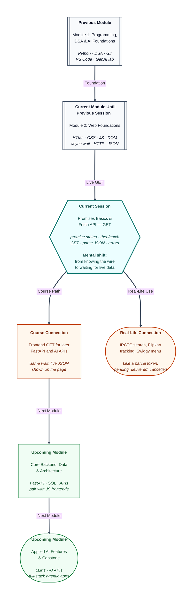

# Pre-read: Promises Basics & Fetch API – GET Requests

## Context of This Session in the Course

---

Riya opens IRCTC on hostel Wi-Fi and taps **Search trains**. *Loading…* appears, yet she can still scroll. A list arrives — or a clear *No trains found* — and the screen never freezes.

Flipkart tracking, Swiggy’s menu, and UPI’s *Processing…* then *Paid* or *Declined* work the same way. The answer is **not in her phone**. Another computer holds it; her phone only **asks** and **waits**.

The fest coordinator wants that feel on the volunteer board: *“On Refresh, load the official list from the college office. Show Loading… then names. If Wi-Fi dies or a roll number is missing, say so — and do not freeze the page.”*

From the previous session she knows a browser **asks**, a server **answers**, and **GET** means “please show me this.” The packing list is often **JSON**, and a timer can wait without locking the page.

What she still lacks is a wait for a reply whose time she cannot guess — then names on the board.

**What if every Refresh either froze the page until the office replied, or printed names on the next line as if the list had already arrived?**

That is the problem this session solves.

---

## A token for “your answer is on the way”

Think of a **Flipkart parcel**. You place the order **now**; the packet is not in your hand yet. Tracking is not the parcel — it is the **agreement** that you will be told later: delivered, or cancelled.

That agreement is a **Promise**. In simple words, it is a **token** that says “your result is on the way” — the paper that lets you sit while the kitchen works, not the food itself.

A Promise is always in **exactly one** of three states:

| State | Daily-life feel | What you tell the user |
|---|---|---|
| **Pending** | UPI still showing *Processing…* | Still waiting — spinner, *Loading…* |
| **Fulfilled** | *Payment successful* plus a UTR | Done — here is the answer |
| **Rejected** | *Transaction declined* | Failed — here is why |

Once it **settles** (no longer pending), that state does not flip back. You attach one instruction for success and one for failure: *“When it works, do this. If it fails, do this.”* You can chain waits — PNR generated, then berth allotted.

A **callback** is a packed note for “run this later.” A Promise is an **object you keep** — pass it, return it, attach success and failure when ready. Nested notes for three waits get messy; the token stays readable.

---

## Asking without leaving the page

Typing a web address in the **address bar** also **asks**, but the browser **navigates** to a new page. Riya’s Refresh button must stay on **her** board and hand the reply to her script.

**Fetch** is the browser’s built-in way to send that ask. For this session the ask is only **GET** — “please give me this resource.” In simple words: a postcard to the college office **without leaving the room**.

The Promise from Fetch is **not** the volunteer list yet. It is the **envelope**. You still read the **stamp** and **open the letter** (the JSON packing list) — two waits, one chain.

Practice JSON in a file taught the packing-list shape. Live apps load **current** lists. A public fake-user list lets you try GET without a login.

---

## Arrival is not the same as “file found”

If the postcard **never leaves** the hostel — no internet, or a browser rule blocking another site’s reply — the Promise **rejects**. That is a **network** problem. In simple words: the envelope did not arrive.

If the office **answers** but the roll number is missing, the envelope **did** arrive with a *not found* stamp. Fetch still treats that as “we got a reply.” You must **read the stamp** before you unpack the letter as a volunteer list.

| What happened | Envelope | What to tell the user |
|---|---|---|
| Wi-Fi off / request never completed | Never arrived | *Could not load* — not “server down” by default |
| Path or id missing (**404**) | Arrived, red stamp | *This id was not found* |
| Success (**200**) | Arrived, green stamp | Unpack JSON, show names on the page |

Users need **text on the page**, not a hidden log. Show *Loading…* while pending, and clear old rows before filling new ones. Match the **shape**: a list needs a loop; one person is a single record, not “ten names.”

---

In this pre-read, you'll discover:

- Why a **Promise** is a token for “later,” not the data — **pending / fulfilled / rejected** as *Processing…*, *Paid*, and *Declined*.
- How **success** and **failure** steps chain: envelope, then letter.
- How **Fetch** sends **GET** without leaving the page, and why the first result is an **envelope**, not JSON.
- Why a missing roll number is different from “no internet,” and why the **stamp** must be read first.

---

## What's Next

After the session, you will be able to:

- Explain a **Promise** with a parcel story and name the three states.
- Wait with **success** and **failure** steps, and **return** a value to the next step.
- Send a **GET**, unpack **JSON**, and show fields on the page.
- Tell a **network** failure apart from “not found.”

Upcoming work reuses this GET-and-display flow when you **debug** frontend code with AI. Later modules put a real backend behind the same ask.

---

## Think About These Before the Session

Bring these to the live class — each one previews a technique you will implement:

- Riya taps Refresh. For one second the list is empty, but the page still scrolls. Is the Promise **pending**, **fulfilled**, or **rejected** — and what should the user see?
- Fetch comes back with “file not found.” A classmate says, “That will automatically run the failure instruction.” Will it? What extra check does the stamp need?
- Airplane mode is on. Another try uses a missing roll number, but Wi-Fi is fine. How should the two error messages **differ**, so she does not call every failure “server down”?

If you can already trace a **GET** and parse JSON on paper, you are ready to wait with a token and print names without freezing the board.
