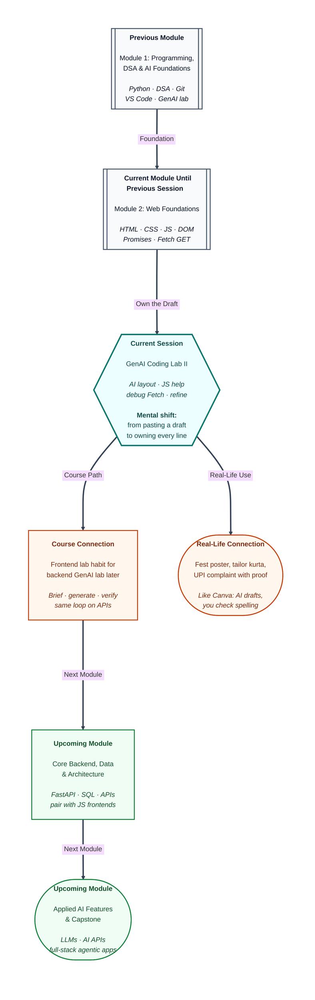

# Pre-read: GenAI Coding Lab II

## Context of This Session in the Course

---

The fest coordinator drops a brief on Riya at 9 p.m.: a **Campus Notice Board** by morning — header, search, Load, cards from the college office list. If Wi-Fi dies, say so. If search matches nothing, say so. She must also **explain** it in the corridor.

She already knows structure, a toolbar row, a card grid, clicks, and **asking** a public list without freezing the tab. She does **not** have three quiet days to type every box by hand.

A classmate says, *“Just tell the chat tool to make a website.”* Seconds later: a login form nobody asked for, names that match nothing, and a Load control that does nothing. The board is still empty.

**What if you had to ship that board overnight — then defend every line in a viva, staring at a blank grid?**

That is the problem this lab solves.

---

## A first draft is not the finished poster

Think of a college **Canva** poster. The tool paints a fest banner in seconds. You still check the club name, the date, and whether the QR code works. A pretty poster with the wrong date still fails.

**ChatGPT** or **Claude** is that designer for the webpage. An **AI coding assistant**, in simple words, is a patient junior who types fast and still needs a review. You **read**, **run**, and **own** every line.

A **prompt** is the kitchen order slip. “Two masala dosas, one less spicy” is a prompt. “Food” is not. A tailor stitches a kurta from **measurements**; without size, “blue festive kurta” can still come back as a raincoat.

You already used this idea to **plan** practice problems. This lab applies it to the **frontend** — structure, look, clicks, and live data. Using AI to learn is the skill. Pasting a page you cannot explain is not.

---

## Describe the station map before the trains

A **layout** is the page arrangement: header, tools, cards, footer — the railway station map, not the train times. You already practised regions, toolbars, and grids. Now you ask the assistant to paint that map from a **brief**, then you inspect it.

A carpenter who hears “study table, four feet, two drawers” builds what you meant. “Make furniture” produces a stool. “Make a nice college website” has the same gap.

Strong briefs name the hostel board, the regions, tools in a **row** and notices in a **grid**, the **exact names** of search, Load, cards, and status, and what **not** to add yet — no click-logic in the first draft. If the draft is anonymous boxes, reject it. You should **point** to where the cards will live before you ask for a click.

---

## One volunteer at a time, then the office truck

Layout is the empty canteen tray. **JavaScript** — the language that makes the page react — is the volunteer who fills trays when you tap. Ask for **one behaviour** at a time: sample cards on Load, then search — not the whole app at once.

You tell a junior CR, “When someone taps the bell, write the next mess item on the blackboard.” You still check the spelling. Paste **your** names so the assistant does not invent a missing button. Search before Load is not a search bug — there is nothing to filter yet.

Live notices reuse the previous session: a **token** for “the answer is on the way,” then **Fetch** (the browser’s **GET** without leaving the page). The first result is still an **envelope**. Read the stamp, open the letter, draw cards.

When the list is blank, “it doesn’t work” wastes the chat. Copy the red console line, the Network stamp, and what you already tried. Ask for a **minimal fix**. Watch for a letter never handed along, a “not found” stamp treated as a notice list, and `title` versus `name`.

---

## The warden’s inspection

A working Load is not the finish line. **Refinement** is the hostel warden before the notice is pinned — same board, cleaner handwriting. AI drafts often ship unused look rules, names like “x”, missing labels, and no *Loading…*.

Users need **text on the board**. Four states matter: waiting, success, empty search, failure. “Make it professional” may dump a library you cannot run. Keep the same names; no new libraries.

The loop is **brief → layout → review → behaviour → live list → debug → refine**. Skipping review is how you get a pretty page that shows zero notices.

---

In this pre-read, you'll discover:

- Why an **AI coding assistant** is a Canva-style first draft — and why **you** still check names and whether Load fills the board.
- How a **strong brief** (regions, row vs grid, exact names, no click-logic yet) beats “make a website.”
- How to add **one behaviour at a time**, then wire the **live list**, and debug with **evidence**.
- Why **refinement** — waiting, empty, error, labels — is quality, not extras.

---

## What's Next

After the session, you will be able to:

- Write a layout prompt for a usable hostel board, and reject drafts that miss regions or invent names.
- Ask for small click-and-search behaviour that uses **your** names.
- Debug a blank list with the console, the Network stamp, and a **minimal** fix.
- Run a quality pass: waiting, success, empty, error, labels.

Upcoming work keeps this same brief–generate–verify–refine habit when the work sits behind the page, not only on it.

---

## Think About These Before the Session

Bring these to the live class:

- Riya types “make a nice college website” and gets a login page. What was missing from her **order slip**?
- Sample cards work. She then asks, in the **same** message, for live data, search, and animations. Why mix the truck with the tray too early?
- Network shows a successful stamp and a list, but the board is empty. What **hand-off** between envelope and letter should you check before rewriting?
- After Load, search for `zzzz`. The grid goes white. Which **user-facing sentence** is missing?

If you can already wait for a list and print names without freezing the page, you are ready to use AI as a junior on the frontend — while **you** stay the person who can defend the board.
