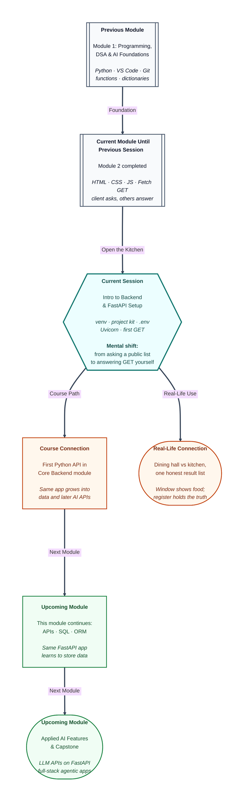

# Pre-read: Introduction to Backend Development & FastAPI Setup

## Context of This Session in the Course

---

Riya opens a food-delivery app at 9 p.m. She sees photos, a search box, and **Place order**. That screen is the **dining hall** — lights, menu, and the button she taps.

Behind that hall there must be a **kitchen**. Someone checks whether the stall is still open, adds GST, and writes the order in a register that every rider can trust. If that kitchen disappeared, each phone would keep its own guess. One friend would see “open.” Another would see “closed.” The bill would be a rumour.

**What if a thousand students needed one honest result list — and the only copy lived inside each browser tab?**

That is the problem this session starts to solve. You already built the dining hall in Module 2: structure, look, and clicks. Python from Module 1 could not run *inside* that hall. The browser speaks a different language. Now you learn the kitchen side, still in **Python**, so the language you practised becomes the language of the **server**.

---

## The shop window is not the shop

A page saved on your laptop is a good poster. Close the tab, and its “data” dies with it. A real product needs a **shared brain** — one attendance sheet, one result list.

That shared brain is the **backend**: the program that receives a request, applies rules, and sends a reply. In simple Indian English: the **stock register** behind the shop window. The window can look beautiful. Without a register, the shop cannot run.

You have already stood on the customer side of this conversation. You asked a public list for data and painted it on the page. Today you open **your** counter.

Companies write that counter in many languages — **Python**, **JavaScript** on the server (Node.js), **Java**, and others. This course uses **Python**, so Module 1 skills transfer. You still will not paste Python into an HTML file. Python belongs in a process you start from the Terminal — a doorbell that stays on.

---

## A labelled tiffin, not a shared mess plate

A backend project is not one random file on the Desktop. Think of a **tiffin** with labelled dabbas.

The **virtual environment** (venv) is your private cupboard for this project. The hostel mess plate is the **system** Python that every assignment shares. If everyone pours new spices into the same bowl, last week’s recipe breaks. Your tiffin keeps **FastAPI** — the helper that maps a web address to a Python function — inside this project only.

**pip** is the grocery run: you buy packages into that cupboard, then freeze the list so another laptop can buy the same items. The settings card in the cash drawer is an **environment variable** file. Shop name can change per machine. Passwords must never hang on GitHub. An ignore-list keeps the cupboard and the drawer off the public repo.

You already use **Git** and **VS Code**. The new habit is: create the cupboard once, **activate** it every time you work, then install. If you buy groceries with the cupboard closed, they land in the mess bowl — and the kitchen later says a package is missing.

---

## One counter, one doorbell, one GET

Once the tiffin is packed, you still need a long-running program. **Uvicorn** is the office that keeps the doorbell on — usually door number **8000** on your own machine. **FastAPI** is the receptionist script: “when someone asks to **read** this path, run this function.”

**GET** is the polite “please show me” you already know. Typing the address in the browser *is* a GET. The function can return a small labelled packet of data — **JSON**, the same packing format you parsed as a client. Status **200** still means “here you go.”

Walk the round trip in your head: address bar → door 8000 → receptionist → your function → JSON back to the browser. Same story as a booking site — only now the clerk’s computer is **your** laptop.

---

In this pre-read, you'll discover:

- Why a **frontend** (the dining hall) cannot be the whole product, and what a **backend developer** actually owns.
- How a professional project uses a **venv**, a grocery list of packages, a folder kit, and a private settings card.
- What **FastAPI** and **Uvicorn** are for — receptionist and doorbell — in plain words.
- How a **GET** from the browser reaches a Python function and comes back as JSON you can see.

---

## What's Next

After the session, you will be able to:

- Explain, with a food-app or results-list example, why secrets and shared records belong on the **server**, not only in page files.
- Create and activate a **venv**, install what the project needs, and keep `.env` off GitHub.
- Start a local FastAPI app and open `http://127.0.0.1:8000/` in the browser.
- Point to the JSON keys on screen and say which Python function produced them.

Keep that project folder. Upcoming work grows the **same** app.

---

## Think About These Before the Session

Bring these to class:

- A classmate says, “We already have a beautiful results page in HTML. Why do we need another program?” What goes wrong if every student’s marks live only in their tab?
- On a shared lab PC, two groups install different versions of the same package into the **system** Python. What breaks next week — and what does a **labelled tiffin** prevent?
- You type a web address and see JSON. Who sent **GET**, who listened on the door, and who wrote the function that packed the reply?
- You change the shop name on the private settings card, refresh the browser, and the old name is still there. What did you forget to restart?

If you can already **ask** a public list for JSON, you are ready to **answer** GET — and to treat your laptop as the kitchen, not only the dining hall.
