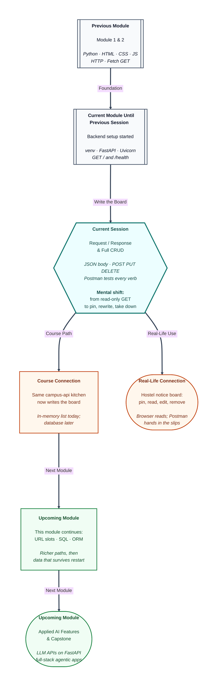

# Pre-read: FastAPI Deep Dive – Request/Response & Full CRUD

## Context of This Session in the Course

---

The warden texts at 9 p.m.: Wi-Fi dies at six, dinner is late, the lab is closed. Riya is on notice-board duty. She can **read** what is already pinned. That is not the job.

She must **pin** a new slip, **rewrite** a wrong time, and **take down** yesterday’s mess menu. If the only tool she has is walking past the board and looking, she can never change a single paper.

**What if a campus board could only be read — never pinned, never corrected, never cleared — and a thousand students still needed the truth to change by morning?**

That is the gap after the previous session. You opened the kitchen and answered “are you open?” A product also **writes**. This session is how the same Python server accepts new slips, replaces text, and removes a pin — and how you test those verbs without pretending the browser address bar can do them.

---

## Four jobs, one board

Think of a hostel **notice board**. Four jobs cover almost every list you will ever store: add a paper, look at the papers, change a paper, throw a paper away.

That pattern is called **CRUD** — Create, Read, Update, Delete. In simple Indian English: pin, read, rewrite, take down. A food-delivery cart, a marks register, and a to-do list all hide the same four jobs.

You already named the four **HTTP methods** in Module 2. **GET** is read. **POST** is create. **PUT** is update. **DELETE** is remove. The browser bar is a customer who can only *ask to see*. It does not hand in a filled slip. Refreshing GET must not create a second Wi-Fi notice. Create is a different verb on purpose.

---

## Envelope and letter

Every call is still the **request–response** cycle you traced for booking sites. FastAPI now lets you look at both sides as objects.

The **request** is the courier **envelope**: which verb, which path, which labels. The **JSON body** is the **letter** inside — the title and message of the new notice. People mix these up. The envelope is not the letter. Opening a GET envelope often finds no letter at all. POST and PUT must carry a letter, written with **double quotes**, like any honest JSON packing list.

The **response** is the stamped plate that leaves the kitchen. Success is not only “some JSON appeared.” Create should feel like **created**, not like a casual read. A missing pin should feel like **not found**, not like success. Incomplete slips should feel like **bad request**. You will learn to choose those stamps on purpose.

---

## Why a new tester

If the address bar cannot send POST, you need a remote control that can. **Postman** is that control: pick the verb, type the full local address (including the door number **8000**), paste a JSON letter when needed, press Send, and **read the stamp first**.

It is still a **client**, the same role as the browser or `fetch`. Your FastAPI process is still the **server**. Postman does not replace the kitchen. It lets you talk to the kitchen in every verb.

Desktop Postman is enough for a server on your own laptop. You will ping the envelope, read an empty board, pin twice, read again, rewrite pin one, take one down, then send a broken letter on purpose. Order matters: you cannot rewrite pin nine if you never pinned anything.

The board in this session lives in the server’s **memory** — sticky notes on the kitchen wall. Close the kitchen (restart the server) and the wall is blank. That is expected. A cupboard that survives restart is upcoming work. Today you prove the four jobs.

One extra habit: **POST** always adds a new pin. **PUT** rewrites a pin that already has a number in the path. Use POST to “fix a typo” and you leave the wrong paper hanging. Use PUT on the path without a number and the office will refuse the verb.

---

In this pre-read, you'll discover:

- Why **CRUD** is pin / read / rewrite / take down — and why GET in the browser cannot cover all four.
- How a **request** is the envelope and the **JSON body** is the letter, and why the **response stamp** matters as much as the text.
- What **Postman** is for: sending every verb to your local kitchen and reading **201**, **400**, and **404** on purpose.
- Why the notice list is **in memory** today, and why POST and PUT are not interchangeable.

---

## What's Next

After the session, you will be able to:

- Map each hostel-board job to **GET**, **POST**, **PUT**, or **DELETE** on `/notices`.
- Send a JSON letter with **title** and **message**, and explain a **400** when a key is missing.
- Use **Postman** to create, list, update, delete, and force a **404** on an id that was never pinned.
- Point at the **Request** envelope (`method`, `path`) and say it is not the same thing as the JSON letter.

Keep the same project folder. Upcoming work adds richer URL patterns and checks on the letter. The four jobs stay.

---

## Think About These Before the Session

Bring these to class:

- Riya only types a web address and hits Enter. She wants a *new* Wi-Fi notice to appear. Why will that fail even if the kitchen is open?
- She sends the same create action twice with the same title. Should the board show one paper or two — and which verb did she just repeat?
- The envelope says POST `/notices`, but the letter has only a title. What kind of stamp should leave the kitchen?
- She rewrites notice `99` though GET showed only id `1`. What should she read in the tester before she assumes the kitchen is broken?

If you can already answer GET in the browser, you are ready to **write** the board — and to stop asking the address bar to pin papers.
