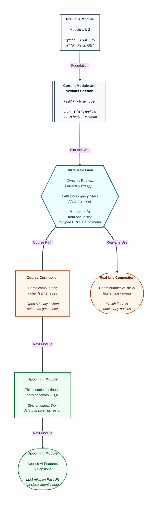

# Pre-read: FastAPI Dynamic Routes, Parameters & Swagger Docs

## Context of This Session in the Course

---

The warden says: “Show me **block Ganga, floor 3**.” Then: “On the notice board, show **only two** slips, and only if they mention **wifi**.”

Those are two different kinds of instruction. The first names **which place**. The second **filters** a list that already has an address. If Riya treats “wifi” as a room number, she knocks on a door that does not exist. If she never writes the floor, she cannot find the corridor at all.

**What if every search, every floor, and every “show me two items” needed its own painted sign on the hostel wall — hundreds of signs, and still no honest menu of what the kitchen can do?**

That is the problem this session solves. In the previous session you could pin, read, rewrite, and take down notices. You even used a small **number in the path** so a delete knew *which* pin. Today that blank in the address becomes a proper skill, filters sit after a question mark, and FastAPI prints an interactive **menu** so you do not type every long address by hand.

---

## Which room versus sticky notes

Think of a hostel corridor. **Path** is the door number: room **12**, floor **3**, hostel **Ganga**. It answers *which resource*. **Query** is a sticky note on the request: “only two cards,” “search wifi.” It answers *how to trim the list*. The building is still `/notices`. The stickies come after `?`.

You already saw query-looking pieces on booking sites (`from=Pune&to=Nagpur`). Those are not a second station. They are extra description on the same counter.

Braces like `{notice_id}` live in **your** Python template. The browser never types curly braces. It sends `/notices/1`. Mixing this up is how “wifi” in the path is treated as a **number slot** and rejected.

---

## Numbers that must be numbers

A **dynamic route** is one rule for many doors: `/notices/1`, `/notices/2`, `/notices/9` — not a separate decorator for every id.

If the slot is typed as a number, `1` becomes a real integer so it can match the stored pin. Letters like `abc` never reach your search loop. The kitchen stamps **422** — wrong type — which is not the same as **404** (valid number, no paper on the board). Two blanks can sit in one address: hostel **name** (text) then **floor** (number). Order in the corridor is order in the URL.

**Query** keys are different. “How many?” can have a **default** of ten if you stay silent. A dedicated search counter can **require** a keyword: no word, no search. Optional search on the list (`q`) is a courtesy filter, not a new building.

Identity in the path. Options after `?`. New title and message still travel in the **JSON letter** for write methods — not as a query.

---

## A menu that stays true

Typing `?limit=2&q=wifi` is legal GET. The browser can do that. You still need a place that **shows** every slot as a box, marks required fields, and lets you press Execute.

**OpenAPI** is the printed menu FastAPI writes from your routes and types. **Swagger UI** is the kiosk at `/docs` that reads that menu: Try it out, fill path and query, read the stamp. It is documentation, not the notice list itself. The data still lives in memory until you restart.

You will open `/docs`, pin two notices so GET-one has something to find, then practise a numeric path, a letter path (422), two nested slots, optional filters, and a required keyword. A glance at the raw menu file is enough to see `in: path` versus `in: query`. You do not edit that file by hand.

Postman remains a valid client. Today the course tester is the kiosk, so the menu and the live call stay in sync.

---

In this pre-read, you'll discover:

- Why a **path** names *which* notice or floor, and a **query** only *filters* the board.
- How a **typed** slot turns `1` into a number and stops `abc` with **422** before your function runs.
- Why **optional** filters have defaults and a **required** keyword does not.
- How FastAPI **auto-builds** an interactive **docs** page from the same Python you already write.

---

## What's Next

After the session, you will be able to:

- Split `/notices/1` from `/notices?limit=2` and say which part is identity.
- Call GET-one, two path slots, optional `q` / `limit`, and required search — mainly from **`/docs`**.
- Explain **422** (bad type or missing required query) versus **404** (id parsed, row missing).
- Point at OpenAPI `in: path` and `in: query` without treating `/docs` as your database.

Keep the same project. Upcoming work makes the **JSON letter** stricter. Your URL slots stay.

---

## Think About These Before the Session

Bring these to class:

- Riya types `/notices/wifi` hoping to filter. Which slot did she just fill, and why might the kitchen refuse before it searches titles?
- `GET /notices/1` on an empty board versus `GET /notices/abc`. Which stamp is “no paper,” and which is “not even a number”?
- She wants “at most two notices.” Should that number be a **door** or a **sticky note**?
- The kiosk at `/docs` shows a required box she left blank. What should she expect **before** any notice JSON?

If you can already pin and take down notices with Postman, you are ready to **address** the board precisely — and to let FastAPI print the menu for every slot you declare.
