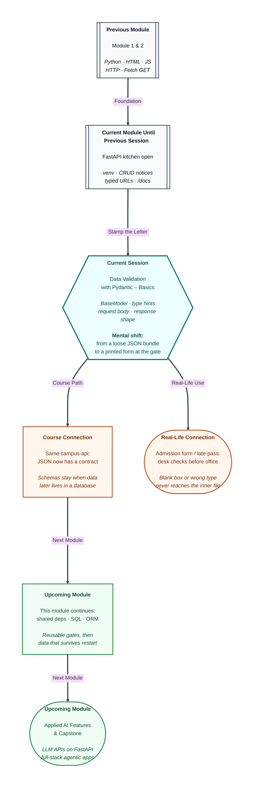

# Pre-read: Data Validation with Pydantic – Basics

## Context of This Session in the Course

---

Have you submitted a college **admission form**, an exam application, or a railway concession slip? Name, roll number, date of birth — if a box is blank, or someone writes “twelve” where a **number** is required, the desk sends the paper back. The inner office never even opens the file.

Your API is that desk. You can already **pin**, **read**, **rewrite**, and **take down** notices. Typed **path** and **query** slots can reject a bad id.

The **letter** inside POST and PUT was still a loose bundle: a missing title, a number where text was expected, a spelling like `titel`. Each route inventing its own red-pen checks is like every clerk using a different rule — easy to forget at one counter.

**What if a thousand hostel late-pass slips arrived in one evening — missing names, room written as “two”, overnight marked “maybe” — and every clerk had to invent a private checklist before the warden ever saw a file?**

That is the problem this session solves. FastAPI uses **Pydantic** so the letter is checked **before** your function runs, and the receipt you send back follows the same kind of printed form.

---

## One printed form for kitchen and counter

Think of a mess rebate or a hostel late-pass. The **blank form** is not one student’s filled sheet. It lists the **boxes** and what belongs in each: text, a whole number, yes or no.

Kitchen and counter must share that form. Otherwise every waiter invents a different slip.

A plain **dictionary** accepts almost any keys. That is convenient on day one and unsafe as soon as two clients must agree.

A missing title silently becomes empty. A number in a text box is stored as a heading. A misspelt key is treated as missing, and an extra `author` may hide with no rule.

A **schema** is that blank form: field **names**, **types**, and which boxes are required. **Validation** is the clerk at the gate.

**Pydantic** does this from type hints. FastAPI does not replace it — FastAPI **uses** it for JSON bodies, just as a path slot already had to be a number. If FastAPI is already in the project, Pydantic arrives with it.

---

## Boxes, labels, and official letterhead

A Pydantic model is an ordinary Python **class** that inherits from **BaseModel**. That parent is the **official letterhead**. Without it, a Word file is just text, not a college form.

Each line under the class is a **field** — one named slot. The **type hint** after the colon is the label next to the box:

- **Text** (`str`) — title or message. A JSON number is rejected.
- **Whole number** (`int`) — a room number. Letters such as `"two"` fail.
- **Yes or no** (`bool`) — overnight. JSON uses `true` / `false`. `"maybe"` fails; some words like `"yes"` may still pass.
- **Decimal** (`float`) — a score such as `8.5`. Letters such as `"eight"` fail.

A field **without a default** is **required**. Omit the key, and the desk stamps a failure. A field **with a default** is optional; silence fills the printed default.

The class is the schema. One **instance** is one filled form. Read boxes with **dots**, not dictionary brackets.

The class is only a **shape**. Routes still use the POST and PUT decorations you already know.

Two models can share similar fields for different jobs. **NoticeCreate** is what the client **may send** — title and message, no pin. **NoticeOut** is what every client **will see** — the same text plus an `id` that **you** assign.

Clients must not pick the pin. A small **hostel pass** (name, room, overnight) lets you practise number and yes/no without mixing them into notices.

---

## The letter is checked at the gate

Replace a loose body dictionary with the request model. FastAPI sees a BaseModel that is **not** in the path, so it treats that parameter as the **JSON request body**.

Think of campus-event security. Incomplete gate pass — you never enter the hall.

If validation fails, FastAPI returns **422 Unprocessable Entity** automatically. Your create or update function **does not run**.

- Title and message both present as text — the function runs.
- Message only — **422**, `title` missing.
- Extra `author` beside valid fields — the function runs; the extra key is **ignored** by default.
- Title sent as a JSON number — **422**, wrong type.

An **empty string** is still text. Required means **the key is present and the type matches**, not “the text looks useful.” Length rules come later.

Send **JSON**, not a browser form. After you wire the class, **`/docs`** draws the request editor from **your** schema.

Path checks from the previous session still run first on URL slots. Today’s new guard is the **body**.

A valid letter to a missing pin is still **404**. Letters in a number path are still **422** on the **path**. A broken body fails the schema **before** “not found” can speak.

---

## Red-pen notes versus a missing file

A failed body is not a crash. It is a **successful rejection**. The receipt is a **list** of notes under `detail`.

Read **`loc` first** — which box failed (`body` then `title`, or `path` then the parameter). Then **`msg`** (what to fix) and **`type`** (the stamp category: `missing`, wrong number, and similar).

Several missing fields mean several notes. Students often debug the create function when it never started.

Do not mix this with **404**. Not-found `detail` is usually a **string**. Same key name, different shapes.

---

## The printed receipt on the way out

A **response model** is the fee-receipt format. Extra scribbles on the kitchen copy are not shown to the student.

GET-one, POST, and PUT should return the **same keys** for one notice: `id`, `title`, `message`. You may return a dictionary; FastAPI builds **NoticeOut** and **drops** extra keys. Using the *create* class as output would hide `id`.

Not-found must stay a special error body so FastAPI does not squeeze `detail` into those three fields. The list route can stay a wrapper dictionary today. DELETE can confirm with a small message.

You are practising **one-notice** output first.

Request model = what the client **may send**. Response model = what every client **will see**. Two classes, one resource.

The in-memory board is unchanged. Only the **wire** JSON is filtered.

---

In this pre-read, you'll discover:

- Why a **schema** is a shared printed form, and why a loose dictionary is not a contract.
- How **BaseModel** plus **type hints** become boxes the desk can stamp before your function runs.
- How **request** and **response** models differ — what the client may send versus what every client will see.
- How to **read** a **422** receipt (`loc`, `msg`, `type`) without mixing it up with **404**.

---

## What's Next

After the session, you will be able to:

- Draw a small form on paper (name, room, overnight) and turn it into a typed model.
- Point at **NoticeCreate** versus **NoticeOut** and say which class owns `id`.
- POST and PUT through `/docs`, force a missing field and a wrong type, and read `loc` before touching your loop.
- Explain why an extra `author` may be ignored on the way in and dropped on the way out, and why `""` can still pass a basic text check.

Keep the same project and the same `/docs` kiosk. Upcoming work in this module adds reusable gates, then storage that survives a restart. The **JSON contract** you start today stays around those features.

---

## Think About These Before the Session

Bring these to class:

- POST body `{}` on create. Does the kitchen function run, or does the desk send the paper back first?
- POST with only `"title"`. Which box will `loc` name, and will the board gain a broken row?
- PUT a valid letter to a missing pin, versus PUT `{}` to a real pin, versus letters in the pin slot. Which stamp is schema, which is missing row, which is path?
- After a valid create, should the receipt show `author` if that key slipped into the letter?

If you can already address the board with path and query, and you have opened `/docs`, you are ready to give the desk a **printed form** — in and out.
