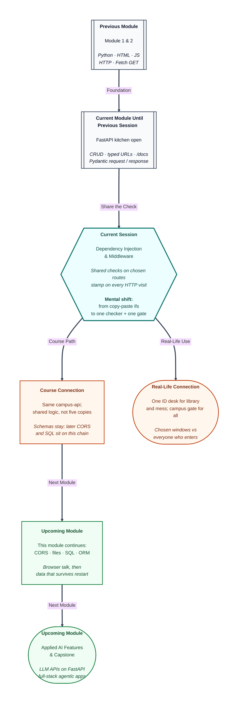

# Pre-read: Advanced FastAPI – Dependency Injection & Middleware

## Context of This Session in the Course

---

Have you been through a college office where the **library**, the **mess rebate** desk, and the **hostel late-pass** window all ask for the same ID? If every clerk writes the rule in a private notebook, one window will forget — and someone walks through without the check.

You do not want five copies of the same instruction. You want **one** checker that those counters share.

The **campus gate** is a different job. Everyone who enters or leaves gets a stamp, whether they are going to the library or the hostel. No building should invent its own gate register.

**What if every write window copied the ID rule by hand, every reply copied a timing stamp by hand, and the public menu itself got locked because the gate rule was pasted onto the whole campus?**

That is the problem this session solves. **Dependency injection** is one shared check on the counters you choose. **Middleware** is one stamp on every visit.

You already check the **shape** of JSON with **Pydantic**. Keep that printed form. Today you attach **reusable work** to routes, and a **wrapper** around every visit.

---

## One circular, not five notebooks

**Modular** here means shared behaviour is defined once and attached where needed. In simple Indian English: one helper, many doors — not five copies of the same `if`.

You can call a helper yourself at the top of each function. That is ordinary Python. FastAPI will not know about it, **`/docs`** will not show extra boxes, and you must remember every route.

**Dependency injection** means the framework **creates** and **passes in** what a function lists, instead of the function fetching it itself. You list what the route needs. FastAPI fetches it and hands it over.

Think of an exam hall. The invigilator **issues** the question paper as you sit down. Students do not each print their own.

A **dependency** is a reusable helper with an official doorway into the route. **`Depends`** is the tag that says: do not treat this as a normal default — **run** this function. Like a form field labelled “Office use — do not fill.”

Why this exists:

- **One change, many routes.** Edit the checker once; every decorated write window follows.
- **Swagger stays true.** If the helper needs a query box, `/docs` shows it **only** on routes that inject that helper.
- **The route stays short.** Create-notice talks about titles and ids, not about how keys are read from `.env`.
- **You choose the set.** Middleware cannot easily say “only POST and PUT.” Dependencies can.

Pydantic checks **data shape**. Dependencies and middleware run **code**. They are not the same tool.

---

## Two helpers, two jobs

A dependency is an ordinary Python function. FastAPI inspects its parameters the same way it inspects a route.

One helper can have **no extra parameters**. It returns a small settings bag — for example the **app name** from `.env`. Inject it on welcome, health, and the notices list.

Change the name once; all three stay in sync. Swagger grows **no** new box.

Another helper can declare a required **query** named `access_key`. Compare it to a class key in `.env`. Put it on **POST**, **PUT**, and **DELETE** only.

Reads stay open. The key is **not** a field inside `title` and `message`. It is a separate box, so write tools can send it without folding it into the JSON letter.

If the query is **missing**, FastAPI stamps **422** before your comparison even runs. If the key is **present but wrong**, the helper raises **401** — understood, but the credential is not accepted.

That is like showing an expired ID card: the desk does not start the paperwork. Your create function runs only after a match.

**401** `detail` is a **string**. **422** `detail` is a **list**. Same key name you already know from not-found, different shapes.

Do not give the key a default inside the helper. A default would make the query optional. A missing guest would then match the fallback and walk through.

Keep the key required so silence is **422**.

The same `Depends` line is what you **apply across multiple endpoints**. One function, three write doors. One settings function, three GET doors.

GET-one can take **neither**, on purpose, so `/docs` proves that not every card has the key.

Dependencies are not routes. Only path functions get the GET/POST decorations.

---

## The campus gate

**Middleware** is a belt around the whole shop: in, then the counter, then out. Security at the campus gate timestamps **everyone** — mess, library, hostel office — not one clerk copied into each building.

On the way in, you see the **envelope**: method, path, headers — not the JSON body Pydantic already checks. Then you ask the rest of the app to run. On the way out, you hold the reply and can stamp headers.

**When to use middleware**

- You need something on **all** (or nearly all) HTTP traffic: a timing header, a custom **X-API** label, a log of method and path.
- The work is about the **envelope**, not about one resource’s business rule.

**When to use a dependency instead**

- Only **some** routes need the behaviour (writes need a key; reads do not).
- You need Swagger to show an extra **parameter** on those routes.
- You need to **return a value** into the function (the app name).

Timing **one** handler with a clock inside that function misses `/health` and the docs page. Middleware times the whole round trip.

Do **not** put the access key in middleware. Then `/docs` itself would demand the key, and you could not open the menu. Keep the key as an **opt-in** dependency on write routes.

Order to remember, one direction:

1. Middleware (in)
2. Route match and **dependencies**
3. Your path function
4. Middleware (out) — set headers on the **response**

If the gate raises **before** the rest of the chain, health never runs. After the chain, you always send the reply back.

The wrapper must **wait** for the rest of the shop. Ordinary routes stay ordinary functions. Do not copy “wait” onto every handler.

In class you will put a **process-time** header and an **X-API** label on every reply — including `/docs`. No extra Python inside each return.

---

In this pre-read, you'll discover:

- Why **one shared checker** on chosen windows beats copy-paste, and how **dependency injection** lets FastAPI run that helper for you.
- How the **same** helper can guard POST, PUT, and DELETE, while reads stay open.
- Why a missing key is **422** and a wrong key is **401**, and why those are not **404**.
- When **middleware** should stamp every visit — and when that would lock the public menu.

---

## What's Next

After the session, you will be able to:

- Point at **Depends** versus a handmade helper call, and say which one Swagger can see.
- Name which methods share settings, which share the write key, and which GET uses neither.
- Force a missing key and a wrong key, and read the stamp before blaming the create function.
- Find **X-API** and process time on `/health` without adding headers inside that handler.

Keep the same project, the same **Pydantic** forms, and the same `/docs` kiosk. Upcoming work in this module still sits on this chain: chosen helpers, then a wrapper around every visit, then storage that survives a restart.

---

## Think About These Before the Session

Bring these to class:

- POST with a valid notice letter and **no** `access_key`. Does create run, and is the stamp **422** or **401**?
- POST with `access_key=wrong`. Which helper ran, and why is `detail` a string this time?
- Why can you still open `/docs` without a key, yet still expect **X-API** on GET `/health`?
- If the campus gate stamped **before** the rest of the chain and then stopped, would `/health` still run?

If you can already pin notices through a printed JSON form, you are ready to give the office **one shared ID checker** — and the campus **one honest gate**.
