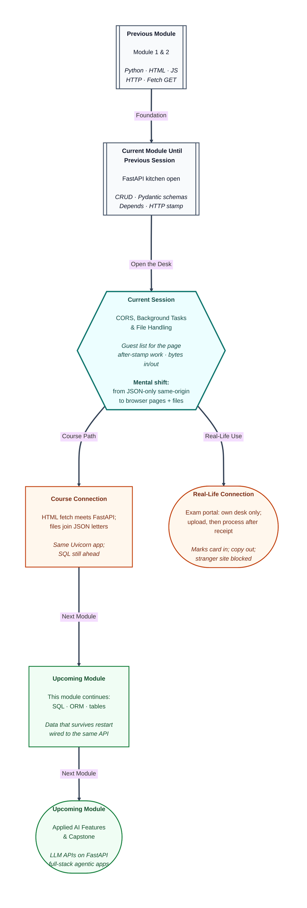

```mermaid
%%{init: {"diagramPadding": 24, "flowchart": {"htmlLabels": true, "nodeSpacing": 90, "rankSpacing": 110, "curve": "basis", "padding": 20}, "theme": "base", "themeVariables": {"fontFamily": "Arial", "fontSize": "15px", "lineColor": "#334155"}}}%%
flowchart TB
    subgraph FOUNDATION[" "]
        direction LR
        PM[["&nbsp;&nbsp;<b>Previous Module</b>&nbsp;&nbsp;<br/><br/>Module 1 &amp; 2<br/><br/><i>Python · HTML · JS<br/>HTTP · Fetch GET</i>"]]
        CM[["&nbsp;&nbsp;<b>Current Module Until Previous Session</b>&nbsp;&nbsp;<br/><br/>FastAPI kitchen open<br/><br/><i>CRUD · Pydantic schemas<br/>Depends · HTTP stamp</i>"]]
    end

    CURRENT{{"&nbsp;&nbsp;<b>Current Session</b>&nbsp;&nbsp;<br/><br/>CORS, Background Tasks<br/>&amp; File Handling<br/><br/><i>Guest list for the page<br/>after-stamp work · bytes in/out</i><br/><br/><b>Mental shift:</b><br/>from JSON-only same-origin<br/>to browser pages + files"}}

    subgraph VALUE[" "]
        direction LR
        COURSE["&nbsp;&nbsp;<b>Course Connection</b>&nbsp;&nbsp;<br/><br/>HTML fetch meets FastAPI;<br/>files join JSON letters<br/><br/><i>Same Uvicorn app;<br/>SQL still ahead</i>"]
        REAL(["&nbsp;&nbsp;<b>Real-Life Connection</b>&nbsp;&nbsp;<br/><br/>Exam portal: own desk only;<br/>upload, then process after receipt<br/><br/><i>Marks card in; copy out;<br/>stranger site blocked</i>"])
    end

    subgraph FUTURE[" "]
        direction LR
        M3["&nbsp;&nbsp;<b>Upcoming Module</b>&nbsp;&nbsp;<br/><br/>This module continues:<br/>SQL · ORM · tables<br/><br/><i>Data that survives restart<br/>wired to the same API</i>"]
        M4(["&nbsp;&nbsp;<b>Upcoming Module</b>&nbsp;&nbsp;<br/><br/>Applied AI Features<br/>&amp; Capstone<br/><br/><i>LLM APIs on FastAPI<br/>full-stack agentic apps</i>"])
    end

    PM ==>|&nbsp;Foundation&nbsp;| CM
    CM ==>|&nbsp;Open the Desk&nbsp;| CURRENT
    CURRENT ==>|&nbsp;Course Path&nbsp;| COURSE
    CURRENT ==>|&nbsp;Real-Life Use&nbsp;| REAL
    COURSE ==>|&nbsp;Next Module&nbsp;| M3
    M3 ==>|&nbsp;Next Module&nbsp;| M4

    classDef previous fill:#f8fafc,stroke:#475569,stroke-width:2px,color:#0f172a
    classDef current fill:#ecfeff,stroke:#0f766e,stroke-width:3px,color:#134e4a
    classDef value fill:#fff7ed,stroke:#c2410c,stroke-width:2px,color:#7c2d12
    classDef future fill:#f0fdf4,stroke:#15803d,stroke-width:2px,color:#14532d

    class PM,CM previous
    class CURRENT current
    class COURSE,REAL value
    class M3,M4 future

    style FOUNDATION fill:transparent,stroke:transparent
    style VALUE fill:transparent,stroke:transparent
    style FUTURE fill:transparent,stroke:transparent
    linkStyle default stroke:#334155,stroke-width:3px
```
