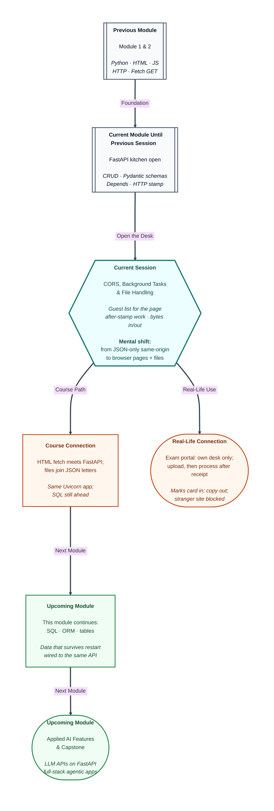

# Pre-read: Advanced FastAPI – CORS, Background Tasks & File Handling

## Context of This Session in the Course

---

Have you uploaded a **marks card**, a passport photo, or a government ID on an exam portal or a job site? You click upload, the page says it is processing, and only after a short wait the document shows as submitted.

That is not a simple “I sent a letter, I got a reply.” After the site has already told you “we received it,” work still continues behind the scenes — storing the file, checking it, updating your application.

Now think of the office behind that website — your backend. Its door can be found by anyone on the internet.

**What if a stranger builds their own website and quietly plugs it into your office: your students’ files, your data?**

That is not acceptable. You must allow **only your own front desk** to talk to your office.

This session covers those everyday needs: **file upload and download** (the marks card), **background tasks** (the processing after the receipt), and **CORS** (the guest list so only your frontend may use your backend).

You already share checks across routes and stamp every visit. Keep that. Today you add **who may call you from a webpage**, **how a file arrives and goes back**, and **work that continues after the stamp**.

---

## Two buildings on the same street

JavaScript in a page may call `fetch`. The **browser**, not Python, decides whether the page is allowed to **see** that response.

An **origin** is the full address of the building: scheme, host, and **port**. `http://127.0.0.1:8000` and `http://127.0.0.1:5500` are two buildings on the same street — different door numbers, different origins.

`localhost` and `127.0.0.1` are also different hosts. A page at one and an API at the other is still **cross-origin**: the page lives at one address; the API lives at another.

**`/docs` on the API port talking to `/health` on the same port is same-origin.** Swagger will not show a CORS failure. That is why testing CORS only inside `/docs` never proves the guest list.

A real frontend — HTML and `fetch` you already practised — is often **not** served by Uvicorn. Without CORS, `fetch` fails in the **browser console**, while `/docs` still looks fine. FastAPI can answer **200** and still be unusable from JavaScript if the allow-origin stamp is missing.

That is a browser lock, not a Python crash. `curl` and Postman are not browsers; they ignore CORS.

---

## A guest list on the door

**CORS** (Cross-Origin Resource Sharing) is the header protocol that lets a server say which origins, methods, and headers a browser may use. In simple Indian English: the API puts a **guest list** on the door — “pages from this address may read my replies.”

Think of a library that allows readers from College A’s ID, not from any random campus.

**`CORSMiddleware`** is a **ready-made** wrapper. You do not write a custom `call_next` function. You pass **which origins** are allowed — a printed visitor policy at the gate, not a new guard you invent each morning.

List the **page** origins, with scheme and port: both `http://127.0.0.1:5500` and `http://localhost:5500`. Listing only the API’s own address is listing the office, not the front desk.

The Origin the browser sends must **match one string**. A trailing slash or the wrong port will fail.

Some cross-origin calls first send a **preflight**: an automatic “may I?” **OPTIONS** message before the real letter. Like asking the clerk if the counter accepts a parcel, then sending the parcel.

The provided middleware answers that for you. You do not add an OPTIONS route by hand.

**`Access-Control-Allow-Origin`** is the stamp on the reply: “this page is allowed to look.” A visitor pass with **one** college name — not a blank pass for the whole city.

Classroom setup today: cookies stay off. A wildcard guest list together with cookies is not a valid CORS setup.

You will prove the guest list with a small HTML page on **port 5500** calling health on **port 8000**. Two processes: the API and a static page server. Opening the file as `file://` is not on the list.

---

## Stamp the receipt, then write the register

A **background task** is work FastAPI runs **after** the response has already gone to the client. Stamp the receipt first, then write the register. The student does not wait for the register.

The mess prints your coupon immediately; the count of plates is updated a moment later.

You attach a to-do slip to **this one request**. FastAPI injects that helper because of its type. It is **not** a field in the JSON body.

You schedule the function. You do not call it yourself before `return`.

The client’s **accepted** JSON does not wait for the disk write. Open `server.log` after Execute. Do not look for the log line inside the same JSON.

This is still the **same** Uvicorn process. A tiny delay after the reply is normal. It is not a second server.

Use it for a **small** follow-up — a log line. A one-hour job needs other systems; not today. If the log write fails **after** the stamp, the student may already have **200**.

The helper is not a route. Do not decorate it with POST.

---

## A pouch for the marks card, then the copy back

JSON letters are text. A file is a stream of **bytes** with a **filename**.

Browsers send that as **multipart** form data — an envelope that can hold a document, not only a written note. Think of a courier pouch with a form on top and a photocopied certificate inside.

**`UploadFile`** is the packet the client attached: name plus contents. The marker **`File(...)`** says this box is a **file picker**, not a JSON key. `/docs` **Try it out** becomes **Choose file**. You do not paste JSON for upload.

After a successful upload, the HTTP **response** is a JSON receipt (name and size). The file itself sits on the **server disk** under `uploads/`. Profile photos, CSV dumps, and PDFs cannot live in `{"title": "..."}`.

Do not trust a filename that includes folders. Keep only the last part of the name so `../` cannot walk out of the folder.

**Download** is the other direction. **`FileResponse`** answers with the **file itself**, not with `{"filename": ...}`. The office hands you the photocopied sheet, not a slip that only names the sheet.

**`Content-Disposition`** is the courier sticker: “save this as notes.txt.” **200** from a file response is the bytes. **404** for a missing name stays JSON so `/docs` can still read the error.

Returning a path as text is not a download. Execute in Swagger may **download** or show binary. That is success, not a broken JSON printer.

CORS is **app-wide**. Background log, upload, and download are **routes**. One sample app holds all three.

---

In this pre-read, you'll discover:

- Why a page on one **port** calling an API on another is **cross-origin**, and why `/docs` does not prove the **guest list**.
- How **CORS middleware** lets only your own front desk **read** the reply.
- Why a **background task** writes the register **after** the student already has “accepted.”
- How **upload** stores bytes and **download** returns those bytes — not a JSON name-slip.

---

## What's Next

After the session, you will be able to:

- Name an origin as scheme + host + port, and say whether 5500 → 8000 is cross-origin.
- Point at the guest-list settings and explain why both `127.0.0.1` and `localhost` must be listed.
- POST a note, see **accepted** first, then find the line in `server.log`.
- Upload a small text file, confirm it on disk, download it back, and expect **404** for a name you never stored.

Keep **`/docs`** for notes, upload, and download. Use the **HTML page** for CORS.

Upcoming work in this module stores data that survives a restart. These three tools stay on the same Uvicorn app.

---

## Think About These Before the Session

Bring these to class:

- A page on **5500** calls `/health` on **8000**. Same origin or not? Will `/docs` on 8000 ever show that browser lock?
- POST a note and get **accepted**. Where do you look for the log line — in the JSON, or in a file on disk?
- Which route uses a **file picker**, and after upload is the file in the **response body** or on the **server disk**?
- If someone asks for `../main.py` as a download name, should they receive your source file?

If you can already share checks across counters and stamp every visit, you are ready to put a **guest list** on the door — and to send a marks card **in** and **out** without making the student wait for the register.
