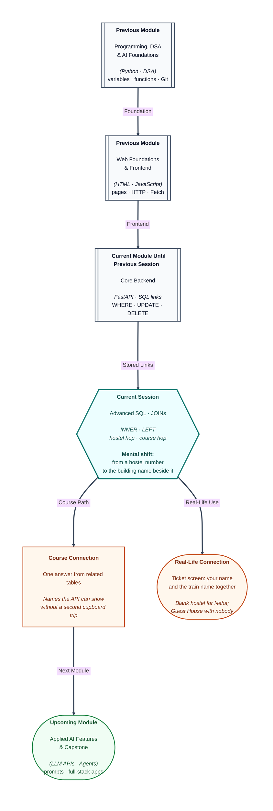

```mermaid
%%{init: {"diagramPadding": 24, "flowchart": {"htmlLabels": true, "nodeSpacing": 90, "rankSpacing": 110, "curve": "basis", "padding": 20}, "theme": "base", "themeVariables": {"fontFamily": "Arial", "fontSize": "15px", "lineColor": "#334155"}}}%%
flowchart TB
    subgraph FOUNDATION[" "]
        direction LR
        PM1[["&nbsp;&nbsp;<b>Previous Module</b>&nbsp;&nbsp;<br/><br/>Programming, DSA<br/>&amp; AI Foundations<br/><br/><i>(Python · DSA)</i><br/>variables · functions · Git"]]
        PM2[["&nbsp;&nbsp;<b>Previous Module</b>&nbsp;&nbsp;<br/><br/>Web Foundations<br/>&amp; Frontend<br/><br/><i>(HTML · JavaScript)</i><br/>pages · HTTP · Fetch"]]
        CM[["&nbsp;&nbsp;<b>Current Module Until Previous Session</b>&nbsp;&nbsp;<br/><br/>Core Backend<br/><br/><i>FastAPI · SQL links</i><br/>WHERE · UPDATE · DELETE"]]
    end

    CURRENT{{"&nbsp;&nbsp;<b>Current Session</b>&nbsp;&nbsp;<br/><br/>Advanced SQL · JOINs<br/><br/><i>INNER · LEFT<br/>hostel hop · course hop</i><br/><br/><b>Mental shift:</b><br/>from a hostel number<br/>to the building name beside it"}}

    subgraph VALUE[" "]
        direction LR
        COURSE["&nbsp;&nbsp;<b>Course Connection</b>&nbsp;&nbsp;<br/><br/>One answer from related tables<br/><br/><i>Names the API can show<br/>without a second cupboard trip</i>"]
        REAL(["&nbsp;&nbsp;<b>Real-Life Connection</b>&nbsp;&nbsp;<br/><br/>Ticket screen: your name<br/>and the train name together<br/><br/><i>Blank hostel for Neha;<br/>Guest House with nobody</i>"])
    end

    subgraph FUTURE[" "]
        direction LR
        M4(["&nbsp;&nbsp;<b>Upcoming Module</b>&nbsp;&nbsp;<br/><br/>Applied AI Features<br/>&amp; Capstone<br/><br/><i>(LLM APIs · Agents)</i><br/>prompts · full-stack apps"])
    end

    PM1 ==>|&nbsp;Foundation&nbsp;| PM2
    PM2 ==>|&nbsp;Frontend&nbsp;| CM
    CM ==>|&nbsp;Stored Links&nbsp;| CURRENT
    CURRENT ==>|&nbsp;Course Path&nbsp;| COURSE
    CURRENT ==>|&nbsp;Real-Life Use&nbsp;| REAL
    COURSE ==>|&nbsp;Next Module&nbsp;| M4

    classDef previous fill:#f8fafc,stroke:#475569,stroke-width:2px,color:#0f172a
    classDef current fill:#ecfeff,stroke:#0f766e,stroke-width:3px,color:#134e4a
    classDef value fill:#fff7ed,stroke:#c2410c,stroke-width:2px,color:#7c2d12
    classDef future fill:#f0fdf4,stroke:#15803d,stroke-width:2px,color:#14532d

    class PM1,PM2,CM previous
    class CURRENT current
    class COURSE,REAL value
    class M4 future

    style FOUNDATION fill:transparent,stroke:transparent
    style VALUE fill:transparent,stroke:transparent
    style FUTURE fill:transparent,stroke:transparent
    linkStyle default stroke:#334155,stroke-width:3px
```
