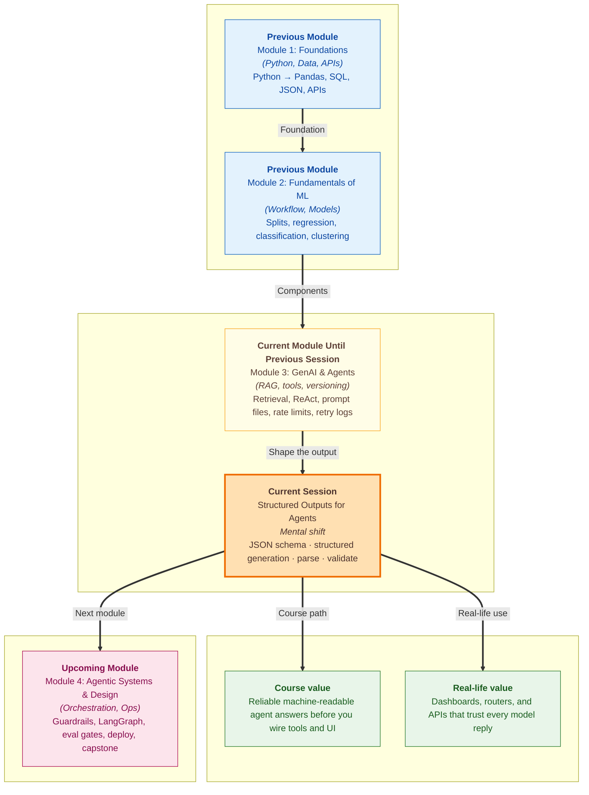

# Pre-read: Structured Outputs for Agents

Your **ShopEasy support dashboard** looked ready for launch. The design team built neat cards — **priority badge**, **team queue**, **one-line summary**, **draft reply box**. The AI agent sounded brilliant in testing. *"We will process your refund within five to seven working days once verified."* Polite. Clear. Human.

Then engineering connected the live agent to the dashboard. The screen went blank. The logs showed a crash. The model had written a **beautiful paragraph** — but the dashboard expected **labelled boxes**: which team should handle the ticket, how urgent it is, whether a human must take over, what the short summary is. The reply had none of that in a fixed shape. Someone tried to **guess** the priority by searching for the word *"urgent"* inside the paragraph. It worked on three demo messages and failed on the fourth. A customer wrote *"this is urgent!!!"* about a **shipping** delay, and the system routed them to **billing** with a **high** priority badge. The manager asked a fair question: *"If the AI is so smart, why can't our app read its own answers?"*

That gap — fluent language on the outside, broken handoff on the inside — is one of the most common surprises when moving from a chat demo to a **real product**. Humans read tone and intent. **Software** reads **keys and types**. Your database, tool router, and UI do not "understand" prose the way you do. They need answers in a **strict, repeatable format** — the same way **IRCTC** needs your **from station**, **to station**, and **class** filled in exact boxes, not *"I think I want Mumbai sometime next week."*

In the **previous** part of the course you learned how agents retrieve context, use tools, version prompts, and call APIs safely. Those habits keep development honest. The next reliability layer is **output shape**: making sure every agent answer is something your application can **parse**, **check**, and **route** without praying the wording stays the same.

---

## Context of This Session in the Course

---

## When a perfect sentence is the wrong answer

Picture a **passport office**. The clerk does not accept a diary entry about your life story. The form has **fixed fields** — name, date of birth, address — and some boxes carry a **red asterisk** meaning *you cannot leave this empty*. Miss one required box and the application returns to you, even if the rest is written in perfect English.

An AI agent in a product works the same way once **something else** must act on its answer — assign a **support queue**, show a **red HIGH badge**, skip auto-reply and alert a human, or trigger a **refund tool**. The model may write gorgeous language. Your app still needs **`category`**, **`priority`**, **`summary`**, and **`needs_human`** — every time, in a predictable structure.

That structure is what teams call **structured output**. The most common format is **JSON** — a neat text layout of **labelled values** that programs already know how to read. You have seen JSON before when working with APIs and data files. Here the twist is new: you are not only **receiving** JSON from a service — you are **asking the model itself** to **produce** JSON that your own code can trust.

---

## The challenges we will tackle

What if you tell the model *"please reply in JSON"* but it sometimes wraps the answer in **extra sentences**, **markdown formatting**, or **half-finished braces** — and your app crashes instead of showing a friendly error?

What if the JSON **looks** valid but uses **`"Priority": "High"`** instead of the lowercase **`"high"`** your routing rules expect — so tickets land in the wrong queue silently?

What if the model returns every required field except **`needs_human`**, and your auto-reply sends a refund draft to a customer who was **threatening legal action** — because nobody **validated** the shape before clicking send?

What if you build a **refund tool** that fires whenever JSON parses successfully — even when the business rule says **humans must approve billing disputes first**?

What if a new prompt reads **warmer and smarter** to humans but **breaks your dashboard** because **`summary`** sometimes runs too long or **`suggested_reply`** appears when it should stay empty?

In class we connect these stories to a practical pipeline: define a **JSON schema** (your application's contract), **prompt** the model to follow it, use provider settings that nudge **valid JSON syntax**, **parse** the raw text safely when the model adds noise, and **validate** required fields and business rules **before** any tool or UI component sees the data.

---

## The steel tiffin with labelled compartments

Imagine a **school tiffin** with fixed compartments — **dal**, **roti**, **sabzi**, **salad** — each labelled. The rule is: *food only goes in the right compartment, nothing loose on the tray.* You do not hand the teacher a mixed blob in a plastic bag and hope they sort it.

**Structured generation** is that tiffin rule for agent answers. Your **schema** is the label diagram — which compartments exist, which are **mandatory**, which values are allowed (for example priority must be **low**, **medium**, or **high** — not *"super urgent!!!"*). Your **prompt** tells the model the rule in plain language. The **API setting** for JSON mode is the canteen supervisor nudging *"serve only on the standard tray."* Even then, a careful kitchen still **checks the tray** before it reaches the student — that check is **validation**.

Parsing is **opening the lid and confirming** the contents are actually in JSON form, not prose hidden inside decorative wrapping. Validation is **confirming every required compartment is filled correctly** before the tray goes to the **billing team counter**, the **dashboard display**, or the **refund tool**.

---

In this pre-read, you'll discover:

- **Why** free-form agent replies break **dashboards, routers, and tools** — and how **structured JSON** turns answers into something software can trust every time
- **How** a **JSON schema** acts as your **application contract** — required fields, allowed values, and no surprise extra keys
- **How** to combine **clear prompt instructions** with **JSON mode** on the API so the model aims at the right shape — and why you still **validate** in your own code
- **What** to do when model output is **messy or almost-right** — clean it safely, parse it, reject bad data with clear errors instead of silent crashes

---

## Words you will hear — explained right away

- **Structured output:** A model answer in a **fixed format** (usually JSON) so programs can read it without guessing from paragraphs.
- **JSON:** A text format of **labelled values** — like a digital form with named fields instead of a essay.
- **JSON schema:** The **blueprint** your team writes that says which fields must exist, what type they are, and which string values are allowed.
- **Required field:** A key that **must** appear in every valid answer — like a red-asterisk box on a government form.
- **Enum:** A **fixed menu** of allowed strings — for example priority can only be **low**, **medium**, or **high**.
- **Structured generation:** Guiding the model — through instructions and API settings — to produce output in that agreed shape.
- **JSON mode:** An API option that nudges the model toward **syntactically valid JSON** — correct brackets and quotes — though your schema rules still need a separate check.
- **Parsing:** Converting the model's raw text into a **Python dictionary** your code can index by field name.
- **Validation:** Checking that the parsed dictionary is **actually usable** — right keys, right types, allowed values, and business rules like *empty draft reply when a human is required*.
- **Schema pass rate:** When you test many sample customer messages, the percentage that **parse and validate** successfully — a simple reliability score for your agent output.

---

## What's next

By the end of the session, you should be able to:

- **Define** a **JSON schema** for a **ShopEasy support ticket** classifier — mapping fields to real UI and routing decisions
- **Write** prompt instructions that list **every required key** — not just *"respond in JSON"*
- **Call** the model with **JSON mode** and understand what it guarantees — and what it does **not**
- **Parse** model output **defensively** when fences, preamble text, or truncation appear
- **Validate** required fields, enums, and simple **business rules** before passing data to a **dashboard card** or **tool gate**
- **Explain** why **parsing success** and **validation success** are two different safety layers — and why tools should still check policy flags like **`needs_human`**

Deeper **agent build**, **orchestration**, and **deployment** topics lie ahead in this module and the **next** module. Today you learn the habit every production agent needs: **contract first, validate before side effects** — so fluent language never tricks your product into acting on bad data.

---

## Questions to think about before class

1. A customer writes: *"I was charged twice for order 8821. Refund the duplicate immediately or I will complain to consumer court."* Your dashboard needs **`category`**, **`priority`**, **`summary`**, **`needs_human`**, and **`suggested_reply`**. Why is a polite **paragraph answer** dangerous here even if it sounds perfect — and which **two fields** would you expect to protect the business before any auto-reply or refund tool runs?

2. The model returns text that starts with *"Here is the JSON:"* and wraps the object inside **markdown formatting** — but the content between the braces is otherwise correct. Why is **trusting your eyes** a bad strategy in production — and what should happen instead of pasting the reply straight into a database insert?

3. Two test runs on the **same customer message** produce JSON where one uses **`"priority": "high"`** and the other **`"priority": "HIGH"`**. Your router only recognises lowercase values. Who should catch this mistake — the model, the API, or your **validation step** — and what happens if you skip that step?

Bring these questions to class. The session turns fragile *"please reply in JSON"* wishes into a **repeatable pipeline** — schema, generation, parse, validate, then route — so your agent can sound human while your product stays **machine-safe**.
