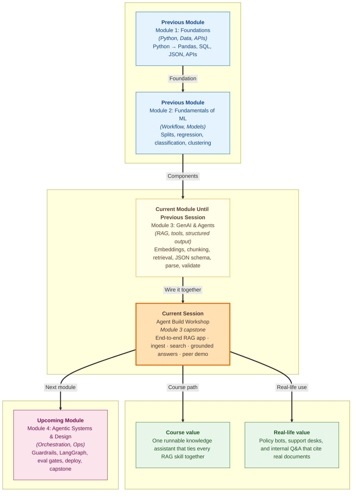

# Pre-read: Agent Build Workshop

**ShopEasy** is ready to turn on a **customer support assistant**. The demo looks impressive. A student types *"Can I return shoes I bought last week?"* and the assistant replies in perfect English — warm tone, confident advice, even a suggested next step. Leadership nods. Someone asks the question every product manager eventually asks: *"Which policy document did that answer come from?"*

Silence. The reply sounded right, but nobody could point to a **returns file**, a **page number**, or a **paragraph** that actually said **30 days**. Another tester asks about **free delivery on a ₹600 order**. The assistant says yes — but the shipping policy on the company wiki mentions a **₹499 threshold**. A third person asks *"Do you accept UPI?"* There is **no payment policy** in the folder at all — yet the model still invents a polite answer instead of saying **"I don't know."**

The team did not build a bad demo on purpose. They connected a **smart language model** to a chat box and hoped it would behave like a trained support agent. What they built was a **fluent guesser** — impressive sentences with no **library**, no **search step**, and no proof. In the **previous** part of the course you learned **structured outputs** so agent answers can feed dashboards and tools reliably. Across **earlier labs** you also practised the **pieces** of a better design: turning text into **searchable meaning**, **splitting** long policies into small chunks, **finding** the right chunks for a question, and **writing answers only from what was retrieved**.

Each lab taught **one stage**. The **final session of Module 3** is where those stages become **one product** — a **simple, end-to-end knowledge application** you build yourself, run from a single script, and **demo to a peer** with evidence on screen.

---

## Context of This Session in the Course

---

## When confidence is not the same as correctness

Picture a **railway enquiry counter** at a busy station. Two clerks sit side by side. One answers from **memory** — fast, smooth, sometimes wrong platform number. The other **looks at the live display board**, reads the exact row, then speaks. Passengers trust the second clerk when trains are delayed and boards change every few minutes.

A support assistant for **returns**, **shipping**, and **warranty** rules faces the same choice. Your company already has the answers — in PDFs, help-centre pages, and internal notices. The hard part is not *whether* the model can write English. The hard part is making it **read your documents first**, **show which lines it used**, and **refuse to invent** when the topic is not in the library at all.

That design has a name teams use in industry: **Retrieval-Augmented Generation** — often shortened to **RAG**. In everyday terms: **search your files, paste the relevant parts, then write the answer** — like an **open-book exam** where the invigilator checks that you only used the pages you were given.

---

## The challenges we will tackle

What if your shop has **three short policy documents** — returns, shipping, warranty — but a customer question needs **only two** of them? How do you avoid dumping the entire company handbook into every reply?

What if a customer writes *"I want my money back"* instead of *"return policy"* — and a simple keyword search misses the right paragraph even though the meaning is obvious?

What if the model **sounds** authoritative about **UPI payments** when your corpus never mentioned payments — and a real customer acts on bad advice?

What if your teammate asks you to **demo the app live** and you cannot show **which chunk** supported each fact — only a polished paragraph with no paper trail?

What if you built each RAG step in a **separate lab notebook** but never packaged them into **one runnable program** a manager could launch with a single command?

In the workshop we answer these by building a **complete pipeline**: pick a **small document set**, **prepare and label** the text, **store** it for **meaning-based search**, **retrieve** the best few passages for each question, **assemble** them into a clear prompt with rules that say *"answer only from this evidence"*, and **generate** a reply you can **audit** before you show it to anyone.

---

## The librarian with three folders

Imagine a **college library** with a strict rule: you may not answer from memory. When a student asks a question, the librarian runs to the shelf, pulls **up to three thin folders** labelled with **file name and page**, places them on the desk, reads only those pages, then answers — and ends with *"Sources used: returns policy, page 2."*

If the question is about **hostel laundry** but the library only stocks **mess rules, curfew, and guest policy**, the librarian says **"I could not find that in the documents I have"** — instead of making up a timetable.

That is the **core logic** of the session. Your **document corpus** is the shelf. **Chunking** is cutting long policies into **index cards** so one card holds roughly one idea. **Embeddings and vector search** are how the librarian finds cards by **meaning**, not only by matching the exact words the student typed. **Grounded generation** is the rule that the spoken answer must follow the cards on the desk. The **runnable application** is the whole desk process wired together — so you can repeat it for every new question and **prove** it in a **peer review demo**.

---

In this pre-read, you'll discover:

- **Why** a chat box on top of a language model is not enough for **policy-style support** — and how **search-then-answer** changes trust
- **How** a **small, labelled document set** becomes the only source of truth your assistant may cite
- **What** happens at each stage — **prepare**, **store**, **retrieve**, **assemble context**, **generate** — when you wire them into **one end-to-end build**
- **How** to **test** your app with both **easy** and **trick** questions — including topics **not** in your library — before you demo it live

---

## Words you will hear — explained right away

- **Document corpus:** The **collection of source texts** your app is allowed to search — your small library shelf, not the whole internet.
- **Chunking:** Splitting long documents into **short, labelled pieces** so search returns a useful paragraph, not a wall of text.
- **Embedding:** Turning a piece of text into a **list of numbers that capture meaning** — so *"money back"* and *"refund"* can land near each other in search.
- **Vector database:** A store that keeps those meaning-numbers and finds the **closest matches** quickly — like a catalogue sorted by idea, not spelling.
- **Top-k retrieval:** Asking for the **best few chunks** (for example three) for each question — enough detail without noise.
- **Context assembly:** Placing retrieved chunks inside a **clearly marked section** of the prompt, with rules at the top, before the user's question.
- **Grounded generation:** The model writes an answer **only from the supplied chunks** — and should refuse when the answer is not there.
- **Grounding check:** You compare each **fact in the answer** to the **retrieved text** and note which **source file** supported it.
- **Peer review demo:** You run the live app while a partner asks questions and checks a short **yes/no checklist** — evidence visible before every answer.

---

## What's next

By the end of the session, you should be able to:

- **Choose** a **small corpus** — reuse the **ShopEasy** policy set from earlier labs or bring your own short texts
- **Run** the full **Module 3 RAG flow**: load and chunk documents, create embeddings, store them in a **vector database**
- **Configure retrieval**, **assemble context** for the language model, and **generate answers grounded** in retrieved chunks only
- **Package** everything as a **simple runnable application** and **demo** it with a **peer-review checklist**
- **Explain** why showing the **retrieval trace before the answer** is non-negotiable for a trustworthy demo

This workshop **closes Module 3** — you leave with a working knowledge assistant, not just separate lab exercises. The **next** module moves toward **orchestration, guardrails, and deployment** at a larger scale. Today you earn the builder's confidence that comes from wiring the full path yourself: **library first, answer second, proof always**.

---

## Questions to think about before class

1. A customer asks: *"I bought headphones for ₹2,400 last month. They stopped working. Can I return them or only claim warranty?"* Your corpus has **separate** returns and warranty policies. Why might a **plain chatbot** blend or confuse those rules — and what would you want to **see on screen** before trusting the answer?

2. Someone asks: *"Is cash on delivery available in my city?"* Your folder has **no payment or delivery-payment policy at all**. What should a **responsible** assistant say — and why is a confident invented answer worse than *"I could not find this in the provided documents"*?

3. You are about to demo your app to a classmate. They will deliberately ask one **fair** question and one **unfair** question you did not rehearse. What **evidence** will you show for each answer so they know you did not type the reply by hand — and which **single test question** would you run the night before to catch a broken pipeline early?

Bring these questions to class. The workshop turns scattered RAG skills into **one capstone build** — a support-style assistant that **searches first, cites its sources, and refuses to bluff** when the library has nothing to say.
