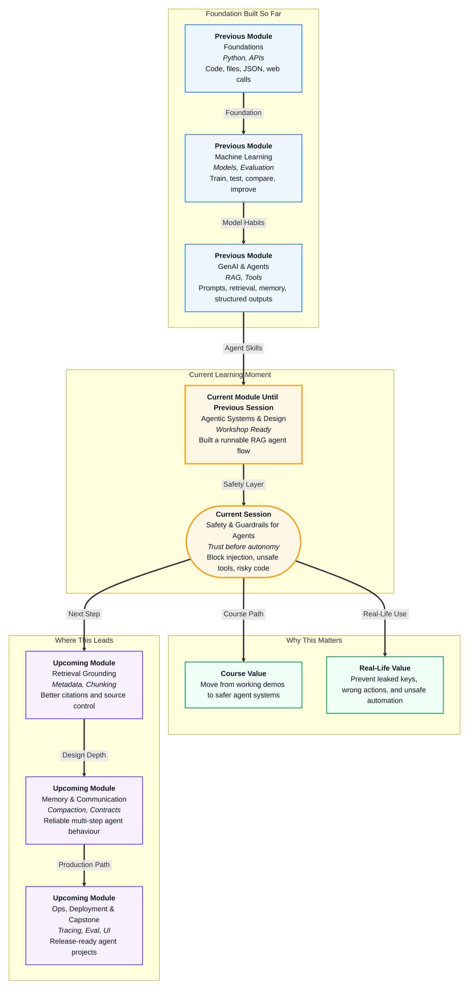

```mermaid
%%{init: {"flowchart": {"nodeSpacing": 55, "rankSpacing": 70, "diagramPadding": 20}} }%%
flowchart TB
  subgraph Foundation["Foundation Built So Far"]
    M1["<b>Previous Module</b><br/>Foundations<br/><i>Python, APIs</i><br/>Code, files, JSON, web calls"]
    M2["<b>Previous Module</b><br/>Machine Learning<br/><i>Models, Evaluation</i><br/>Train, test, compare, improve"]
    M3["<b>Previous Module</b><br/>GenAI & Agents<br/><i>RAG, Tools</i><br/>Prompts, retrieval, memory, structured outputs"]
  end

  subgraph Current["Current Learning Moment"]
    CM["<b>Current Module Until Previous Session</b><br/>Agentic Systems &amp; Design<br/><i>Workshop Ready</i><br/>Built a runnable RAG agent flow"]
    CS(["<b>Current Session</b><br/>Safety &amp; Guardrails for Agents<br/><i>Trust before autonomy</i><br/>Block injection, unsafe tools, risky code"])
  end

  subgraph Value["Why This Matters"]
    CV["<b>Course Value</b><br/>Move from working demos to safer agent systems"]
    RV["<b>Real-Life Value</b><br/>Prevent leaked keys, wrong actions, and unsafe automation"]
  end

  subgraph Future["Where This Leads"]
    F1["<b>Upcoming Module</b><br/>Retrieval Grounding<br/><i>Metadata, Chunking</i><br/>Better citations and source control"]
    F2["<b>Upcoming Module</b><br/>Memory &amp; Communication<br/><i>Compaction, Contracts</i><br/>Reliable multi-step agent behaviour"]
    F3["<b>Upcoming Module</b><br/>Ops, Deployment &amp; Capstone<br/><i>Tracing, Eval, UI</i><br/>Release-ready agent projects"]
  end

  M1 ==>|&nbsp;Foundation&nbsp;| M2
  M2 ==>|&nbsp;Model Habits&nbsp;| M3
  M3 ==>|&nbsp;Agent Skills&nbsp;| CM
  CM ==>|&nbsp;Safety Layer&nbsp;| CS
  CS ==>|&nbsp;Course Path&nbsp;| CV
  CS ==>|&nbsp;Real-Life Use&nbsp;| RV
  CS ==>|&nbsp;Next Step&nbsp;| F1
  F1 ==>|&nbsp;Design Depth&nbsp;| F2
  F2 ==>|&nbsp;Production Path&nbsp;| F3

  classDef previous fill:#EEF6FF,stroke:#4A90E2,stroke-width:2px,color:#111827
  classDef current fill:#FFF7E6,stroke:#F5A623,stroke-width:3px,color:#111827
  classDef value fill:#F0FFF4,stroke:#38A169,stroke-width:2px,color:#111827
  classDef future fill:#F7F0FF,stroke:#805AD5,stroke-width:2px,color:#111827

  class M1,M2,M3 previous
  class CM,CS current
  class CV,RV value
  class F1,F2,F3 future
  linkStyle default stroke-width:3px
```
