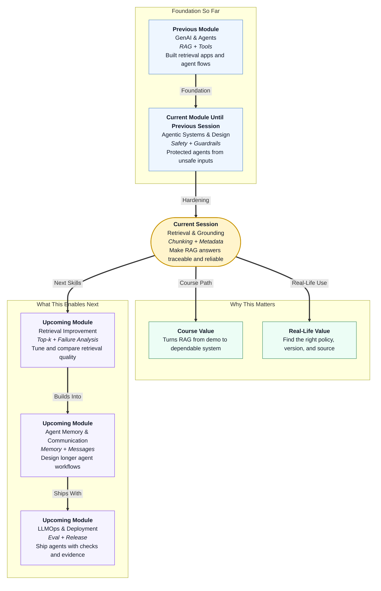

```mermaid
%%{init: {'flowchart': {'nodeSpacing': 55, 'rankSpacing': 70, 'diagramPadding': 20}} }%%
flowchart TB
    subgraph Foundation["Foundation So Far"]
        M3["<b>Previous Module</b><br/>GenAI & Agents<br/><i>RAG + Tools</i><br/>Built retrieval apps and agent flows"]
        CM["<b>Current Module Until Previous Session</b><br/>Agentic Systems & Design<br/><i>Safety + Guardrails</i><br/>Protected agents from unsafe inputs"]
    end

    CS(["<b>Current Session</b><br/>Retrieval & Grounding<br/><i>Chunking + Metadata</i><br/>Make RAG answers traceable and reliable"])

    subgraph Value["Why This Matters"]
        CV["<b>Course Value</b><br/>Turns RAG from demo to dependable system"]
        RV["<b>Real-Life Value</b><br/>Find the right policy, version, and source"]
    end

    subgraph Future["What This Enables Next"]
        U1["<b>Upcoming Module</b><br/>Retrieval Improvement<br/><i>Top-k + Failure Analysis</i><br/>Tune and compare retrieval quality"]
        U2["<b>Upcoming Module</b><br/>Agent Memory & Communication<br/><i>Memory + Messages</i><br/>Design longer agent workflows"]
        U3["<b>Upcoming Module</b><br/>LLMOps & Deployment<br/><i>Eval + Release</i><br/>Ship agents with checks and evidence"]
    end

    M3 ==>|&nbsp;Foundation&nbsp;| CM
    CM ==>|&nbsp;Hardening&nbsp;| CS
    CS ==>|&nbsp;Course Path&nbsp;| CV
    CS ==>|&nbsp;Real-Life Use&nbsp;| RV
    CS ==>|&nbsp;Next Skills&nbsp;| U1
    U1 ==>|&nbsp;Builds Into&nbsp;| U2
    U2 ==>|&nbsp;Ships With&nbsp;| U3

    classDef previous fill:#eef6ff,stroke:#4b83c4,color:#111827;
    classDef current fill:#fff4cc,stroke:#c79200,color:#111827,stroke-width:2px;
    classDef value fill:#ecfdf5,stroke:#2f855a,color:#111827;
    classDef future fill:#f5f3ff,stroke:#7c3aed,color:#111827;

    class M3,CM previous;
    class CS current;
    class CV,RV value;
    class U1,U2,U3 future;
    linkStyle default stroke-width:3px;
```
