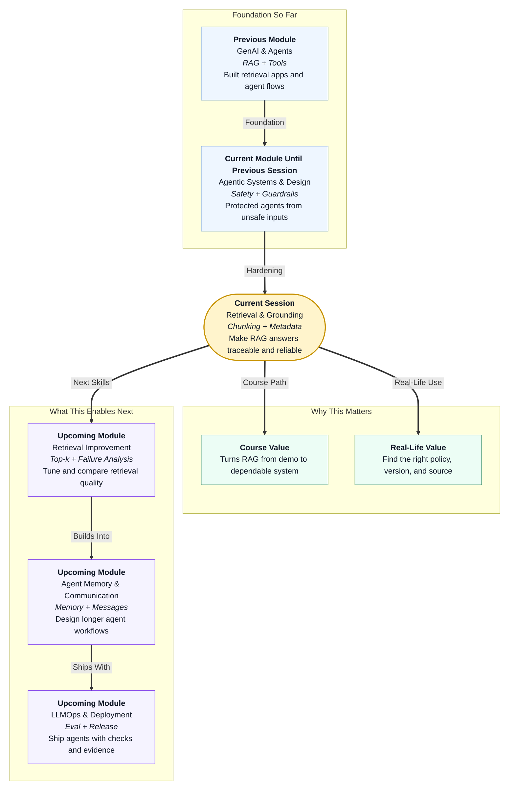

# Pre-read: Retrieval & Grounding: Chunking & Metadata

## Context of This Session in the Course

## Why This Topic Matters

Imagine you visit a college office and ask, **"What is the latest assignment submission rule?"**

The staff member opens a cupboard, pulls out an old circular, and confidently gives you the answer. The paper looks official, but the answer is still wrong because the source is outdated.

This is exactly what can happen in a RAG system.

A RAG app may sound smart because it writes fluent answers. But if it retrieves the wrong document, an old policy, or a chunk without source information, the final answer can become misleading.

The better question is not only **"Can the AI answer?"** It is: **"Can the AI show that its answer came from the right source?"**

## The Challenge

Think of a company with many documents:

- Product manuals
- Return policies
- Warranty rules
- Old policy versions
- FAQs

Now a user asks: **"Can I return my laptop after ten days?"**

The word **return** may appear in mobile policy, laptop policy, grocery policy, old policy, and training notes.

If the system only searches by meaning, it may bring a related but wrong document. The AI may then create a confident answer from weak evidence.

The AI may simply be answering from the wrong shelf.

## The Core Idea

This session introduces the habits that make retrieval more reliable:

- **Chunking** means breaking large documents into smaller useful parts.
- **Metadata** means labels attached to each chunk, like document type, product, date, version, and source.
- **Metadata filters** help the system search only the correct category of chunks.
- **Source tagging** helps the answer show where it came from.
- **Grounding checks** help confirm that the final answer is supported by retrieved sources.

Think of it like a library.

If all books are dumped in one big pile, finding the right answer is risky. If books are arranged by subject, year, and author, the librarian can quickly find the correct book.

RAG also needs this kind of arrangement.

Documents should be stored with meaningful labels.

## A Simple Analogy

Imagine your family keeps important papers at home.

There may be bills, certificates, reports, and bank papers. If everything is inside one plastic bag, finding one paper becomes stressful.

Now imagine each paper has a label:

- **Type:** bill, certificate, report, agreement
- **Year:** current or old
- **Person:** whose document it belongs to
- **Source:** where it came from
- **Status:** active or expired

Suddenly, searching becomes easier. Metadata in RAG works in the same way.

Chunking is like separating one large file into useful pages.

## What You Will Discover

In this pre-read, you'll discover:

- **Understand** why a fluent AI answer can still be wrong if retrieval brings the wrong chunk.
- **Learn** how metadata filters help the system respect document type, product, date, and status.
- **Discover** why content changes require re-chunking and re-indexing with consistent ids.
- **Understand** how source tags make citations possible and improve trust.

These ideas may look small, but they separate a demo chatbot from a dependable assistant.

## Why Old Chunks Are Dangerous

One of the easiest RAG mistakes is forgetting to refresh old chunks.

Suppose an old refund policy says refunds take **15 working days**. Later, the rule changes to **7 working days**.

If the old chunk remains in the search index, the bot may still answer with 15 working days. The model may look wrong, but the real issue is that the system gave it outdated context.

That is why chunk refresh matters. When documents change meaningfully, the system should create fresh chunks and update the index.

## Why Citations Matter

A citation is a visible source reference.

Instead of only saying, **"Laptops can be returned within 10 days,"** a better answer also says, **"Source: laptop_policy.md - Return Rules."**

This builds trust. It also helps developers inspect the exact source chunk when an answer is wrong.

In professional AI systems, traceability is part of reliability.

## What You Will Be Able to Do After This

After the session, you will be able to:

- Explain why retrieval problems should be checked before blaming the prompt.
- Design simple metadata fields for a RAG knowledge base.
- Decide when a document needs to be re-chunked.
- Describe how source tagging supports citations.
- Use a grounding checklist before changing a RAG prompt.

This prepares you for stronger retrieval improvement work and later agent release practices.

## Interesting Questions for the Live Session

Keep these questions in mind:

- If two chunks look similar, how can the system know which one is the current policy?
- What happens when a RAG app retrieves the correct topic but the wrong product?
- How can a user trust an AI answer if the answer does not show any source?

By the end, you will start seeing RAG not as magic search, but as a carefully organised knowledge system.
