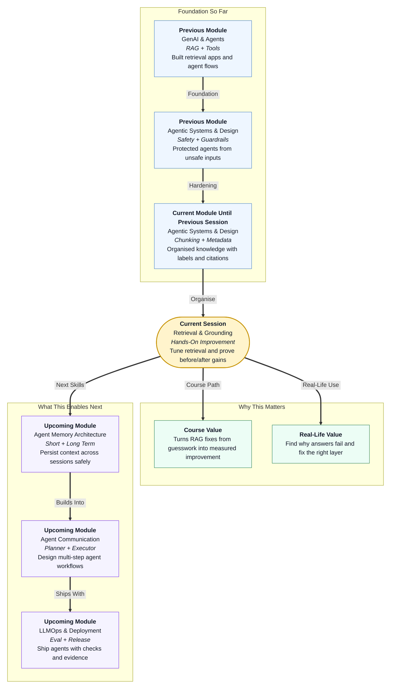

# Pre-read: Retrieval & Grounding: Hands-On Improvement

## Context of This Session in the Course

## Why This Topic Matters

Imagine you run a small customer support desk for an online store.

Every day, ten different customers ask ten different questions about returns, warranty, delivery, and refunds. You have all the answers somewhere in company documents. But some days your team gives perfect replies. On other days, the same team gives confident but wrong replies.

When that happens, the problem is rarely that your staff cannot read English. The problem is often that they picked the **wrong document** before answering.

A RAG system faces the same risk.

In the previous session, you learnt how to organise knowledge with **chunking**, **metadata**, and **source tags**. That work created a cleaner library. But a clean library alone does not guarantee that the right page is picked every time.

This session is about something every professional AI team eventually does: **stop guessing and start measuring**.

Instead of saying, "The bot feels better now," you will learn to ask, "Did retrieval actually improve for the questions that were failing?"

That shift matters for your career. Companies do not reward demos that sound smart once. They reward systems that can be checked, improved, and trusted again and again.

## The Challenge

Picture a company knowledge bot with fifty policy documents.

A user asks: **"Can I exchange a damaged laptop within seven days?"**

The bot answers confidently: **"Exchanges are allowed within fifteen days."**

The answer sounds polished. But it is wrong.

Now imagine you are the person responsible for fixing it. Where do you start?

- Do you rewrite the prompt?
- Do you change chunk size?
- Do you increase how many documents the system fetches?
- Do you add a metadata filter?
- Or is the retrieval already correct, and the model simply misread the policy?

If you change the wrong thing, you may waste hours and still fail on the next question.

This is the real challenge of RAG improvement: **many things can look broken, but only one layer is actually failing**.

What if you had a small notebook of test questions — each with the exact document that should support the answer?

Then you could run the same questions again and again after each change. You could see whether retrieval got better **before** worrying about fancy tools or expensive search systems.

That notebook is the heart of this session.

## Measuring Retrieval Like a Practical Engineer

Professional teams often use complex evaluation platforms. In this session, you will use a simpler and very powerful beginner habit:

1. Build a **small eval set** — a short list of real user-style questions.
2. For each question, note the **expected supporting document** or chunk.
3. Run retrieval and check whether the right source appears in the results.
4. Record an informal **retrieval hit rate** — how often the correct document is found.

Think of it like a tuition teacher checking homework against an answer key.

The teacher does not need a huge exam system on day one. Even ten carefully chosen questions can reveal a pattern:

- Which topics fail repeatedly?
- Are failures happening on old policy questions?
- Does the system confuse two similar products?
- Is the right document missing, or buried too low in the results?

This kind of measurement turns frustration into direction.

## The Two Knobs You Will Tune

Once you know which questions fail, you can experiment with retrieval settings without rebuilding the whole system.

### Top-k

**Top-k** means how many chunks the system retrieves before answering.

- If **k** is too small, the correct chunk may be left out entirely.
- If **k** is too large, the model may receive too many mixed documents and get confused.

It is like asking a librarian for books:

- Ask for **one** book, and you may miss the right shelf.
- Ask for **twenty** books, and the student may read the wrong one first.

There is no magic number for every company. That is why you test.

### Chunk Parameters

**Chunk size** and **chunk overlap** decide how documents are split before search.

- A **small chunk** may be very focused but may cut an important sentence in half.
- A **large chunk** may include extra noise.
- **Overlap** helps when the answer sits across two chunk boundaries.

In the previous session, you learnt why these choices matter for organisation and citations. In this session, you will see how they affect **retrieval success** on real failing questions.

## Retrieval Failure vs Generation Failure

One of the most important skills in this session is learning to classify failures correctly.

### Retrieval Failure

This happens when the system fetches the wrong documents, old documents, or no useful document at all.

**Symptoms:**

- The answer invents details not present anywhere.
- The citation points to the wrong file.
- The correct policy exists, but never appears in retrieved results.

**Likely fixes:**

- Adjust **top-k**
- Improve **chunk size** or **overlap**
- Add or tighten **metadata filters**
- Re-chunk and re-index outdated content

### Generation Failure

This happens when retrieval brings the correct document, but the final answer still goes wrong.

**Symptoms:**

- The right source appears in retrieved chunks.
- The citation is correct, but the answer misreads a number, date, or condition.
- The model adds extra assumptions not supported by the text.

**Likely fixes:**

- Strengthen the prompt
- Ask the model to quote or cite before answering
- Apply grounding checks
- Refuse when evidence is weak

This distinction saves time.

If retrieval is wrong, rewriting the prompt again and again will not solve the root problem. If retrieval is right, changing chunk size again and again will also not help.

Good engineers fix the correct layer first.

## A Simple Analogy: The Medical Report

Imagine you visit a doctor because you feel unwell.

The doctor can only give a good treatment if two steps work:

1. **Tests** bring the correct reports.
2. **Diagnosis** interprets those reports correctly.

If the lab sends the wrong patient's report, even a brilliant doctor may give the wrong advice. That is a **retrieval failure**.

If the lab sends your correct report, but the doctor misreads the sugar level, that is a **generation failure**.

RAG works the same way.

Retrieval is the lab report step. Generation is the diagnosis step. You must know which step failed before choosing the treatment.

## What You Will Discover

In this pre-read, you'll discover:

- **Understand** why a small eval set with expected supporting documents is the fastest way to improve RAG honestly.
- **Learn** how changing **top-k** and **chunk parameters** affects whether the right document appears in search results.
- **Discover** how to record an informal retrieval hit rate and compare results before and after a change.
- **Understand** how to separate **retrieval failures** from **generation failures** and apply the right fix.

These habits help you improve a system with evidence, not hope.

## Before-and-After Improvement

The goal of this session is not only to find problems. It is to **prove improvement**.

You will pick questions that currently fail, make a focused retrieval change, and run the same eval set again.

For example:

| Question | Before | After Tuning |
|---|---|---|
| Laptop exchange within seven days | Wrong policy retrieved | Correct policy retrieved |
| Refund timeline for cancelled order | Correct doc missing from top results | Correct doc appears in top results |

Even fixing **two** failing questions in a measurable way is a strong professional habit. It shows you can debug like a builder, not just demo like a presenter.

This before-and-after mindset also prepares you for later work in agent memory, multi-step workflows, and release-time evaluation — because all of those topics depend on knowing how to test changes safely.

## What You Will Be Able to Do After This

After the session, you will be able to:

- Build a small question set with expected supporting documents for a RAG app.
- Run **top-k** and chunk experiments and note their effect on retrieval quality.
- Estimate retrieval hit rate in a simple, practical way.
- Label a failure as **retrieval** or **generation** and choose the right next fix.
- Show clear before-and-after improvement on at least two failing questions.

That is the difference between "I changed something" and "I improved something."

## Interesting Questions for the Live Session

Keep these questions in mind:

- If the correct document exists in your knowledge base but never appears in the top results, is that a prompt problem or a retrieval problem?
- Why might increasing **top-k** fix one question but make another question worse?
- When the retrieved chunks are correct but the answer is still wrong, what should you change first — and what should you **not** waste time changing?

By the end, you will start seeing RAG improvement as a calm, repeatable process: **test, classify, tune, compare, and prove**.
