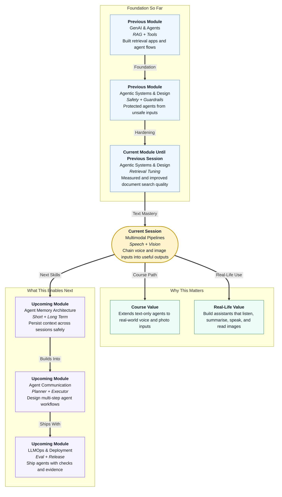

# Pre-read: Multimodal Pipelines (Speech and Vision Models)

## Context of This Session in the Course

---

## Why Agents Must Go Beyond Typed Text

Picture a busy college campus on a Monday morning.

The hostel warden sends a **voice note** on WhatsApp: library hours have changed, carry your student ID, and a guest lecture is cancelled. At the same time, someone posts a **photo** of a notice board near the canteen with the same details written in small print.

Most students will not read a long email. They listen to voice notes while walking. They glance at photos while standing in a queue. They expect quick answers — not a wall of text to decode.

Until now, much of your agent work lived in the **text world**: typed questions, document chunks, written answers. That is powerful for knowledge bases and policy bots. But real products also handle **sound** and **pictures**.

This session is about that shift. You will learn how to connect simple steps so a machine can **hear** a short message, **understand** the main points, **speak** a brief summary back, and **look** at an image to describe what it shows.

That is not science fiction. It is how modern assistants, support tools, and campus bots are built — one clear stage at a time.

## The Challenge: Too Much Information, Too Many Formats

Imagine you are building a small campus update assistant.

Every day you receive:

- A two-minute voice note from the admin office
- A blurry photo of a printed notice
- A long typed email nobody has time to read

Your job is to give every student a **short, accurate briefing** they can listen to on the way to class.

Could you do this by hand?

You would have to **listen carefully** and write down every word. Then **pick out** only the useful facts — library time, ID rule, cancelled event. Then **read those facts aloud** in a calm voice for students who prefer audio. And separately, **open each photo** and describe what the notice says.

For one message, maybe you manage. For ten messages before lunch, you will miss details, mix up timings, or give up.

The hard part is not intelligence alone. It is **coordination across formats**:

| Format | What arrives | What the student needs |
|---|---|---|
| **Audio** | Spoken campus update | Short spoken summary |
| **Image** | Photo of a notice board | One or two clear sentences |
| **Text** | Long transcript | Three bullet points |

What if a system could run this like a small factory line — where each desk does **one job** and passes clean output to the next desk?

That factory-line idea is exactly what you will build in this session.

## From Voice Note to Spoken Summary

The main path you will map looks like this:

**Voice in → written words → short summary → voice out**

Each step has a name professionals use, but the logic is everyday:

1. **Speech-to-Text** — the computer **listens** and writes what was said. Think of YouTube auto-captions under a video.
2. **Summarisation** — the computer **shrinks** a long transcript into the main facts, like sending three bullet points after a meeting instead of the full recording.
3. **Text-to-Speech** — the computer **reads** the summary aloud, like Google Maps giving turn-by-turn directions.

In the previous session, you worked on **retrieval quality** — making sure the right document appears before an answer is written. That skill stays important. This session adds **new input types** so your agents are not limited to typed text alone.

### A Parallel Path for Photos

Speech is one door into the system. **Vision** is another.

A student snaps a photo of a hostel notice. They never recorded a voice message. The useful facts still live **inside the image**.

So you will also try a simple **image → description** step: send a picture to a cloud vision model and get back one or two short sentences about what it shows — library hours, ID reminder, event cancellation.

Vision does not replace speech. It sits beside it. Real apps often need **both**: listen when someone sends audio, look when someone sends a photo.

## A Simple Analogy: The Bank Counter Line

Think of a bank where each counter handles **one task only**.

- Counter 1 collects your form.
- Counter 2 checks the details.
- Counter 3 approves and prints the receipt.

Nobody at Counter 3 tries to fill the form again. Each desk trusts the output from the desk before it.

A **multimodal pipeline** works the same way:

- **Desk 1 (Speech-to-Text):** sound becomes text.
- **Desk 2 (Summarise):** long text becomes short useful points.
- **Desk 3 (Text-to-Speech):** those points become spoken audio again.

If Desk 1 writes the wrong words, Desk 2 and Desk 3 cannot fix the root mistake. That is why you will also learn to **check transcript quality** — compare what the model heard with what was actually said, the way you proofread a friend's dictated message before forwarding it.

For images, imagine a separate **photo desk** that looks at a picture and writes a one-line caption. Same building, different entrance.

## What You Will Discover

In this pre-read, you'll discover:

- **Understand** what **multimodal** means — agents that accept more than typed words, including voice notes and photos.
- **Learn** how to map a full **speech pipeline**: audio in, transcript, summary, spoken summary out.
- **Discover** how to judge whether **Speech-to-Text** captured the right facts before you trust the next step.
- **Understand** where a simple **vision** step fits — image in, short text description out — alongside the speech path.

## Checking Quality at Each Stage

Professional teams do not assume every step worked perfectly. They spot-check.

After speech becomes text, you will compare the model's transcript with a known sample message. Ask practical questions:

- Did it capture **library hours** correctly?
- Did it catch the **student ID** instruction?
- Is the meaning close enough to **summarise safely**?

If the transcript is wrong, fixing the summary prompt will not help. You fix **the failing stage first**, then run the line again — just like reprinting a form at Counter 1 instead of arguing at Counter 3.

For vision, the check is simpler: does the description mention the **useful facts** visible in the photo — not random guesses?

This habit — **test one stage, then connect the full pipeline** — is how beginners avoid hours of confused debugging.

## Cloud Power, Light Laptop

Heavy listening, summarising, and image understanding runs on **cloud services**. Your laptop's job is small: hold sample files, send requests, and show results.

You do not need two different language-model accounts fighting each other. For the main lab path, **one cloud key** powers speech recognition, summarisation, and vision. Text-to-Speech uses a separate lightweight speech service that does not need the same key.

That keeps setup calm: one provider, one key, three connected speech stages — plus an optional image step when you are ready.

## What You Will Be Able to Do After This

After the session, you will be able to:

- Draw and label a **multimodal agent pipeline** on paper before writing any code.
- Run **Speech-to-Text** on a short campus-style voice note and judge transcript quality.
- **Summarise** a transcript into a tight, useful briefing with a cloud language model.
- Connect **Text-to-Speech** so the summary can be **heard**, not only read.
- Send a sample **image** through a vision step and read back a short description.
- Explain when to use **speech** versus **vision** — audio for spoken updates, images for posters, screenshots, and notices that were never recorded.

These skills matter for product roles, support automation, and any agent that must meet users where they already communicate — on WhatsApp, in voice notes, and through phone cameras.

## Interesting Questions for the Live Session

Keep these questions in mind:

- If the spoken summary says the library closes at the wrong time, how do you know whether **Speech-to-Text** failed or **summarisation** changed the meaning?
- Why is it smarter to test **Speech-to-Text**, **summarise**, and **Text-to-Speech** as separate steps before running the full pipeline end to end?
- A student sends a photo of a canteen menu instead of a voice note — which path do you use, and what kind of text output do both paths share?
- When would a product need **both** speech and vision in the same assistant, not just one?

By the end, you will see multimodal agents not as magic, but as a **clear sequence of jobs** — listen, compress, speak, and sometimes look — each step small enough to test, improve, and trust.
