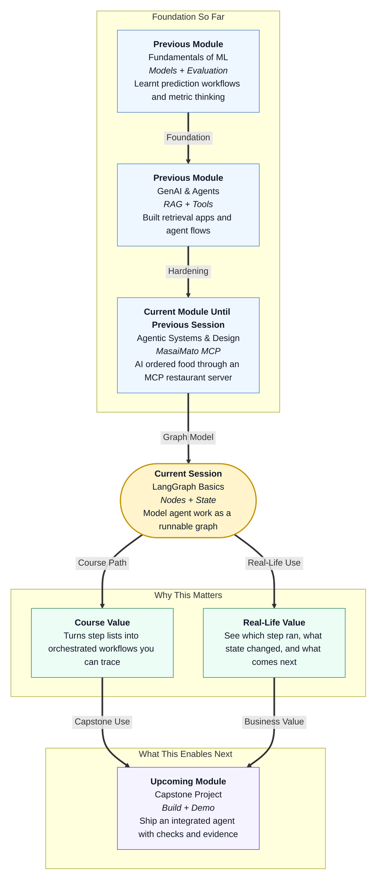

```mermaid
%%{init: {'flowchart': {'nodeSpacing': 55, 'rankSpacing': 70, 'diagramPadding': 20}} }%%
flowchart TB
    subgraph Foundation["Foundation So Far"]
        M2["<b>Previous Module</b><br/>Fundamentals of ML<br/><i>Models + Evaluation</i><br/>Learnt prediction workflows and metric thinking"]
        M3["<b>Previous Module</b><br/>GenAI & Agents<br/><i>RAG + Tools</i><br/>Built retrieval apps and agent flows"]
        CM["<b>Current Module Until Previous Session</b><br/>Agentic Systems & Design<br/><i>MasaiMato MCP</i><br/>AI ordered food through an MCP restaurant server"]
    end

    CS(["<b>Current Session</b><br/>LangGraph Basics<br/><i>Nodes + State</i><br/>Model agent work as a runnable graph"])

    subgraph Value["Why This Matters"]
        CV["<b>Course Value</b><br/>Turns step lists into orchestrated workflows you can trace"]
        RV["<b>Real-Life Value</b><br/>See which step ran, what state changed, and what comes next"]
    end

    subgraph Future["What This Enables Next"]
        U1["<b>Upcoming Module</b><br/>Capstone Project<br/><i>Build + Demo</i><br/>Ship an integrated agent with checks and evidence"]
    end

    M2 ==>|&nbsp;Foundation&nbsp;| M3
    M3 ==>|&nbsp;Hardening&nbsp;| CM
    CM ==>|&nbsp;Graph&nbsp;Model&nbsp;| CS
    CS ==>|&nbsp;Course&nbsp;Path&nbsp;| CV
    CS ==>|&nbsp;Real-Life&nbsp;Use&nbsp;| RV
    CV ==>|&nbsp;Capstone&nbsp;Use&nbsp;| U1
    RV ==>|&nbsp;Business&nbsp;Value&nbsp;| U1

    classDef previous fill:#eef6ff,stroke:#4b83c4,color:#111827;
    classDef current fill:#fff4cc,stroke:#c79200,color:#111827,stroke-width:2px;
    classDef value fill:#ecfdf5,stroke:#2f855a,color:#111827;
    classDef future fill:#f5f3ff,stroke:#7c3aed,color:#111827;

    class M2,M3,CM previous;
    class CS current;
    class CV,RV value;
    class U1 future;
    linkStyle default stroke-width:3px;
```
