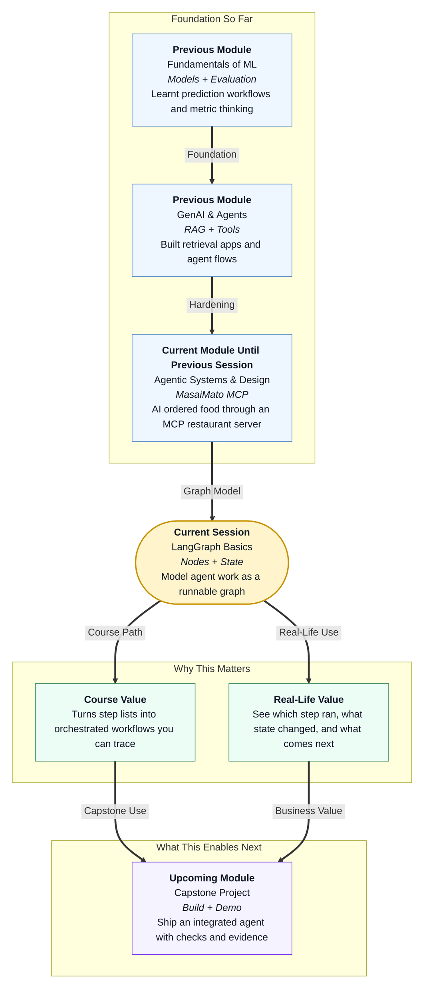

# Pre-read: LangGraph Basics

## Context of This Session in the Course

---

## When a To-Do List Is Not Enough

Imagine a hospital front desk handling appointment requests.

A patient says: **"I need a follow-up visit with the same doctor, preferably next week, and please send me the confirmation."** That one request hides several stations of work. Someone must check the patient record. Someone must find available slots. Someone must book the visit. Someone must prepare the confirmation message.

If the team only keeps a sticky-note list — "check," "book," "message" — things still go wrong. Which note was finished? What information was found at each stage? Did booking happen before the slot was confirmed? When a mistake appears, nobody can replay the path clearly.

Real agent systems face the same issue. A list of steps is a start. A trustworthy system also needs a **map of the journey**: where work happens, how control moves from one step to the next, and what shared information travels along the way.

That is the focus of this session.

## The Challenge: From Ordered Steps to a Visible Workflow Map

In the previous session, you refreshed **agent communication** patterns and built **MasaiMato**: an AI client discovered restaurant tools on an MCP server and placed food orders through a standard protocol. That gave you structured handoffs plus a portable way to reach outside capabilities.

Now ask the next design question: **What if you had to draw that workflow as a diagram of steps and conditions, keep a shared notebook of progress, run a small two- or three-step version end to end, and then walk through exactly how the shared notebook changed after each step?**

Without that map, even a good plan can feel invisible during execution. You may know the roles, but you cannot easily see:

- Which step is running now?
- Why did control move to this next step?
- What information was updated before the next step began?
- Where did the flow finish?

This session introduces **LangGraph** basics as a way to model agent workflows as **graphs** — a practical language for orchestration.

## The Building Blocks: Nodes, Transitions, and State

In simple Indian English, a **graph** here means a flowchart of work, not a chart of sales numbers.

Three ideas matter most:

1. **Nodes** — The stations or steps in the workflow. Each node does one bounded job, such as "read request," "decide next action," or "create confirmation."
2. **Transitions** — The paths between nodes. A transition can be direct, or it can depend on a **condition**. For example: if documents are complete, go to booking; if not, go to a "need more info" step.
3. **Graph state** — The shared notebook carried through the run. State holds the minimal information every node may need, such as the user goal, intermediate results, flags, or error notes.

**LangGraph** is a framework that helps you build and run these graphs for agent workflows. You do not need to memorise advanced features yet. First you need the mental model: steps, paths, and shared state.

Together, these ideas support **orchestration** — making sure the right step runs at the right time with the right shared context.

## What a Simple Graph Looks Like in Plain Terms

A beginner-friendly agent graph for appointment help might look like this:

1. **Node A: Understand request** — Capture the patient goal in a clean form.
2. **Node B: Check availability** — Use the shared state to look for possible slots.
3. **Node C: Confirm outcome** — Write the final message or a blocked reason.

Transitions connect A to B, and B to C. The **state** might store:

- the original request
- whether a valid slot was found
- the chosen appointment time
- any error or blocked reason

When the graph runs, each node reads state, does its job, and updates state. After the run, you should be able to **trace execution order** and explain what changed at each node. That tracing habit is as important as building the graph itself.

This session keeps the first build small: a **two- to three-node** graph for a bounded task. Small is good. It forces clarity.

## Think of It Like a Metro Map and a Shared Travel Card

A useful analogy is a city metro system.

Each station is a **node**. The tracks between stations are **transitions**. Some journeys are straight. Some branch based on conditions — for example, if the express line is closed, passengers move to the local line.

Now imagine every passenger carries one **travel card** that updates at each station: entry point, current station, destination, and any delay note. That travel card is like **graph state**. Every station can read it. Every station can update the relevant fields. No station should invent a private version of the journey that other stations cannot see.

**LangGraph** is like operating that metro according to a published map instead of shouting directions in a crowded lobby. You can point to the route. You can explain why a passenger moved from Station A to Station B. You can inspect the travel card after each stop and understand the journey so far.

When something goes wrong, you do not only say "the trip failed." You ask: Did the passenger enter the wrong station? Did a transition condition send them the wrong way? Did the travel card miss a required field?

## Why Shared State Matters More Than Fancy Steps

Beginners often focus only on writing impressive node logic. Professionals also design the **minimal state**.

If state is too empty, later nodes guess. If state is too crowded, every node becomes confused by unused details. Good state design is like packing a small office file for a meeting: only the papers the next person needs.

As you walk through execution in the live session, practise reading state updates:

- What did Node 1 add?
- What did Node 2 change?
- Did Node 3 finish because the condition was met, or because the flow was blocked?

That skill prepares you for later reliability topics such as checkpoints, resume behaviour, timeouts, and retries. Those advanced ideas rest on one foundation: a workflow you can see and a state you can inspect.

## Why This Matters for Your Career and the Course

Business stakeholders trust systems they can explain. "The AI handled it" is weak. "The request moved from intake to availability check to confirmation, and here is what the shared state contained after each step" is professional.

In this course, you have already built agent abilities: prompting, tools, retrieval, safety, memory, multimodal pipelines, and MCP-based tool connections. LangGraph basics turn those abilities into an **orchestrated workflow map**. This is also a bridge toward more advanced graph control in upcoming learning, and toward capstone systems that must be demonstrated with clear flow evidence.

You will leave this session thinking less like a person writing one long prompt, and more like a person designing a small operating system for a task.

## In this pre-read, you'll discover:

- **Understand** how an agent workflow can be drawn as nodes and conditional transitions.
- **Discover** why minimal shared graph state helps every step work from the same notebook.
- **Learn** what a simple two- to three-node graph is trying to prove in a bounded task.
- **Understand** how to trace execution order and interpret state updates after each node.

## What You Will Be Able to Talk About After This Session

After this session, you should be able to explain a LangGraph-style workflow without heavy jargon. You will be able to point to the steps, the paths between them, and the shared state fields that make handoffs possible.

You will also be able to discuss debugging more precisely. Instead of saying "the workflow broke," you will ask which node failed, which transition condition fired, and which state field was missing or wrong.

Most importantly, you will start treating orchestration as a design skill: map the journey first, then run it, then read the trace like an operations lead reviewing a process.

## Interesting Questions for the Live Session

- If you draw a two- or three-node graph for one business request, which jobs deserve their own **nodes**, and which details should stay inside one node?
- What belongs in **minimal graph state**, and what should be left out so the notebook stays useful?
- When should a **transition** be unconditional, and when should a condition decide the next path?
- After a full run, how would you walk through **execution order** and prove what changed in state after each node?

By the end, LangGraph should feel less like a mysterious library name and more like a practical way to turn agent work into a **visible, runnable map** — with clear steps, clear paths, and a shared state you can actually inspect.
