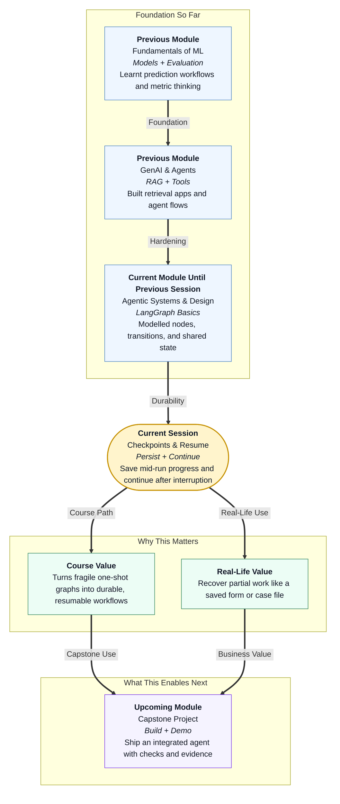

# Pre-read: LangGraph Advanced: Checkpoints & Resume

## Context of This Session in the Course

---

## When Progress Disappears Mid-Way

Imagine you are filling a long scholarship form on a seva kendra computer.

You have already entered personal details, uploaded marksheets, and selected your preferred college. Suddenly the power cuts. The machine restarts. If the system kept everything only in temporary memory, your work is gone. You start again from the first field.

That is painful for one student. Now imagine an **agent workflow** doing multi-step work: understand a request, check rules, prepare a confirmation. If the laptop sleeps, the process crashes, or someone restarts the program halfway, a pure in-memory run forgets everything.

Professionals do not accept "start from zero" as the default. They expect a **case file** that can be reopened.

## The Challenge: What If the Run Stops Halfway?

In the previous session, you modelled an agent workflow as a **graph**: **nodes** (stations of work), **transitions** (paths between stations), and **minimal shared state** (the notebook carried through the run). You ran a small map and practised reading what changed after each step.

That skill answers: *what ran, and what changed?*

Now ask the harder operations question:

**What if you had to keep a long-running agent flow alive across interruption — save progress mid-way, prove how far it went, and continue later without repeating finished work?**

Without that ability, even a clean graph is fragile:

- A crash forces a full restart
- You cannot prove how far a partial run went
- Debugging becomes guesswork from memory

Real systems need something closer to a saved Google Form draft: close the browser today, reopen the same answers tomorrow.

## The Idea That Solves It: Checkpoints, Persist, Resume, Inspect

This session introduces **checkpointing** on a LangGraph workflow as the practical answer.

In simple Indian English:

- A **checkpoint** is a saved snapshot of graph progress — the current notebook values plus where the workflow paused. Think of it as a **save-game** for your agent workflow.
- A **checkpointer** is the storage engine that writes and reads those saves. Think of it as the **filing cupboard** where save-files live.
- A **thread ID** is the unique key that groups checkpoints for one ongoing job. Think of it as the **file number** on a campus case — different students must not share the same number.
- **Persisted state** means the notebook is written outside temporary process memory, so it survives restart. Think of notes saved in a diary on disk, not only kept in your head.

Together, these ideas let you:

1. **Enable checkpointing** on a workflow you already understand
2. **Persist** graph state to a store (including a disk file) and **list** available checkpoints
3. **Resume** execution after a simulated failure or restart
4. **Inspect checkpoint payloads** to debug stuck or partial runs

By the end, you should treat long-running agent flows like a form you can save mid-way and reopen tomorrow.

## Think of It Like a Campus Case File

Staff do not keep a student's appointment request only in short-term memory. They open a **file number**, write what is already done, and put the file back in the cabinet. If the clerk goes for lunch, or the power fails, the next person can reopen the same file and continue from the last safe note.

| Office habit | Workflow idea |
|---|---|
| Filing cupboard | **Checkpointer** |
| File number for one student | **Thread ID** |
| Snapshot written after each station | **Checkpoint** |
| Papers that survive overnight | **Persisted state** |
| Clerk continues from the last page | **Resume** |
| Supervisor opens the file to see stuck work | **Inspect** |

You will reuse the same small campus appointment-style map from previous graph basics — understand request → check availability → confirm outcome — so the new skill is **durability**, not a brand-new business story.

## Two Kinds of Saving (And Why Disk Matters)

You will meet two checkpointer styles in simple terms:

- **In-memory saving** — Useful for a quick demo inside one run. Fast to try. Disappears when the process ends.
- **Disk saving** — Writes checkpoints to a file-based store. This matches real interruptions: close the program, open again later, continue the same case.

Disk persistence is the career-relevant habit. Memory is only a warm-up.

You will also see a planned pause idea: ask the graph to stop **before** a named step. That is like a bank form that saves after OTP verification and waits before final submit. In class, this lets you practise resume safely without crashing your laptop on purpose.

## Why Inspecting Saves Matters as Much as Resuming

Beginners often celebrate "it continued." Professionals also ask: *what did the system believe when it paused?*

**Inspecting checkpoint payloads** means opening the saved notebook and reading:

- What values were stored at the pause point?
- Which step was waiting to run next?
- How many earlier saves exist for the same thread?
- Did the run finish, or is work still pending?

That habit turns debugging from "something broke" into "the case stopped after availability check, confirmation never ran, and here is the saved state."

A common mistake to avoid later: changing the thread ID when you meant to resume. That opens a different case file. Same job, same file number.

## Why This Matters for Your Career and the Course

Business teams trust systems that recover gracefully. "The AI forgot everything after the restart" is not acceptable in demos or real services.

In this course, you already built agent abilities and then learned to draw them as a runnable graph. Checkpointing is the next reliability layer: the map still matters, but now the journey can be saved and continued.

This also prepares you for upcoming reliability topics such as timeouts and retries. Those answer different questions. This session stays focused on **save / list / resume / inspect**.

You will leave thinking less like a person who runs a demo once, and more like a person who designs workflows that survive interruption.

## In this pre-read, you'll discover:

- **Understand** why a finished graph can still be fragile if progress lives only in temporary memory.
- **Discover** how checkpoints, a checkpointer, and a thread ID work together like a campus case file.
- **Learn** why persisting state to disk matters more than in-memory demos for real interruptions.
- **Understand** how inspecting saved payloads helps you debug stuck or partial runs before you resume.

## What You Will Be Able to Talk About After This Session

After this session, you should be able to explain checkpointing without heavy jargon — what was saved, under which case file, where the saves live, and how continuation works after a pause or restart.

You will also discuss debugging more precisely. Instead of "the workflow died," you will ask which checkpoint was last written, what state it held, and which step was next.

Most importantly, you will start treating durability as a design habit: run with a file number, persist progress, inspect before you guess, and resume from the last safe point.

## Interesting Questions for the Live Session

- If a three-step appointment workflow pauses before the final confirmation, what should the **partial trace** contain — and should the final result already be filled?
- How would you prove, by **inspecting checkpoint history**, that work stopped mid-way rather than finished cleanly?
- After a true restart (new program run, same disk file, same thread ID), what must stay the same so resume opens the correct case — and what goes wrong if the file number changes?

By the end, checkpoints should feel less like a mysterious advanced feature and more like a practical habit: **save the case file, reopen it later, and continue with confidence.**
