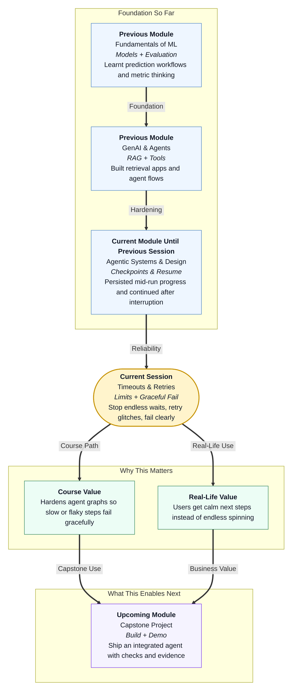

# Pre-read: LangGraph Advanced: Timeouts & Retries

## Context of This Session in the Course

---

## When the Screen Spins Forever

Imagine you open a UPI payment to pay hostel fees.

The app shows a loading circle. One second. Five seconds. Thirty seconds. Nothing happens. You do not know whether money was sent, whether the bank is busy, or whether the app simply froze. You refresh again and again. Frustration rises. Trust falls.

That feeling is not only a payments problem. Any multi-step agent that calls outside services can fail in messy ways: a step hangs too long, a network blip appears once then disappears, or a service stays down after many tries.

Users do not want a spinning wheel with no explanation. They want the system to **wait wisely**, **try again within limits**, and **speak clearly** when it must stop.

## The Challenge: Slow Steps and Temporary Glitches

In the previous session, you added **checkpoints** so a long-running LangGraph flow could **persist** progress, **resume** after interruption, and let you **inspect** saved payloads. That protects a case file across stops and restarts.

This session answers a different reliability question:

**What if one station in the workflow is too slow, or an API fails temporarily — how do you stop endless waiting, retry only the right failures, and still give the user a calm next step when the budget is finished?**

Without that discipline, even a well-drawn graph can disappoint:

- The screen spins forever while one API hangs
- A temporary network blip kills the whole run on the first try
- After many failures, the user sees a scary technical crash instead of a clear message

Checkpoints answer: *can we save mid-way and continue later?*  
Timeouts and retries answer: *can we stop waiting, retry temporary glitches, and fail gracefully?*

Keep those skill families separate in your mind. Both matter. They solve different problems.

## The Ideas That Solve It: Timeouts, Retries, Clear Errors

This session introduces practical reliability controls for agent development.

In simple Indian English:

- A **timeout** is a maximum time allowed for an operation before it is cancelled as too slow. Think of a **kitchen timer** for one step. When it rings, stop waiting.
- A **retry** means running the same operation again after a failure, usually with a limit on attempts. Think of refreshing a railway booking page once or twice when the site hiccups — not one hundred times.
- **Backoff** means waiting longer between successive retries. If the canteen line is stuck, you wait, then wait longer before asking again — you do not shout every half second.
- A **retry policy** is the house rules for “try again”: how many attempts, how long to pause, and how the pause grows.
- A **user-facing error** is a short, actionable message for humans when the system cannot finish. Think of a polite desk note, not a stack of technical jargon.

You will also separate two kinds of failure:

| Kind | Meaning | What to do |
|---|---|---|
| **Transient** | Temporary problem (network blip, brief “service busy”) | Retry within limits |
| **Permanent** | Clear hard error (empty input, forbidden action) | Fail clearly — do not keep retrying |

## Think of It Like a Campus Helpdesk Line

A useful daily-life picture is calling the campus IT helpdesk.

You dial once. The line is busy. You wait a little and dial again. You try a third time. If it still fails, you stop and go to the physical desk with a calm note: “Could not create ticket after 3 attempts — service unavailable — please try later or visit IT.”

| Helpdesk habit | Workflow idea |
|---|---|
| Stop waiting for a silent call | **Timeout** |
| Try again a few times | **Bounded retry** |
| Wait longer between calls | **Backoff** |
| Know “busy” vs “wrong number” | **Transient vs permanent** |
| Leave a clear note when you give up | **User-facing error** |
| Quick checklist before declaring “ready” | **Reliability checklist** |

You will practise these ideas on small campus-style flows — checking a desk status or creating a maintenance ticket — so the focus stays on time limits and graceful failure.

## Two Timers: One Station vs the Whole Journey

Timeouts come in two useful shapes:

- **Per-node timeout** — Each station has its own kitchen timer. If the status API does not respond in time, that step fails with a clear delay message.
- **Global timeout** — One timer for the whole journey. Like an exam that has a total duration even if each question also has a suggested time.

Design tip: if both exist, give them clear ownership. Example — eight seconds for one API fetch, twenty seconds for the full run. Per-node limits pinpoint which station was slow. Global limits protect overall user experience.

## When Retries Must End — And How You Speak

Retries are powerful. They are also dangerous if unbounded.

A good policy says: try a few times, wait longer between tries, then stop. When the budget is finished, convert the technical failure into a calm message that includes:

- What the user asked for (ticket / status / booking)
- That the system already retried (when true)
- A next action (try later / visit desk / contact support)
- No raw crash text, no secret tokens, no scary internal jargon

That is the difference between “ConnectionError: Service unavailable” and “We could not create your ticket after 3 attempts. Please try again after some time, or visit the IT helpdesk.”

## A Minimal Reliability Checklist

Professionals do not guess whether a graph is “reliable enough.” They check a short list during development:

1. Every API-backed step has a **timeout** that fits the step
2. The full run has a sensible **global** time limit for UX
3. Retries are **bounded** on purpose
4. **Backoff** is used so retries do not hammer the service
5. Only **transient** errors are retried; bad input fails fast
6. Exhausted retries produce a **clear user-facing message**
7. Technical detail stays in logs; users see calm language
8. You verified one **slow** case and one **flaky** case before calling it done

You do not need heavy testing frameworks for this habit. Honest Yes/No marks are enough to show what to fix next.

## Why This Matters for Your Career and the Course

Stakeholders forgive temporary glitches when the system behaves like a good helpdesk. They do not forgive endless spinning or cryptic crash screens.

In this course, you already learned to map workflows and to save progress with checkpoints. Timeouts and retries complete another reliability layer: the journey not only survives interruption — it also **waits wisely** and **fails with dignity**.

This prepares you for upcoming observability and operations work, where calm failure behaviour becomes part of how you demonstrate an agent system.

## In this pre-read, you'll discover:

- **Understand** why slow API steps and temporary network glitches need different controls than save-and-resume.
- **Discover** how timeouts, bounded retries, and backoff work together like a campus helpdesk call policy.
- **Learn** why per-node timers and a whole-run timer answer different design questions.
- **Understand** how clear user-facing errors and a short reliability checklist make agent development more professional.

## What You Will Be Able to Talk About After This Session

After this session, you should be able to explain timeouts and retries without heavy jargon — what each control protects, when to retry, when to stop, and how to speak to users when the system cannot finish.

You will also discuss failure more precisely. Instead of “the agent broke,” you will ask whether the step was too slow, whether the error was temporary, whether retries were bounded, and whether the final message gave a next action.

Most importantly, you will start treating graceful failure as a design habit: set timers, retry only transient problems, stop within limits, and leave a calm note when you must give up.

## Interesting Questions for the Live Session

- If a status API usually responds in under two seconds but sometimes hangs for thirty, what should a **per-node timeout** protect — and what would a **global** timeout still add?
- When an API says “service busy, try later,” should you **retry with backoff**, fail immediately, or only wait without retrying — and why?
- After three failed attempts to create a ticket, what ingredients belong in a good **user-facing error**, and what should never appear on the user’s screen?

By the end, timeouts and retries should feel less like advanced jargon and more like everyday desk manners for agent systems: **wait wisely, try again within limits, and fail clearly.**
