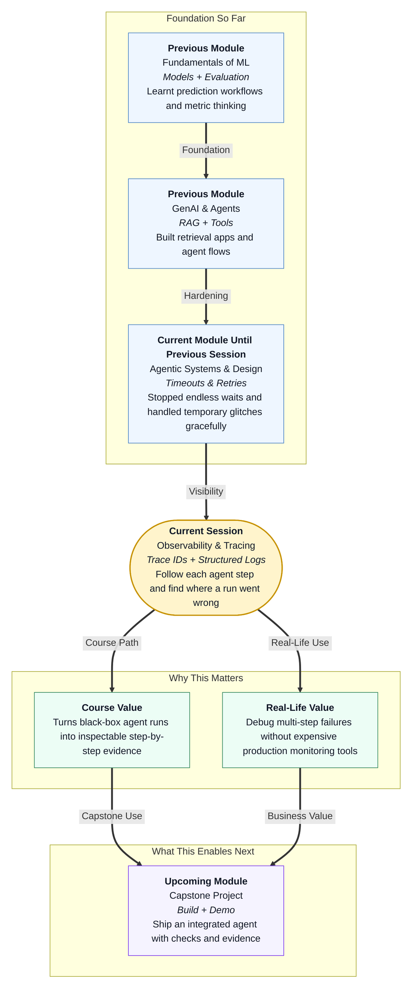

# Pre-read: Observability & Tracing for Agents

## Context of This Session in the Course

---

## When the Answer Is Wrong but Nobody Knows Why

Imagine you order dinner on a food delivery app.

The app shows: **Order placed → Restaurant accepted → Rider picked up → Delivered.** But when you open the door, there is no bag. The status says delivered. The payment went through. You are confused, angry, and stuck.

What do you do first?

You do not guess randomly. You open the **tracking timeline**. You look at each stop: when the rider reached the restaurant, when they left, when they marked delivery. One timestamp does not match reality. That is where the story broke.

Now shift that feeling to an **agent** — a system that can **retrieve** information, **reason** about it, and **act** by calling tools. The final answer may look confident. But if the answer is wrong, incomplete, or oddly formatted, you face the same frustration: *something happened inside — but where?*

A polished graph with checkpoints and retry rules is not enough if you cannot **see** what happened at each step. Reliability controls tell the system how to wait and retry. **Observability** tells you what actually occurred so you can fix the real problem.

## The Challenge: A Multi-Step Run with No Visible Footprints

In the previous session, you learned how to set **timeouts** so a slow step does not spin forever, and how to **retry** temporary failures within sensible limits. Those habits protect users from endless waiting and noisy crashes.

This session answers a different question:

**When an agent run finishes with a bad result — or stops halfway — how do you find the exact step that went wrong without guessing?**

Consider a simple agent workflow:

1. **Retrieve** — fetch relevant documents from a knowledge base  
2. **Reason** — decide what the user needs based on those documents  
3. **Act** — call a tool or return a final answer  

If the user asks, *"What is our refund policy for cancelled hostel bookings?"* and the agent replies with gym membership rules, many things could have failed:

- Retrieval pulled the wrong documents  
- The model ignored the retrieved text  
- A tool was called with the wrong arguments  
- A step ran twice and overwrote earlier state  

Without a clear trail, debugging feels like blaming the entire kitchen because one dish came out salty. You need a **read-only investigation path** — a way to walk through the run step by step, like reading a case file, without changing production behaviour or buying heavy monitoring software on day one.

## The Ideas That Solve It: Traces, Structured Logs, and a Debug Workflow

This session introduces **observability** for agent development — the practice of making internal steps visible enough that a beginner can debug confidently.

In simple Indian English:

- **Observability** means you can understand what a system did internally by looking at the records it left behind — not by guessing from the final output alone.
- A **trace** is the full journey of one agent run, from start to finish, with each step linked together.
- A **trace id** is a unique label stamped on every log line belonging to the same run — like a **parcel tracking number** shared across every scan point.
- A **timestamp** records when each step happened, so you can spot delays, wrong order, or missing steps.
- **Structured logs** are log entries written in a fixed, readable format — often one **JSON line** per event — instead of messy free-text sentences scattered everywhere.
- **Log fields** are the named pieces inside each log entry: step name, tool name, message type, duration, error flag, and so on.
- A **read-only debug workflow** means you **inspect** logs and traces to locate bugs — you do not rewrite live behaviour while investigating.

You will learn to instrument each agent step so every important moment leaves a searchable record: when a tool was called, what the model said, how long a step took, and whether an error appeared.

## Think of It Like a Swiggy Order Timeline

A powerful daily-life picture is food delivery tracking.

When you tap **Track Order**, you do not see one vague message saying *"Something is happening."* You see a **sequence**:

| Timeline stop | What it tells you |
|---|---|
| Order placed | The run started |
| Restaurant preparing | An early step completed |
| Rider assigned | A handoff happened |
| Picked up | An action was taken |
| Delivered | The final outcome |

Each stop has a **time** and a **label**. All stops share the **same order id**. If delivery fails, you know which stage to question first.

Agent tracing works the same way:

| Agent step | What you learn from its log |
|---|---|
| Retrieve | Did we fetch the right documents? |
| Reason | Did the model use retrieved context? |
| Act | Was the correct tool called with sensible inputs? |
| Error line | Did a step fail, retry, or time out? |

The mental shift is simple: **treat every agent run like a trackable delivery**, not a magic box that only shows the final sentence.

## What Good Logs Look Like (Without Drowning in Noise)

Not every print statement helps. Useful agent logs answer four questions quickly:

1. **Which run is this?** → trace id  
2. **Which step is this?** → step or node name  
3. **What happened?** → event type such as tool call, model message, or error  
4. **When did it happen?** → timestamp  

Structured logs — written as consistent JSON lines — make this easy to scan. Each line is one event. Each field has a clear name. You can filter: *show me only tool calls for this trace id*, or *show me every error in the last ten runs*.

This is especially important for the **retrieve → reason → act** pattern. If the final answer is wrong, structured logs let you check each phase separately:

- Did retrieval return empty or irrelevant chunks?  
- Did the model message show it saw the retrieved text?  
- Did the action step call a tool that never ran in earlier tests?  

That is how you **localise** a bug — narrow it to one station in the workflow instead of rewriting the entire system blindly.

## Why This Matters Before Production Monitoring Tools

Large companies often use expensive **APM** (Application Performance Monitoring) platforms — dashboards that watch live systems at scale. Those tools are valuable in production. But as a learner building agents in development, you still need a **lightweight habit** first:

- Add trace ids and timestamps at each step  
- Write structured logs for tool calls and model messages  
- Follow one failing example from start to failure  
- Fix the root cause with evidence, not intuition  

This read-only debug workflow builds professional discipline. You learn to **prove** where a failure happened before you change prompts, retrieval settings, or tool definitions. That saves hours of random trial and error — and it prepares you for capstone work where you must explain *why* your agent behaved a certain way.

---

## In this pre-read, you'll discover:

- **Why** a correct-looking final answer can still hide a broken step earlier in the workflow  
- **How** trace ids and timestamps turn a confusing agent run into a readable timeline  
- **What** structured JSON log lines should capture for tool calls and model messages  
- **How** to walk through retrieve → reason → act on a failing example and pinpoint the bug — without production monitoring tools  

---

## Questions We Will Answer in the Live Session

These are the kinds of puzzles we will solve together — bring your curiosity:

1. **The wrong-policy mystery:** A hostel refund question returns gym rules. Retrieval logs show three chunks fetched — but only one mentions refunds. At which step did the agent go off track, and what log field would prove it?

2. **The silent tool call:** The user asked for a formatted summary, but the output is plain text. Tool-call logs show the summarizer was never invoked. Did the failure happen during reasoning or during action — and how do timestamps tell the story?

3. **The half-finished run:** An agent stops after retrieve with no error message visible to the user. Trace ids link five log lines across two steps. Which line tells you the run ended early, and what would you inspect next before changing any code?

---

## After This Session, You Will Be Able To

- Stamp each agent step with a **trace id** and **timestamp** so every event in one run stays connected  
- Write **structured JSON logs** for tool calls and model messages with consistent, meaningful fields  
- Follow a failing run through **retrieve → reason → act** and identify which phase caused the bad outcome  
- Use a **read-only debug workflow** to localise bugs with log evidence — a habit that scales from classroom projects to real agent deployments  

When something breaks, you will not stare at the final answer and hope for inspiration. You will open the trace, read the timeline, and know exactly which step to fix.
