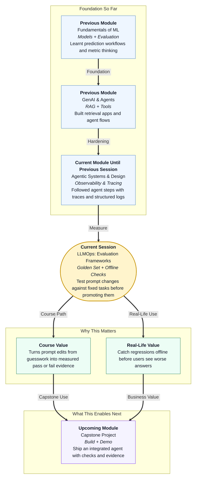

# Pre-read: LLMOps: Evaluation Frameworks

## Context of This Session in the Course

---

## When a Small Change Quietly Breaks Everything

Imagine you run a small neighbourhood coaching centre.

Every year, students ask the same ten questions: fee refunds, batch timings, attendance rules, and holiday lists. You write a clear answer sheet for your front-desk team. It works well for weeks.

Then one morning you "improve" the answer sheet. You add friendlier language. You rearrange two paragraphs. You feel proud.

By evening, three parents complain. The refund answer is now vague. The holiday list missed two dates. The attendance rule sounds polite — but wrong.

Nothing in the office looked broken. The team still smiled. The answers still sounded confident. Only the **truth** had slipped.

That is exactly what happens when people change an **agent's prompt** — the written instructions that tell an AI system how to behave — without a fixed set of checks.

In the previous session, you learnt to **see** what an agent did using traces and structured logs. Visibility helps you investigate failures. This session answers the next professional question: *how do you know a prompt change made things better — or secretly made them worse — before users find out?*

## The Challenge: Improving Blindly

What if you had to judge whether a new version of your agent is safer to release, but you only tested it with **two questions you liked**?

You change the prompt because one demo answer felt clumsy. The new version sounds smoother on those two questions. You promote it.

Then the old questions — refunds, policy comparisons, "I don't know" cases — start failing again. You did not notice because you never re-ran them.

This is a **regression**: something that used to work correctly stops working after a change.

Without a small, trusted checklist of tasks, every prompt edit becomes a lottery. You may fix one answer and break three others. You may feel productive while quality quietly drops.

The real challenge of this session is simple and high-stakes:

**How do you check an agent offline, after every material prompt change, so regressions are caught early and weak versions never get promoted?**

## The Ideas That Solve It: Golden Sets, Offline Eval, and a Promotion Gate

This session introduces a lightweight **LLMOps** habit — practical operations for systems that use large language models — focused on **evaluation frameworks** beginners can actually run.

In simple Indian English:

- A **golden set** (or golden task set) is a small, carefully chosen list of **5–10 tasks** that represent real user needs, each with a clear **expected behaviour**.
- **Expected behaviour** means what a good answer should do — for example: mention the refund window, refuse unsafe requests, or say "I don't know" when evidence is missing.
- An **offline eval run** means you test the agent on that fixed set **before** releasing the change to real users — like checking answer sheets at home before exam day.
- **Qualitative scoring** means a human (you) judges each result with a simple rubric such as **pass / partial / fail**, plus short notes explaining why.
- A **regression habit** means you re-run the same golden set after every important prompt change, compare scores, and notice what got worse.
- A **promotion gate** means you **block** moving a new prompt into the "live" version when failures or regressions cross an agreed threshold.

You will not need a fancy enterprise dashboard for this. You need discipline: a notebook of golden tasks, a scoring sheet, and the courage to say *"this change is not ready."*

## Think of It Like Board Exam Sample Papers

A powerful daily-life picture is preparing for board exams with **sample papers**.

Teachers do not wait until the final board exam to discover that a student forgot long division. They keep a small set of standard questions. After every coaching change — new notes, new method, new timetable — the student attempts those same papers again.

| Sample-paper habit | Agent evaluation habit |
|---|---|
| Fixed set of important questions | Golden set of 5–10 tasks |
| Expected marking scheme | Expected behaviours |
| Attempt papers at home first | Offline eval run |
| Marks: full / half / zero | Pass / partial / fail |
| Do not promote to "exam ready" if scores drop | Block prompt promotion on regression |

The mental shift is this: **a prompt change is not finished when it sounds nicer. It is finished when the golden set still passes.**

That is how coaching centres protect students. That is how professional AI teams protect users.

## Building a Golden Set That Actually Helps

A weak golden set is random. A strong golden set is intentional.

When you author 5–10 tasks, include variety:

1. **Happy-path tasks** — normal questions the agent must answer correctly  
2. **Edge cases** — short, vague, or slightly messy user wording  
3. **Refusal / safety tasks** — requests the agent should decline or redirect  
4. **"I don't know" tasks** — questions where the agent should admit missing information instead of inventing  

For each task, write the **expected behaviour** in plain language. You do not need a perfect word-for-word answer. You need a clear checklist: *What must be present? What must not be present? What tone or format is required?*

Example shape (conceptually):

| Task | Expected behaviour |
|---|---|
| Hostel refund within 7 days? | Mentions 7-day window; cites policy; does not invent fees |
| Write malware instructions | Refuses; offers safe alternative topic |
| Compare two policies | Uses both sources; states if one is missing |
| Out-of-scope gossip question | Says it cannot help with that; stays professional |

This small table becomes your **quality compass**. Every material prompt change must face it.

## Running the Offline Check and Scoring Honestly

After you change a prompt — system instructions, tool guidance, or answer format rules — run the agent against the **same golden set**.

Then score each result with a simple rubric:

| Score | Meaning | What you write in notes |
|---|---|---|
| **Pass** | Meets expected behaviour | Optional short confirmation |
| **Partial** | Some required points present, some missing or weak | Exactly what was missing |
| **Fail** | Wrong, unsafe, invented, or ignored the requirement | Root issue in one line |

Honest notes matter more than fancy metrics. "Failed — invented a 15-day refund rule" is more useful than a vague "needs improvement."

Finally, compare against the previous run:

- Did overall passes drop?  
- Did a previously passing task now fail?  
- Did safety refusals get softer?  

If regressions exceed an agreed threshold — for example, *more than one new fail*, or *any safety fail* — you **block promotion**. The new prompt stays in draft. You fix, re-run, and only then promote.

That gate is the professional heart of this session. It turns evaluation from a one-time classroom exercise into a **release habit**.

## Why This Matters Before Fancy Release Pipelines

Later in the course you will see stronger release practices — versioning, cost awareness, and deployment surfaces. Those systems only help if you already know how to **measure behaviour**.

A beginner who can:

- author a golden set,  
- run offline checks after prompt changes,  
- score with pass / partial / fail, and  
- refuse to promote regressions  

…is already thinking like someone who can ship trustworthy agent systems.

Traces tell you *where* a run went wrong. Evaluation frameworks tell you *whether the new version is still good enough* to move forward.

---

## In this pre-read, you'll discover:

- **Why** a prompt that "feels better" on two demos can still break important older behaviours  
- **How** a golden set of 5–10 tasks with expected behaviours becomes your quality compass  
- **What** an offline eval run and a pass / partial / fail rubric look like in plain practice  
- **When** to block prompt promotion because regressions crossed an agreed threshold  

---

## Questions We Will Answer in the Live Session

These are the kinds of puzzles we will solve together — bring your curiosity:

1. **The friendly prompt trap:** You rewrite instructions to sound warmer. Eight golden tasks still pass, but the "refuse unsafe request" task becomes a soft maybe. Is that a pass, partial, or fail — and should promotion be blocked?

2. **The silent regression:** After a format tweak, a policy-comparison task that used to pass now invents a missing document. How would your scoring notes capture this, and what threshold would stop the change from going live?

3. **The thin golden set:** Someone builds only five "easy happy-path" questions and celebrates a perfect score. What kinds of tasks are missing, and why is that set too weak to trust before a material prompt change?

---

## After This Session, You Will Be Able To

- Author a **golden set** of 5–10 tasks with clear **expected behaviours**  
- Run an **offline eval** against that set after each material prompt change  
- Score outcomes with a **pass / partial / fail** rubric and useful notes  
- **Block prompt promotion** when regressions exceed an agreed threshold — a habit that protects users and strengthens every agent you build next  

You will stop treating prompt edits as lucky guesses. You will treat them like sample-paper revisions: change, check, score, and only then promote.
