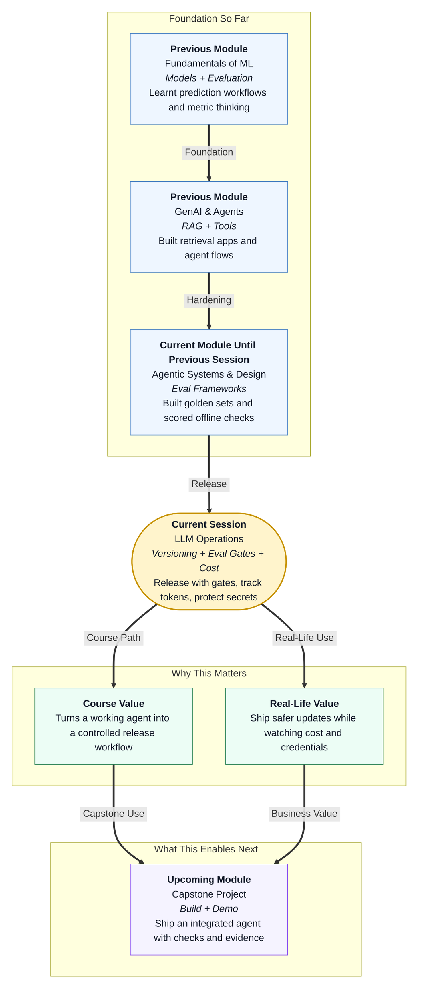

# Pre-read: LLM Operations: Versioning, Eval Gates & Cost

## Context of This Session in the Course

---

## When "Almost Ready" Is Still Dangerous

Imagine a popular food delivery app updates overnight.

The new version looks prettier. Checkout feels smoother. Marketing celebrates. By afternoon, orders fail for half the city. Support phones explode. Nobody can say which change caused it — the menu text, the payment rules, or the delivery partner settings — because those pieces were updated separately, with no shared version label and no final quality check.

Users do not care that each team "meant well." They care that dinner never arrived.

Agent systems fail the same way. A prompt tweak, a tool config edit, and a retrieval setting change can each look harmless alone. Together, they can quietly break answers, raise bills, or leak secrets.

In the previous session, you learnt to build a **golden set** and score results with pass / partial / fail. That gave you a quality compass. This session asks the next professional question: *how do you package, gate, cost, and protect a release so a "better" agent is actually safe to ship?*

## The Challenge: Shipping Without a Release Habit

What if your team improved an agent all week — and then someone asked a simple question you could not answer?

- Which **prompt**, **tool**, and **retrieval** settings are live right now?  
- Did this candidate version pass the golden set **before** deploy?  
- How many **tokens** (pieces of text the model processes) did a typical task use, and what did that cost?  
- Where are the **API keys** stored — in a private place, or accidentally inside a shared notebook?

If any of those answers is "we are not sure," you do not have a release process. You have hope.

The challenge of this session is practical and career-critical:

**How do you run a lightweight release workflow — version configs together, pass a pre-release eval gate, estimate cost, and keep secrets out of the repository — before users ever see the change?**

## The Ideas That Solve It: Versions, Gates, Cost, and Secrets

This session extends everyday **LLM operations** — the habits that keep language-model systems reliable after the first demo works.

In simple Indian English:

- **Release versioning** means giving one clear version label to the **bundle** of things that must move together: prompt files, tool configs, and retrieval settings.
- A **pre-release eval gate** is a required check — usually against your golden set — that must pass before a candidate version is allowed to go live. Think of it like a CI-style (Continuous Integration-style) quality gate used in software teams.
- **Token usage** is how much text the model reads and writes for a task. More tokens usually means more **cost** and sometimes slower answers.
- **Cost tracking** means estimating rupees (or dollars) per task for a representative workload, so surprise bills do not arrive after a "small" prompt change.
- **Secrets** are sensitive values such as API keys. They belong in **environment variables** — settings stored outside the code — never inside committed notebooks or public repositories.

You already practised offline scoring. Now you learn to treat that scorecard as a **gate**, not a suggestion.

## Think of It Like a Pharmacy Batch Release

A powerful daily-life picture is a pharmacy releasing a new medicine batch.

Pharmacies do not ship tablets because one sample "looked fine." They follow a release rhythm:

| Pharmacy habit | Agent release habit |
|---|---|
| Batch number on every related item | One version for prompt + tools + retrieval |
| Lab quality test before shelf | Pre-release eval gate on golden set |
| Cost of ingredients tracked | Token usage and cost per task |
| Controlled storage for restricted items | API keys in environment variables |

If the lab test fails, the batch does not reach customers. If the batch number is missing, nobody can recall the right stock later. If restricted items are left on an open counter, trust collapses.

Agent releases need the same seriousness — even at beginner scale.

## Version the Bundle, Not Random Files

Earlier in the course you saw the value of keeping prompts in versioned files. Now the idea grows up for real releases.

An agent is rarely "just a prompt." Behaviour also depends on:

1. **Prompt configs** — system instructions and answer rules  
2. **Tool configs** — what tools exist and how they may be called  
3. **Retrieval configs** — which knowledge sources and settings feed the answer  

If you update only one piece and leave the others unlabeled, debugging becomes archaeology. You cannot recreate last week's behaviour. You cannot compare two candidates fairly.

A healthy release workflow says: *these three travel together under one version.* Candidate `v1.3` means a known prompt, known tools, and known retrieval settings — not a mystery mix from three different evenings.

That shared version is the foundation for honest gates and honest cost comparisons.

## The Pre-Release Eval Gate: No Pass, No Deploy

Your golden set from the previous session now becomes a **door**.

Before deploying changes:

1. Label the candidate release version  
2. Run the agent against the golden set **offline**  
3. Score with pass / partial / fail and short notes  
4. Compare against the currently live version  
5. **Promote** only if regressions stay within the agreed threshold  

If safety tasks fail, or too many previously passing tasks drop, the gate stays closed. The candidate remains draft. You fix, re-run, and only then deploy.

This is the operational meaning of "CI-style eval gates" for beginners: a **fixed quality checkpoint** before release, not a vague hope that "it felt better in demo."

## Cost Awareness: Tokens Are Not Free

A release can pass every golden task and still be a business problem if each answer suddenly costs three times more.

For a representative workload — for example, your golden set or a small set of typical user tasks — you will learn to:

- Measure **token usage** per task (input plus output)  
- Estimate **cost per task** using the model's pricing  
- Notice when a prompt rewrite or retrieval change inflates usage without improving scores  

This is not about becoming a finance expert. It is about asking one adult question before release: *Is this version worth what it costs?*

Teams that ignore cost often discover the problem only after the monthly bill arrives. Teams that track tokens early can choose a slightly cheaper prompt that still passes the gate.

## Secrets Handling: Keys Never Live in the Repo

The final release habit is non-negotiable.

API keys unlock paid model access and private services. If they sit inside notebooks, screenshots, or committed files, anyone with repo access — or anyone who finds a leaked file — can misuse them.

The beginner rule is clear:

- Store keys in **environment variables**  
- Load them at runtime  
- Keep them out of notebooks you share, out of chat logs, and out of Git commits  

Version your prompts. Do not version your passwords. That one sentence prevents many real-world disasters.

## Why This Matters Before Deployment Screens

Soon you will put a face on your agent — user interfaces and APIs that stakeholders can try. Those surfaces amplify whatever you release.

If versioning is messy, demos become unreproducible. If gates are skipped, stakeholders see broken answers. If cost is ignored, a successful demo becomes an expensive surprise. If secrets leak, trust ends immediately.

This session turns evaluation from a classroom scorecard into an **operations mindset**: package the release, pass the gate, know the cost, protect the keys.

---

## In this pre-read, you'll discover:

- **Why** prompts, tools, and retrieval settings must be versioned together as one release bundle  
- **How** a pre-release eval gate uses your golden set to block weak candidates  
- **What** token usage and cost-per-task estimates reveal before you deploy  
- **Where** API keys must live — and why notebooks and repos are the wrong place  

---

## Questions We Will Answer in the Live Session

These are the kinds of puzzles we will solve together — bring your curiosity:

1. **The mixed-version mystery:** Prompt files say `v2.1`, tool config still says `v1.9`, and retrieval was edited with no label. A golden-set fail appears after deploy. Which release habit was broken first — and how would a shared version have helped?

2. **The expensive pass:** A candidate clears every golden task, but token usage per task jumps sharply. Do you promote it? What evidence would you record before deciding?

3. **The notebook leak:** A teammate shares a Colab file that "just works" because the API key is pasted in a cell. What is the correct secret-handling fix, and what risk remains if that file was already committed once?

---

## After This Session, You Will Be Able To

- Describe a **release workflow** where prompt, tool, and retrieval configs are **versioned together**  
- Run a **pre-release eval gate** against your golden set before deploying changes  
- Measure **token usage** and estimate **cost per task** for a representative workload  
- Store API keys in **environment variables** — never in committed notebooks or repositories  

You will stop shipping by instinct. You will ship like an operator: version the bundle, pass the gate, know the cost, protect the secret.
