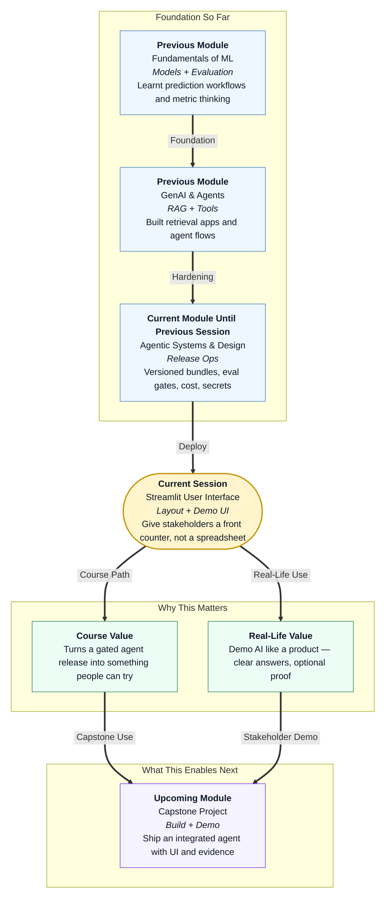

# Pre-read: Deployment: Streamlit User Interface

## Context of This Session in the Course

---

## When the Best Agent Still Fails the Demo

Picture this: you built a campus parcel desk agent that actually works.

It checks a register. It gives honest answers. It passed your eval gate. Your release bundle is labelled. Secrets stay out of notebooks. On paper, you are ready.

Then the dean walks in for a three-minute review.

You open a **Google Sheet** with two hundred rows — AWB numbers, brands, rooms, gates, statuses. You share your screen. You scroll. You filter. You explain which column means what. The dean asks, *“Where is the Flipkart parcel for Room 214?”* You search, highlight a row, and translate spreadsheet cells into human language while everyone watches you navigate like an accountant.

Five minutes pass. The dean still has not *felt* the product. They felt your spreadsheet skills.

This is the gap this session closes. A working agent behind the scenes is not enough. Stakeholders — faculty, teammates, clients — need a **front counter**: type a question, see one clear answer, optionally peek at how the desk checked the facts.

In the **previous** session you learnt to version releases, run pre-release eval gates, track token cost, and protect API keys. That was the back room. Today is the glass window.

## The Challenge: Data on a Sheet Is Not a Demo

What if your entire agent demo still lives inside a shared spreadsheet?

Many teams start there because **Google Sheets** is familiar. Everyone has an account. You can paste parcel rows quickly. Non-coders can edit the register together. For **data**, that is sensible.

For **demonstrating an agent**, it breaks down fast:

| What the visitor wants | What a raw Sheet usually gives |
|---|---|
| Ask a question like on a website | Open tab → filter → scroll → interpret columns |
| One confident answer on screen | Many rows; the visitor does the thinking |
| Optional proof of how the desk checked | Extra columns that look like a data dump |
| A product preview | Homework on Drive |

The challenge is not “Do we know Streamlit?” The challenge is professional and practical:

**How do you give stakeholders a calm, trustworthy demo UI — built from a small sample dataset — without asking them to hunt cells in a spreadsheet?**

That question matters in internships, capstone reviews, and any room where someone who does not read Python decides whether your agent is real.

## The Answer Preview: Streamlit as the Front Counter

This session introduces **Streamlit** — a Python tool that turns a simple script into a browser page with text boxes, buttons, and foldable panels.

In simple Indian English:

- **Streamlit** draws a clean web screen from Python. You do not hand-write HTML or CSS.
- A **user interface (UI)** is what visitors see and click — the counter glass.
- The **agent backend** is the logic behind the glass — retrieval, tools, and replies.
- A **sample dataset** is a tiny realistic register (say, five parcel rows) used for demos before full production data.
- An **agent trace** (at demo level) is a short list of sources and steps — like a tracking slip you open only if curious.

**Streamlit** is not claiming to replace every production website forever. It *is* claiming something important for your career right now: you can ship a **stakeholder-friendly demo** quickly, using the same Python world your agent already lives in.

And here is the mindset shift that saves confusion:

- **Google Sheets** = great **editor** for the sample register  
- **Streamlit** = great **face** for the ask-and-answer experience  

Same facts. Different trust.

## Think of It Like a Campus Parcel Desk

The daily-life picture that carries this whole session is a **hostel parcel counter**.

Behind the counter sit clerks, registers, and rules — your agent brain, tools, and release habits. In front sits a window where a student asks one question and hears one reply.

| Parcel desk habit | Streamlit demo habit |
|---|---|
| Big “Ask here” board | Title + question box on the main page |
| Rules taped on the side drawer | Sidebar tips like “Try: Flipkart Room 214” |
| Clerk speaks the answer clearly | Large answer text + success or warning signal |
| Tracking slip only if asked | Foldable **Sources** and **Steps** panels, closed by default |

A good counter does not dump the entire register on the student’s shoes. It gives the answer first. Proof stays folded until someone wants details.

That is exactly how you will design layout, user input, and a short trace — calm for a dean, honest for an engineer.

## Why Streamlit Beats a Sheet for *This* Job

Sheets win on collaboration and quick edits. Streamlit wins when someone must **experience** the agent.

Consider the same five-row sample register — Flipkart Room 214, Amazon Room 118, and so on.

- In **Sheets**, you perform. You filter, scroll, and narrate.  
- In **Streamlit**, the visitor types, clicks **Ask the desk**, and reads one sentence. Sources and steps wait quietly underneath.

Other merits you will explore:

- **Fast demo path** — from idea to browser page without a full website team  
- **Python-native** — fits the language you already use for agents  
- **Clear widgets** — inputs, buttons, expanders that beginners can reason about  
- **One-command local run** — open a page on your laptop for classroom or peer demos  
- **Honest scope** — excellent prototype desk; production may add other stacks later  

**Common mistake:** judging Streamlit only by “Can it store ten thousand rows?” Its strength is **interaction and presentation**, not replacing your register file.

## Sample Data, Real Demo

Every UI needs something to answer from. You will work with a **small parcel register** — enough rows to feel real, small enough to understand in one glance.

You may keep that table in Google Sheets for easy editing, then export a frozen **CSV** for the demo. Visitors should not live-edit the Sheet while you present. They should use the Streamlit window.

You will also learn a simple **UI–backend contract**: the page expects an **answer**, optional **sources**, optional **steps**, and a signal for whether the run succeeded cleanly. That contract lets you swap in your module or capstone agent later without redesigning the whole screen.

## Local First, Cloud Later

Deployment in this session starts on **your laptop** — a local URL such as `localhost:8501` that opens when you run the app. Classmates on the same Wi-Fi may peek via a LAN share for quick classroom demos.

**Cloud hosting** — running the same app on a remote server with a public link — changes mainly three things: the **URL**, who keeps the process alive, and where **secrets** are injected. The story of “question → answer → optional trace” stays the same.

Secrets still never belong on the page or in a shared Sheet cell. That habit carries forward from your previous release work.

---

## In this pre-read, you'll discover:

- **Why** a spreadsheet register and a stakeholder demo UI are two different jobs  
- **How** Streamlit layout zones — title, sidebar, input, answer, folded trace — create a calm parcel-desk experience  
- **What** a sample dataset handoff from Sheets to a demo app looks like in practice  
- **Where** local run fits today and what changes when the same app moves toward cloud hosting  

---

## Questions We Will Answer in the Live Session

Bring these puzzles — we will solve them together:

1. **The three-minute dean test:** Your agent works and your Sheet has every parcel row. Why does the dean still leave unconvinced — and what would a Streamlit front counter change in that room?

2. **The folded-tray decision:** Should sources, tool steps, and token costs all appear on the first screen? What belongs visible immediately versus inside a closed expander — and why does calm layout build trust?

3. **The honest miss:** A student asks about a parcel that is not in your five-row sample register. Should the UI invent a gate number to sound helpful — or show an honest “not found”? How do demo honesty and eval-gate habits connect?

---

## After This Session, You Will Be Able To

- Explain **why Streamlit** is a stronger stakeholder demo UI than a raw Google Sheet for agent previews  
- Design **desk zones** — input, answer-first layout, and folded sources/steps  
- Build a demo mindset from a **sample parcel dataset** (Sheet or CSV) wired to a simple agent contract  
- Run and share a Streamlit app **locally**, and describe what would differ for **cloud hosting**  

You will stop asking stakeholders to read your register. You will open the front counter — and let the agent speak for itself.
