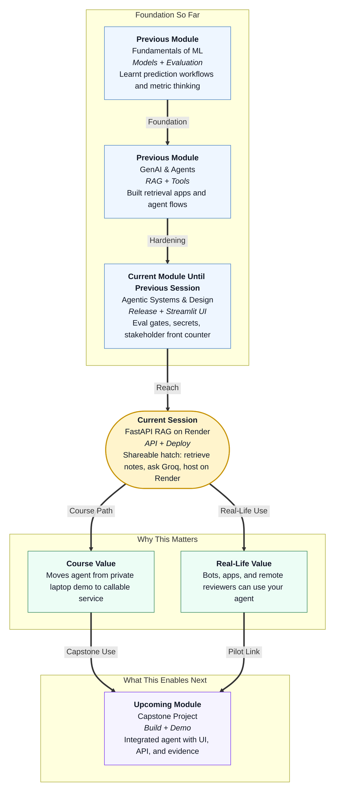

# Pre-read: Deployment: FastAPI RAG on Render

## Context of This Session in the Course

---

## When the Demo Works — but Only on Your Laptop

You finally have a campus parcel desk agent that looks professional.

In the **previous** session you opened a **Streamlit** front counter — a clean window where someone types *“Where is the Flipkart parcel for Room 214?”* and sees one clear answer. Sources and steps stay folded until needed. Your eval habits stay honest. Secrets stay out of the visible page.

You run it on your laptop. It opens in your browser. You feel ready.

Then your faculty mentor messages from another city: *“Send me the link. I want to try it before tomorrow’s review.”*

You copy `localhost:8501` and paste it into WhatsApp.

Silence.

Then: *“It says site can’t be reached.”*

That moment is not a failure of your agent brain. It is a **reachability** problem. Your desk is open — but only inside your hostel room. The rest of the world is standing outside a locked door.

This session is about opening a **second door** — not for humans clicking buttons, but for **programs and people anywhere** who need a stable, shareable way to ask questions and get structured answers. That door is a small **API** deployed on a simple cloud host.

## The Challenge: Local Success Is Not Shared Success

What if every stakeholder, bot, and teammate still depends on *your* laptop being awake, charged, and connected?

Many strong student projects stop here. The logic works locally. The UI looks good on your machine. But faculty cannot open your link from home. Bots cannot call your agent without a machine-readable door. Demos die when you close the laptop lid. Keys end up in chat screenshots instead of a safe host panel.

The challenge is practical:

**How do you move from “it works for me” to “others can reach it” — without turning the project into a DevOps nightmare?**

That question shows up in internships, capstone reviews, and any pilot where someone asks for a **URL**, not a screen-share.

## The Answer Preview: A Thin API, Honest RAG, and a Cloud Pilot

This session introduces three ideas that work together:

- **FastAPI** — a Python-friendly way to expose a simple **service hatch** (for example, one main path where callers send a question and get JSON back). In simple Indian English: a polite reception counter for other apps, not only for your browser.
- **RAG with Groq** — first **retrieve** matching lines from parcel notes, then ask **Groq** (a fast cloud LLM provider you call with an API key) to answer **only from those notes**. In simple Indian English: open the right register pages, then let a rented clerk brain speak from those pages — not from imagination.
- **Render** — a simple **cloud host** (a PaaS) that keeps your API process running and gives you an **HTTPS link**, while secrets sit in an environment panel instead of your repo.

You will not need containers or a giant infrastructure story for this pilot. You will need clarity about **what changes** when the same mini app leaves your laptop.

## Think of It Like Moving the Parcel Counter

The daily-life picture for this whole session is the same **campus parcel desk** you already know — but now you ask where the counter physically lives.

| Local-only habit | Deployed habit |
|---|---|
| Counter inside your hostel room | Counter on the campus road with a sign anyone can find |
| You lock up when you sleep | A host keeps the hatch open |
| Keys on your wall | Keys in the shop manager’s locked drawer |
| Only you hear the doorbell | Faculty, bots, and scripts can knock from far away |

**Deployment** does not magically make your agent smarter. If local answers invent gate numbers, a public link spreads the same mistake faster. Deployment changes **who can reach the desk**, **who keeps the lights on**, and **where secrets and knowledge live**.

## Local Knowledge vs Shared Knowledge

Your RAG needs parcel notes somewhere. This session compares two beginner-friendly stores:

- **Local file** — a simple text file shipped with your project (fastest classroom path; good for first Render deploy).
- **Supabase** — a hosted online table many people can update without redeploying code (better when hostel office volunteers change notes every hour).

Same hatch. Same Groq step. Different drawer for the register.

## What Changes — and What Stays the Same

When you move from local runs to **Render**, expect these shifts: **URL** from private address to shareable HTTPS link; **process owner** from your terminal to the platform; **secrets** from local env to the host panel (never in git); **knowledge** either bundled as a text file or read from **Supabase**.

What stays the same: retrieve → generate → JSON answer, honesty about unknown parcels, and keeping API keys off the request body.

---

## In this pre-read, you'll discover:

- **Why** a working laptop demo is still blocked for faculty, bots, and remote teammates  
- **How** a locally running app differs from a deployed app in URL, uptime, secrets, and data storage  
- **What** a minimal **RAG** API looks like when **FastAPI** retrieves notes and **Groq** generates the reply  
- **Where** to keep knowledge — a **local file** for quick pilots or **Supabase** when many editors must update notes  
- **How** to put the same mini hatch on **Render** with environment variables — no containers required  

---

## Questions We Will Answer in the Live Session

Bring these puzzles — we will solve them together:

1. **The blocked faculty link:** Your Streamlit and API both work on your machine. Why does sending `localhost` to a mentor in another city fail — and what kind of URL actually fixes it?

2. **RAG or guesswork:** A student asks about a parcel that is not in your notes. Should the cloud brain invent a gate to sound helpful — or return an honest “not found”? What does retrieval *before* Groq protect you from?

3. **The drawer vs the cloud register:** Your parcel list changes every hour because three volunteers update it. When should knowledge stay in a file in git, and when should it move to **Supabase** so you do not redeploy for every edit?

---

## After This Session, You Will Be Able To

- Explain **why deployment** matters beyond local success — in words a non-coder faculty member understands  
- Compare **local vs deployed** apps on URL, process lifetime, secrets, and reachability  
- Describe a simple **FastAPI + RAG + Groq** hatch that returns a stable JSON answer with sources  
- Choose **local file vs Supabase** for knowledge in a pilot  
- Outline the steps to deploy the mini app on **Render** and verify it with a health check and a test question  

You will stop being the only person who can reach the parcel desk. You will put the hatch on the campus road — and send a link that works when your laptop is closed.
