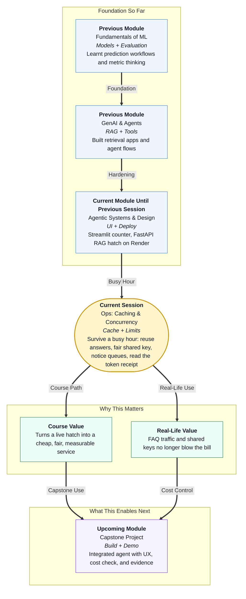

# Pre-read: Ops: Caching & Concurrency

## Context of This Session in the Course

---

## The Link Works — Then Lunch Rush Arrives

In the **previous** session you put the campus **parcel desk** on the road. Faculty in another city could open a link. Classmates could send a question and get a structured answer.

Then the WhatsApp group gets the URL. Twenty people paste *“Where is the Flipkart parcel for Room 214?”* One teammate keeps asking new questions as fast as they can type.

The shared cloud key — the rented clerk brain behind the desk — starts refusing work. Someone says the bill looks scary. You have not changed a single parcel fact.

The answers are still honest. The desk is simply **overwhelmed**. This session is **ops**: habits that keep a live service fast, fair, and cheaper after the feature already works.

## What If Everyone Shouts at Once?

Think of the campus canteen at 12:40. The cook can make one plate well. That is not the problem.

Ten students shout “rice plate” as if each shout needs a fresh fire. One friend cuts in with extra items. There is no token system, no menu photocopy, and no gas notebook — so put that picture on your live agent hatch.

- The same public FAQ is asked again and again — each ask still pays for a full cloud call.
- One session floods the **shared API key** (the secret that lets your app rent the cloud brain).
- Many calls start at once. Two phone lines; fifty people grab the handset.
- Nobody can say **who spent what**. You only know “we used a lot.”

**What if your demo link is the canteen with no tokens, no photocopier, and no bill book?**

That is not a “big company” problem. The first week a URL is public, internships and capstone reviews hit the same rush.

## Four Windows at the Same Counter

This session does not rebuild the RAG brain. It adds four windows to the counter you already deployed.

| Window | In simple Indian English |
|---|---|
| **Response caching** | Photocopy the Gate 2 slip instead of phoning the cook for every “what is lunch?” |
| **Rate limiting** | Five canteen tokens per student per minute — the sixth gets a clear “slow down” (often HTTP **429**) |
| **Queue awareness** | Numbered floor marks; only two cloud calls at once; extras hear “desk busy — retry” |
| **Cost log** | A **kirana receipt** of **tokens** (text chunks) per session — cache hits should show **zero** |

**Identical** questions match after you trim spaces. **Near-identical** questions match after you ignore capitals and extra `?` marks. Different rooms and personal data (OTP, private notes) must **not** share a photocopy.

Hiding the key is required. Rate limits still matter on a public URL, because the *server* holds the key and will spend it for whoever can knock. A full **job queue** product is optional; a small **concurrency limit** already teaches the waiting-line idea.

The classroom rupee number on the receipt is a **meter you can change**, not a live provider invoice. Cache cuts repeats; rate limits cut greedy clients; a concurrency cap protects the phone lines; the log tells you whether the mix is working.

## Think of It Like the Photocopy Machine at the Parcel Desk

The first student asks *“Where is Flipkart 214?”* The clerk phones the cloud brain. That is a **cache miss**.

Gate 2 comes back. A photocopy goes in a tray with a sticky note: valid for a few minutes (**TTL** — time-to-live).

The second student asks *“where is flipkart 214??”* Same meaning, messier typing. If you **normalise** the question (lowercase, strip punctuation, squeeze spaces), you find the photocopy.

That is a **cache hit**. Instant. **Zero tokens** on the receipt.

A third student asks about Amazon Room 108 — different fact, new miss. A fourth asks for a password reset code. You do **not** photocopy that; it is personal.

The token box still limits how often one person may walk up. If two phones are already busy, extras hear “please retry.” **Reuse what is safe, slow down what is greedy, wait when the kitchen is full, keep the bill book honest.**

---

## In this pre-read, you'll discover:

- **Why** a working public link can still fail at lunch rush — duplicate FAQs, one noisy client, and no receipt  
- **How** a **cache** reuses safe, public answers for identical and near-identical questions — and when photocopying is the wrong idea  
- **What** a **per-session rate limit** protects when many people share one cloud key  
- **When** a waiting line (a **job queue**) helps, and how a small “only two calls at once” cap already teaches that idea, plus how to **read a token log**  

---

## Questions We Will Answer in the Live Session

Bring these puzzles — we will solve them together:

1. **The twenty Flipkart curls:** Twenty classmates paste the same parcel question. Why did the cloud key still overheat, and what habit would have made the later asks almost free?

2. **The sixth token:** A session already asked five times in twenty seconds. Should a *new* sixth question still reach the cloud brain, and why does fairness on a **shared key** still matter?

3. **The lying receipt:** Your log says “cache hit” but still shows 200 tokens. If session B spent twice as much as session A, how do you tell whether B asked two different facts — or your cache key was too strict?

---

## After This Session, You Will Be Able To

- Explain **ops** as “the hatch exists” versus “the hatch survives a busy hour”  
- Decide **cache or call** for identical FAQs, near-identical wording, different rooms, and personal data  
- Apply a **per-session** cap so one classmate cannot exhaust a shared key  
- Say **when a queue helps**, use a small concurrency limit as the stand-in, and **read a cost log** of tokens versus free hits  

You will still have the same parcel hatch on the campus road — now with a photocopier, a token box, a short line, and a bill book you can actually read.
