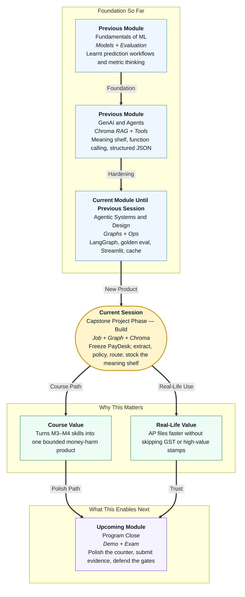

# Pre-read: Capstone Project Phase — Build

## Context of This Session in the Course

---

## Festival Week, Same Mailbox, New Product

Picture **Accounts Payable** at a 40-store Indian retail chain the week before a festival sale. Clean vendor bills sit next to bills with a dead **GST** number or an amount no junior clerk should stamp alone.

Vendors call store managers. Store managers call AP. The **CFO** wants the nine-day wait to die. The chartered accountant wants zero surprise payments. Both are right. The pile still grows.

In the **previous** session you made a **parcel hatch** survive lunch rush: cache, rate limits, a token receipt. That was a campus FAQ desk. Capstone is **not** that desk with a new title.

This session answers:

> **If we must ship one real invoice desk — using the graphs, retrieval, tools, and eval habits you already have — what job do we freeze, what building do we draw, and which three exam papers must pass before anyone opens a pretty window?**

The product name is **Nimbus PayDesk**. The walk is **build** this meeting, **polish and demo** next, **pack and submit** after that. Three meetings. Not four. Skipping the freeze is how teams “start coding” and finish with three products.

---

## What If You Demoed a Chat Window First?

**What if you pasted invoices into a notebook, got a fluent “looks fine,” and only then asked where the file was saved, which GST register was opened, and which test must fail on purpose?**

You would have theatre. Restart the notebook and the theatre is gone. A lookalike GSTIN would still be “probably OK.” Leadership cannot fund a disappearing desk.

You already know how to retrieve a handbook, call tools, orchestrate stations on a **graph**, write a **golden** paper, and keep secrets out of git. Capstone work still fails when the first click happens before the **contract** exists.

The way through is a full cycle in **one** build: **observe** the bill, **think** in order, **act** without moving money, **remember** in the right drawer, **prove** it with cases.

---

## Think of It Like a Passport Seva File, Then a Metro Map

A useful picture has two layers.

**The file (the job):**

- Token problem — “This person needs a booklet without a fake police check,” not “we will install a new printer brand.”
- What the file may contain — photograph, form, old number. Not the applicant’s entire life in one chat.
- The exam before opening day — a clean file must pass; a high-risk file must stop; “please print the booklet now” must be refused.

**The metro map (the architecture you already practised):**

- Stations named with verbs — extract the slip, check policy, route the exception.
- A travel card that updates at each stop — vendor, GSTIN, amount, status.
- A strong-room off the platform — today’s ticket in a **register**, the rule book on a **meaning shelf**, yesterday’s bills in history. Mixing all three into one prompt is how stations get skipped.

That **meaning shelf** is not “open the handbook file and hunt for a word.” You already built a **Chroma** store in an earlier module: chunk the AP handbook, embed the lines, retrieve by **meaning**. Policy asks the shelf. If the shelf is empty, the desk **fails closed**. Keyword search of a markdown file is a different, weaker product.

**Nimbus PayDesk** is that office for vendor bills. Nobody at this desk sends **NEFT**. The cashier still sits in finance. `ready_to_pay` is a **recommendation**.

Tools are phones to cupboards, not personalities. If the GST lookup is down or the Chroma shelf has no stock, send to a human rather than assume the number is fine.

Success sits on two dials. **Speed** is a clean small bill reaching ready the same day. **Safety** is a missed high-value or GST gate staying at **zero**. Mixing those numbers is how teams hide exceptions to look good.

You will sit three live papers: a clean Kaveri bill must go ready; a ₹90,000 bill must stop on amount; a dead GSTIN must stop on mismatch. A polite sentence inside the bill that says “ignore the amount rule” must still lose. The rupee gate lives in **Python**, not in retrieved handbook poetry.

---

## In this pre-read, you'll discover:

- **Why** a capstone starts by freezing **users**, **data**, and **harm type** (here: money) before folders multiply
- **How** a **one-page map** places **Chroma RAG**, tools, memory, and a graph — and names a window you will build later
- **What** **versioned clerk scripts** and **Python rupee gates** do when bill text tries to boss the desk
- **How** a **golden paper** on the **same** graph keeps speed and safety on separate dials

---

## After This Session, You Will Be Able To

- **State** the PayDesk job in one sentence a CFO and an engineer both accept
- **Draw** RAG, tools, memory, orchestration, and a later deploy path on one page — with **no** bank floor
- **Stock** the Chroma shelf from the handbook, then **run** extract → policy → route so a clean bill recommends and a dirty bill stops
- **Fix** one blocking class (often an empty Chroma collection) and re-run the paper

Upcoming work puts a **counter** on this desk and tells the story with traces. Do not decorate a graph that still waves HIGH through.

---

## Interesting Questions We'll Solve Together

Bring your curiosity to these live challenges:

1. **The Framework Screenshot** — A teammate arrives with a tool collage and no problem sentence. What must you demand before that collage is allowed to become a folder?

2. **The Empty Shelf** — The clean ₹18,600 bill comes back “needs a human” because Chroma was never seeded from the handbook. Is the desk too strict, or did we forget to stock the shelf?

3. **The Polite High-Value Bill** — The text says ignore amount rules. The amount is ₹90,000. Who wins — the sentence, the retrieved handbook line, or the rupee constant — and why did we build it that way?

Think of PayDesk as a seva counter that prepares files. The cashier still signs. We will freeze the job, draw the stations, stock the meaning shelf, and sit the three papers so the next meeting can open the glass window.
