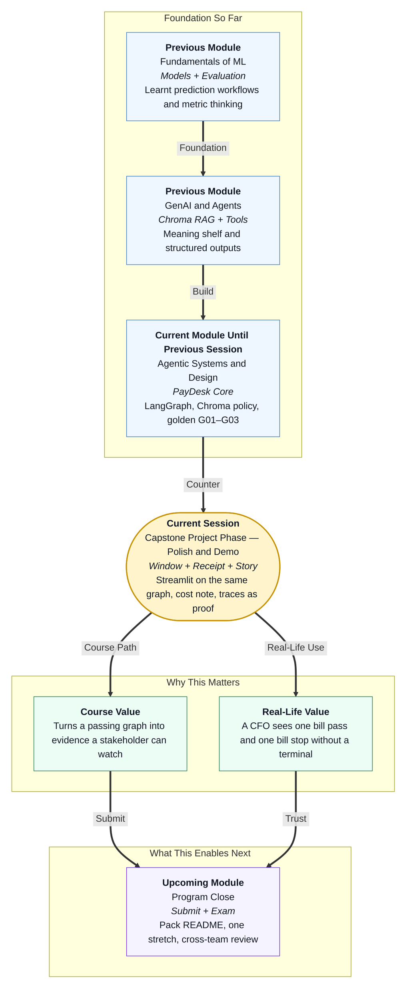

# Pre-read: Capstone Project Phase — Polish & Demo

## Context of This Session in the Course

---

## A Passing Graph Is Still a Back Office

In the **previous** session you froze **Nimbus PayDesk** and ran the stations: extract, policy, route. A clean Kaveri bill reached **ready to pay**. A high-value bill and a dead GSTIN stopped with **named** reasons. Policy asked **Chroma** for handbook lines. A diary of JSON lines proved the runs existed.

Faculty, a finance partner, or a tired reviewer will not grep that diary to “feel” the product. They want a **counter**: paste a bill, read a status, optionally open the file jacket — including which handbook lines the meaning shelf returned.

This session answers:

> **Can we put a calm window on the same brain the exam already uses, count what the demo path costs, tell a short honest story with traces, and write down what we would do with more time — without pretending we measured uptime we never measured?**

That is **polish and demo**. Pretty is not the goal. **Sameness** is the goal: the button, the exam paper, and the diary must agree.

---

## What If the Green Banner Meant Paid?

**What if the window said “Paid successfully” because green feels complete, while the graph only recommended, and the high-value sample was quietly edited down so the demo would never look negative?**

You would train stakeholders to trust a lie. The chartered accountant would think money moved. The next intern would add a real payout to “finish the banner.”

A second lie is quieter. **What if the window pasted fake handbook quotes into the packet so the expander looked full, while the exam path still talked to Chroma?** Then you would demo a poster, not a desk.

You already built a **Streamlit** front for the campus parcel desk. You already wrote **token receipts** and **cache** rules. PayDesk reuses those habits. It does not reuse parcel FAQs. And cache must never photocopy a high-value bill into “ready” because yesterday’s small bill was clean. You may cache a GST lookup. You must not cache the final recommendation.

---

## Think of It Like a Courier Counter, Not a Warehouse CCTV

A useful picture is the **front of a courier office**.

- **The glass** — One form, one button, one status a non-engineer can read. Not a wall of camera feeds.
- **The tracking strip** — Picked up, hub, out for delivery. For PayDesk: extract, policy, route. Fold it away until someone asks “how?”
- **The quoted slip** — Which lines came off the **Chroma** shelf. If the expander is empty on a live run, the shelf was empty — do not type quotes by hand to save the show.
- **The two files you rehearse** — One clean delivery. One that must stop at the hub. If you only show the clean file, you have not shown a desk.
- **The receipt** — What this visit cost in tokens, with the date of the rate you used. Not a five-year cloud budget. Not a fake “99.9% happy customers” poster after a college fest.

The hard rule stays on the glass: this counter **recommends**. The cashier still signs **NEFT** down the road.

If the browser dies, the exam paper in the terminal is still a valid fallback. A working stop is better than a frozen spinner. If the meaning shelf is empty, fail closed and say so — do not comment out the rule to save the show.

A short spoken arc is enough: job, clean bill, high-value bill, proof (stations + Chroma hits + diary line), what you would not add (a bank).

Put the two scripted bills behind **sample buttons** so the demo does not depend on nervous typing. Keep projector hygiene: no real internship GSTIN, no open secret file. If many classmates share one laptop, the ops lesson still applies — a public link without a cap will burn the classroom key. Prefer a local window unless a later hatch is the stretch.

Do not invent **uptime posters**. A retro that says “we would add messy-prose extract and a human stamp” is honest. A retro that claims “99.9% availability” after a campus fest is theatre.

---

## In this pre-read, you'll discover:

- **Why** a stakeholder window must call the **same** graph as the golden paper
- **How** a foldable **trace**, **Chroma** handbook lines, and a **cost sticky** turn a click into evidence
- **What** words must never appear on a success banner
- **How** a **retro** stays honest without service-level theatre

---

## After This Session, You Will Be Able To

- **Paste** a bill in Streamlit and show ready vs needs-human without saying paid
- **Open** proof: stations, Chroma handbook lines, diary line
- **Write** demo-path cost assumptions (including “lab labels used zero model tokens” if that is true)
- **Run** a short live story: one bill through, one bill stopped
- **List** keep / change / more time / never — with **never: payout**

Upcoming work packs a README so a stranger can replay this without you in the room.

---

## Interesting Questions We'll Solve Together

Bring your curiosity to these live challenges:

1. **Two Brains** — The window says stop. The exam script says ready. Which product will you demo, and what is the one-line fix?

2. **The Cheap Lie** — Cache returns yesterday’s “ready” for a new ₹90,000 bill from the same vendor. Which ops habit did we misuse?

3. **The Missing Word** — A teammate wants the banner to say “Paid.” What do you put instead, and how do you explain it to a CFO in one breath?

Walk in with the clean slip and the high-value slip in your head. We will put both on the glass — and keep the cheque book in finance.
